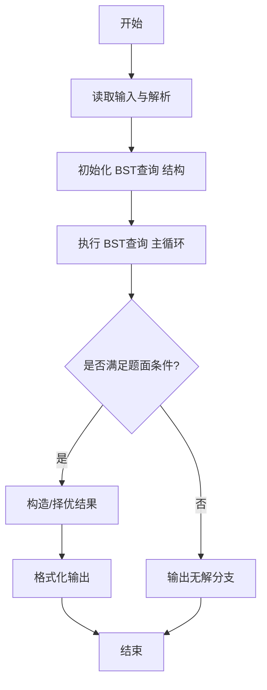
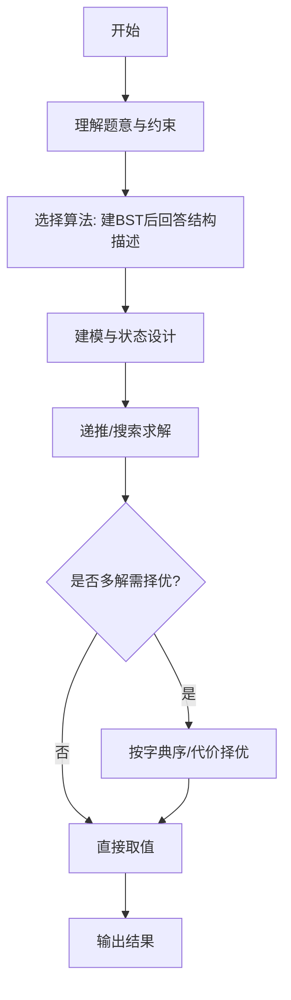

# L3-016 - 二叉搜索树的结构（30 分）

- **时间限制**: 400 ms
- **内存限制**: 65536 KB
- **代码长度限制**: 16 KB

---

## 题目描述


二叉搜索树或者是一棵空树，或者是具有下列性质的二叉树： 若它的左子树不空，则左子树上所有结点的值均小于它的根结点的值；若它的右子树不空，则右子树上所有结点的值均大于它的根结点的值；它的左、右子树也分别为二叉搜索树。（摘自百度百科）

给定一系列互不相等的整数，将它们顺次插入一棵初始为空的二叉搜索树，然后对结果树的结构进行描述。你需要能判断给定的描述是否正确。例如将{ 2 4 1 3 0 }插入后，得到一棵二叉搜索树，则陈述句如“2是树的根”、“1和4是兄弟结点”、“3和0在同一层上”（指自顶向下的深度相同）、“2是4的双亲结点”、“3是4的左孩子”都是正确的；而“4是2的左孩子”、“1和3是兄弟结点”都是不正确的。

### 输入格式:

输入在第一行给出一个正整数$$N$$（$$\le 100$$），随后一行给出$$N$$个互不相同的整数，数字间以空格分隔，要求将之顺次插入一棵初始为空的二叉搜索树。之后给出一个正整数$$M$$（$$\le 100$$），随后$$M$$行，每行给出一句待判断的陈述句。陈述句有以下6种：

- `A is the root`，即"`A`是树的根"；
- `A and B are siblings`，即"`A`和`B`是兄弟结点"；
- `A is the parent of B`，即"`A`是`B`的双亲结点"；
- `A is the left child of B`，即"`A`是`B`的左孩子"；
- `A is the right child of B`，即"`A`是`B`的右孩子"；
- `A and B are on the same level`，即"`A`和`B`在同一层上"。

题目保证所有给定的整数都在整型范围内。

### 输出格式:

对每句陈述，如果正确则输出`Yes`，否则输出`No`，每句占一行。

### 输入样例:
```in
5
2 4 1 3 0
8
2 is the root
1 and 4 are siblings
3 and 0 are on the same level
2 is the parent of 4
3 is the left child of 4
1 is the right child of 2
4 and 0 are on the same level
100 is the right child of 3
```

### 输出样例:
```out
Yes
Yes
Yes
Yes
Yes
No
No
No
```

## 示例

### 示例 1

**输入:**
```
5
2 4 1 3 0
8
2 is the root
1 and 4 are siblings
3 and 0 are on the same level
2 is the parent of 4
3 is the left child of 4
1 is the right child of 2
4 and 0 are on the same level
100 is the right child of 3
```

**输出:**
```
Yes
Yes
Yes
Yes
Yes
No
No
No
```
---

## 解题思路

### 题目分析

本题为 L3-016 - 二叉搜索树的结构（30 分），核心属于 **BST结构查询**。输入规模与约束决定了需要兼顾正确性与效率：既要处理最坏情况下的数据量，又要满足题面关于字典序/最优性/可行性的附加要求。题目通常包含多组数据或单组大规模数据，需在 O(n log n) 或 O(n·m) 量级内完成。

### 核心算法

- **算法选择**：建BST后回答结构描述。
- **关键步骤**：按给定序列依次插入建二叉搜索树，维护父、左、右指针；对每条查询解析类型（A is root / A and B are siblings / A is parent of B 等）直接在树上判定输出 Yes/No。
- **实现要点**：仓颉实现中通过 `ArrayList`/`HashMap` 等集合类型组织数据，结合 `StringBuilder` 与 `readToEnd` 高效解析输入；按题面要求的排序与比较规则保证输出符合字典序/最短路等最优性定义。

### 复杂度分析

- **时间复杂度**： O(N²)建树 O(Q·N)，空间 O(N)。
- **空间复杂度**： O(N)，主要由 DP 表/图邻接表/辅助数组占据。

## 代码流程说明

1. 读取 N 与插入序列依次插入建 BST，维护节点父左右指针
2. 读取查询数 M，对每条查询解析结构描述语句（is root / parent / sibling 等）
3. 在树上定位对应节点，通过指针关系直接判定查询真假
4. 对每条查询输出 Yes/No，按输入顺序逐行输出

## 代码实现

```cangjie
// L3-016 二叉搜索树的结构 - build BST and answer queries
import std.env.*
import std.collection.*
import std.convert.*

main() {
    let cin = getStdIn()
    let all = cin.readToEnd() ?? ""
    if (all.trimAscii().isEmpty()) { return }
    // split lines preserving statements with spaces
    // Use manual line split by '\n'
    var lines = ArrayList<String>()
    var curLine = StringBuilder()
    for (r in all.toRuneArray()) {
        let rs = r.toString()
        if (rs == "\n") {
            lines.add(curLine.toString())
            curLine = StringBuilder()
        } else if (rs == "\r") {
            // ignore
        } else {
            curLine.append(rs)
        }
    }
    lines.add(curLine.toString())
    var idx: Int64 = 0
    func skipEmpty(): Unit {
        while (idx < lines.size && lines[idx].trimAscii().isEmpty()) { idx++ }
    }
    func nextLine(): String {
        skipEmpty()
        if (idx >= lines.size) { return "" }
        let v = lines[idx]
        idx++
        return v
    }
    // also need token helper for first lines that may be split
    let first = nextLine().trimAscii()
    let N = Int64.parse(first)
    var nums = ArrayList<Int64>()
    while (nums.size < N) {
        let line = nextLine()
        // split line by whitespace manually
        var cur = StringBuilder()
        for (r in line.toRuneArray()) {
            let rs = r.toString()
            if (rs == " " || rs == "\t") {
                if (cur.size > 0) { nums.add(Int64.parse(cur.toString())); cur = StringBuilder() }
            } else { cur.append(rs) }
        }
        if (cur.size > 0) { nums.add(Int64.parse(cur.toString())) }
    }
    let mLine = nextLine().trimAscii()
    let M = Int64.parse(mLine)
    var queries = ArrayList<String>()
    for (_ in 0..M) {
        // queries may be empty? take raw line (including spaces)
        // Use nextLine that skips empties, but queries are non-empty
        let q = nextLine()
        queries.add(q)
    }
    // Build BST
    let parent = HashMap<Int64, Int64>()
    let left = HashMap<Int64, Int64>()
    let right = HashMap<Int64, Int64>()
    let depth = HashMap<Int64, Int64>()
    let exists = HashSet<Int64>()
    var root: Int64 = 0
    var hasRoot = false
    for (v in nums) {
        exists.add(v)
        if (!hasRoot) {
            root = v
            hasRoot = true
            depth[v] = 0
        } else {
            var cur = root
            while (true) {
                if (v < cur) {
                    if (left.contains(cur)) {
                        cur = left[cur]
                    } else {
                        left[cur] = v
                        parent[v] = cur
                        depth[v] = depth[cur] + 1
                        break
                    }
                } else {
                    if (right.contains(cur)) {
                        cur = right[cur]
                    } else {
                        right[cur] = v
                        parent[v] = cur
                        depth[v] = depth[cur] + 1
                        break
                    }
                }
            }
        }
    }
    func splitTokens(s: String): Array<String> {
        var res = ArrayList<String>()
        var cur = StringBuilder()
        for (r in s.toRuneArray()) {
            let ch = r.toString()
            if (ch == " " || ch == "\t") {
                if (cur.size > 0) { res.add(cur.toString()); cur = StringBuilder() }
            } else { cur.append(ch) }
        }
        if (cur.size > 0) { res.add(cur.toString()) }
        return res.toArray()
    }
    func extractInts(s: String): Array<Int64> {
        let toks = splitTokens(s)
        var res = ArrayList<Int64>()
        for (tok in toks) {
            // try parse if numeric
            var isNum = true
            if (tok.isEmpty()) { continue }
            var start: Int64 = 0
            if (tok[0].toString() == "-") { start = 1; if (tok.size == 1) { continue } }
            for (k in start..tok.size) {
                let c = tok[k].toString()
                if (c < "0" || c > "9") { isNum = false; break }
            }
            if (isNum) { res.add(Int64.parse(tok)) }
        }
        return res.toArray()
    }
    let out = StringBuilder()
    for (q in queries) {
        let s = q.trimAscii()
        var ans = "No"
        let toksQ = splitTokens(s)
        if (s.contains("is the root")) {
            if (toksQ.size >= 1) {
                let a = Int64.parse(toksQ[0])
                if (hasRoot && a == root) { ans = "Yes" }
            }
        } else if (s.contains("are siblings")) {
            if (toksQ.size >= 3) {
                let a = Int64.parse(toksQ[0]); let b = Int64.parse(toksQ[2])
                if (exists.contains(a) && exists.contains(b) && parent.contains(a) && parent.contains(b) && parent[a] == parent[b]) {
                    ans = "Yes"
                }
            }
        } else if (s.contains("is the parent of")) {
            if (toksQ.size >= 6) {
                let a = Int64.parse(toksQ[0]); let b = Int64.parse(toksQ[5])
                if (parent.contains(b) && parent[b] == a) { ans = "Yes" }
            }
        } else if (s.contains("is the left child of")) {
            if (toksQ.size >= 7) {
                let a = Int64.parse(toksQ[0]); let b = Int64.parse(toksQ[6])
                if (left.contains(b) && left[b] == a) { ans = "Yes" }
            }
        } else if (s.contains("is the right child of")) {
            if (toksQ.size >= 7) {
                let a = Int64.parse(toksQ[0]); let b = Int64.parse(toksQ[6])
                if (right.contains(b) && right[b] == a) { ans = "Yes" }
            }
        } else if (s.contains("are on the same level")) {
            if (toksQ.size >= 3) {
                let a = Int64.parse(toksQ[0]); let b = Int64.parse(toksQ[2])
                if (exists.contains(a) && exists.contains(b) && depth.contains(a) && depth.contains(b) && depth[a]==depth[b]) { ans = "Yes" }
            }
        }
        out.append(ans)
        out.append("\n")
    }
    print(out.toString())
}
```

## 代码流程图




## 解题流程图



