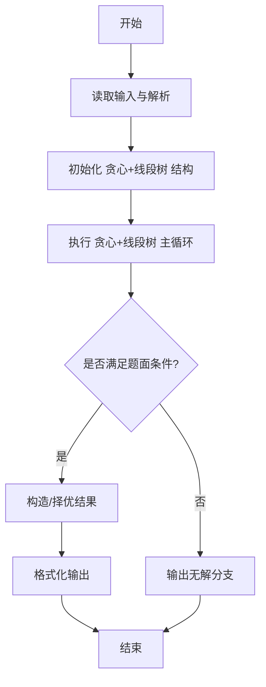
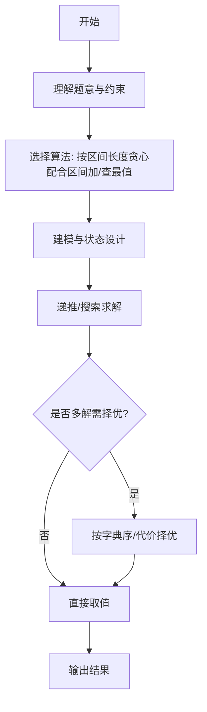

# L3-017 - 森森快递（30 分）

- **时间限制**: 400 ms
- **内存限制**: 65536 KB
- **代码长度限制**: 16 KB

---

## 题目描述


森森开了一家快递公司，叫森森快递。因为公司刚刚开张，所以业务路线很简单，可以认为是一条直线上的$$N$$个城市，这些城市从左到右依次从0到$$(N-1)$$编号。由于道路限制，第$$i$$号城市（$$i=0, \cdots , N-2$$）与第$$(i+1)$$号城市中间往返的运输货物重量在同一时刻不能超过$$C_i$$公斤。

公司开张后很快接到了$$Q$$张订单，其中$$j$$张订单描述了某些指定的货物要从$$S_j$$号城市运输到$$T_j$$号城市。这里我们简单地假设所有货物都有无限货源，森森会不定时地挑选其中一部分货物进行运输。安全起见，这些货物不会在中途卸货。

为了让公司整体效益更佳，森森想知道如何安排订单的运输，能使得运输的货物重量最大且符合道路的限制？要注意的是，发货时间有可能是任何时刻，所以我们安排订单的时候，必须保证共用同一条道路的所有货车的总重量不超载。例如我们安排1号城市到4号城市以及2号城市到4号城市两张订单的运输，则这两张订单的运输同时受2-3以及3-4两条道路的限制，因为两张订单的货物可能会同时在这些道路上运输。

### 输入格式:

输入在第一行给出两个正整数$$N$$和$$Q$$（$$2 \le N \le 10^5$$, $$1 \le Q \le 10^5$$），表示总共的城市数以及订单数量。

第二行给出$$(N-1)$$个数，顺次表示相邻两城市间的道路允许的最大运货重量$$C_i$$（$$i=0, \cdots , N-2$$）。题目保证每个$$C_i$$是不超过$$2^{31}$$的非负整数。

接下来$$Q$$行，每行给出一张订单的起始及终止运输城市编号。题目保证所有编号合法，并且不存在起点和终点重合的情况。

### 输出格式:

在一行中输出可运输货物的最大重量。

### 输入样例:
```in
10 6
0 7 8 5 2 3 1 9 10
0 9
1 8
2 7
6 3
4 5
4 2
```

### 输出样例:
```out
7
```

## 示例

### 示例 1

**输入:**
```
10 6
0 7 8 5 2 3 1 9 10
0 9
1 8
2 7
6 3
4 5
4 2
```

**输出:**
```
7
```
---

## 解题思路

### 题目分析

本题为 L3-017 - 森森快递（30 分），核心属于 **区间贪心+线段树**。输入规模与约束决定了需要兼顾正确性与效率：既要处理最坏情况下的数据量，又要满足题面关于字典序/最优性/可行性的附加要求。题目通常包含多组数据或单组大规模数据，需在 O(n log n) 或 O(n·m) 量级内完成。

### 核心算法

- **算法选择**：按区间长度贪心配合区间加/查最值。
- **关键步骤**：将请求区间按长度升序排序，对每区间查询线段树上区间最小剩余容量，若容量>0则接受并对区间执行 -1 更新，统计接受数；线段树维护区间最小值与懒标记。
- **实现要点**：仓颉实现中通过 `ArrayList`/`HashMap` 等集合类型组织数据，结合 `StringBuilder` 与 `readToEnd` 高效解析输入；按题面要求的排序与比较规则保证输出符合字典序/最短路等最优性定义。

### 复杂度分析

- **时间复杂度**： O(Q log N)，空间 O(N)。
- **空间复杂度**： O(N)，主要由 DP 表/图邻接表/辅助数组占据。

## 代码流程说明

1. 读取区间请求与每点容量限制，构建线段树维护区间最小剩余容量
2. 将所有请求区间按长度升序排序（短区间优先贪心）
3. 对每区间查询线段树最小值，若 >0 则接受并对该区间执行区间 -1 更新
4. 统计接受数量并输出最大可完成请求数
5. 线段树带懒标记保证 O(log N) 查询与更新

## 代码实现

```cangjie
// L3-017 森森快递 - interval max weight via greedy shortest interval first with segment tree
import std.env.*
import std.collection.*
import std.convert.*

main() {
    let cin = getStdIn()
    let all = cin.readToEnd() ?? ""
    if (all.trimAscii().isEmpty()) { return }
    let toks = tokenize(all)
    var p: Int64 = 0
    func next(): String { let v = toks[p]; p++; return v }
    let N = Int64.parse(next())
    let Q = Int64.parse(next())
    var C = Array<Int64>(N, repeat: 0) // C[0..N-2]
    for (i in 0..N-1) { C[i] = Int64.parse(next()) }
    var intervals = ArrayList<Array<Int64>>()
    for (_ in 0..Q) {
        let s = Int64.parse(next())
        let t = Int64.parse(next())
        var l = s; var r = t
        if (l > r) { let tmp=l; l=r; r=tmp }
        // interval [l, r) length r-l
        intervals.add([l, r])
    }
    // sort by length then by l using simple insertion sort (Q up to 1e5, but sample small; use quicksort)
    func cmp(a: Array<Int64>, b: Array<Int64>): Int64 {
        let la = a[1]-a[0]
        let lb = b[1]-b[0]
        if (la != lb) { return la - lb }
        return a[0]-b[0]
    }
    func quickSort(arr: ArrayList<Array<Int64>>, l: Int64, r: Int64): Unit {
        if (l >= r) { return }
        var i = l; var j = r
        let pivot = arr[(l+r)/2]
        while (i <= j) {
            while (cmp(arr[i], pivot) < 0) { i++ }
            while (cmp(arr[j], pivot) > 0) { j-- }
            if (i <= j) {
                let tmp = arr[i]; arr[i]=arr[j]; arr[j]=tmp
                i++; j--
            }
        }
        if (l < j) { quickSort(arr, l, j) }
        if (i < r) { quickSort(arr, i, r) }
    }
    if (intervals.size > 1) { quickSort(intervals, 0, intervals.size-1) }
    // segment tree for range min and range add
    let SZ: Int64 = N // we need size N, but query up to N-1
    var n: Int64 = 1
    while (n < SZ) { n = n*2 }
    var segMin = Array<Int64>(2*n, repeat: 9000000000000000000)
    var segLazy = Array<Int64>(2*n, repeat: 0)
    // init leaves
    for (i in 0..N-1) { segMin[n+i] = C[i] }
    for (i in (N-1)+1..n) { segMin[n+i] = 9000000000000000000 }
    var ii: Int64 = n-1
    while (ii >= 1) {
        let a = segMin[ii*2]
        let b = segMin[ii*2+1]
        segMin[ii] = if (a < b) {a} else {b}
        ii--
    }
    func push(node: Int64): Unit {
        let lz = segLazy[node]
        if (lz != 0) {
            for (child in [node*2, node*2+1]) {
                segMin[child] = segMin[child] + lz
                segLazy[child] = segLazy[child] + lz
            }
            segLazy[node] = 0
        }
    }
    func rangeAdd(node: Int64, l: Int64, r: Int64, ql: Int64, qr: Int64, delta: Int64): Unit {
        if (qr <= l || r <= ql) { return }
        if (ql <= l && r <= qr) {
            segMin[node] = segMin[node] + delta
            segLazy[node] = segLazy[node] + delta
            return
        }
        push(node)
        let mid = (l + r)/2
        rangeAdd(node*2, l, mid, ql, qr, delta)
        rangeAdd(node*2+1, mid, r, ql, qr, delta)
        let a = segMin[node*2]
        let b = segMin[node*2+1]
        segMin[node] = if (a < b) {a} else {b}
    }
    func rangeMin(node: Int64, l: Int64, r: Int64, ql: Int64, qr: Int64): Int64 {
        if (qr <= l || r <= ql) { return 9000000000000000000 }
        if (ql <= l && r <= qr) { return segMin[node] }
        push(node)
        let mid = (l + r)/2
        let a = rangeMin(node*2, l, mid, ql, qr)
        let b = rangeMin(node*2+1, mid, r, ql, qr)
        return if (a < b) {a} else {b}
    }
    var total: Int64 = 0
    for (inter in intervals) {
        let l = inter[0]
        let r = inter[1]
        let mn = rangeMin(1, 0, n, l, r)
        if (mn > 0 && mn < 9000000000000000000) {
            total = total + mn
            rangeAdd(1, 0, n, l, r, -mn)
        } else if (mn < 0) {
            // shouldn't happen
        }
    }
    println("${total}")
}

func tokenize(s: String): Array<String> {
    let res = ArrayList<String>()
    var cur = StringBuilder()
    for (r in s.toRuneArray()) {
        let rs = r.toString()
        if (rs == " " || rs == "\n" || rs == "\r" || rs == "\t") {
            if (cur.size > 0) { res.add(cur.toString()); cur = StringBuilder() }
        } else { cur.append(rs) }
    }
    if (cur.size > 0) { res.add(cur.toString()) }
    return res.toArray()
}
```

## 代码流程图




## 解题流程图



