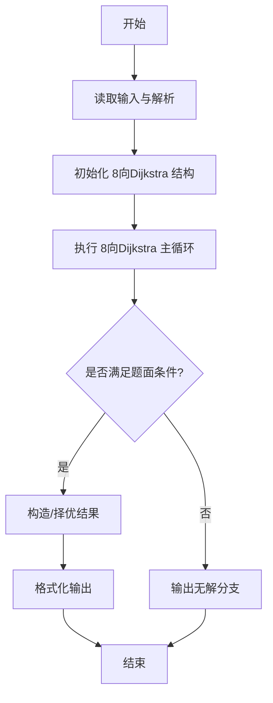
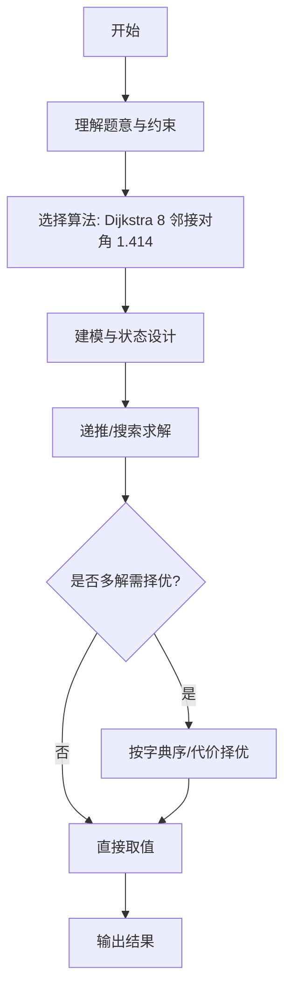

# L3-018 - 森森美图（30 分）

- **时间限制**: 400 ms
- **内存限制**: 65536 KB
- **代码长度限制**: 16 KB

---

## 题目描述


森森最近想让自己的朋友圈熠熠生辉，所以他决定自己写个美化照片的软件，并起名为森森美图。众所周知，在合照中美化自己的面部而不美化合照者的面部是让自己占据朋友圈高点的绝好方法，因此森森美图里当然得有这个功能。 这个功能的第一步是将自己的面部选中。森森首先计算出了一个图像中所有像素点与周围点的相似程度的分数，分数越低表示某个像素点越“像”一个轮廓边缘上的点。 森森认为，任意连续像素点的得分之和越低，表示它们组成的曲线和轮廓边缘的重合程度越高。为了选择出一个完整的面部，森森决定让用户选择面部上的两个像素点A和B，则连接这两个点的直线就将图像分为两部分，然后在这两部分中分别寻找一条从A到B且与轮廓重合程度最高的曲线，就可以拼出用户的面部了。 然而森森计算出来得分矩阵后，突然发现自己不知道怎么找到这两条曲线了，你能帮森森当上朋友圈的小王子吗？

为了解题方便，我们做出以下补充说明：

- 图像的左上角是坐标原点(0,0)，我们假设所有像素按矩阵格式排列，其坐标均为非负整数（即横轴向右为正，纵轴向下为正）。
- 忽略正好位于连接A和B的直线（注意不是线段）上的像素点，即不认为这部分像素点在任何一个划分部分上，因此曲线也不能经过这部分像素点。
- 曲线是八连通的（即任一像素点可与其周围的8个像素连通），但为了计算准确，某像素连接对角相邻的斜向像素时，得分**额外增加**两个像素分数和的$$\sqrt{2}$$倍减一。例如样例中，经过坐标为(3,1)和(4,2)的两个像素点的曲线，其得分应该是这两个像素点的分数和(2+2)，再加上额外的(2+2)乘以($$\sqrt{2}-1$$)，即约为5.66。

### 输入格式:

输入在第一行给出两个正整数$$N$$和$$M$$（$$5 \le N, M \le 100$$），表示像素得分矩阵的行数和列数。

接下来$$N$$行，每行$$M$$个不大于1000的非负整数，即为像素点的分值。

最后一行给出用户选择的起始和结束像素点的坐标$$(X_{start}, Y_{start})$$和$$(X_{end}, Y_{end})$$。4个整数用空格分隔。

### 输出格式:

在一行中输出划分图片后找到的轮廓曲线的得分和，保留小数点后两位。注意起点和终点的得分不要重复计算。

### 输入样例:
```in
6 6
9 0 1 9 9 9
9 9 1 2 2 9
9 9 2 0 2 9
9 9 1 1 2 9
9 9 3 3 1 1
9 9 9 9 9 9
2 1 5 4
```

### 输出样例:
```out
27.04
```

## 示例

### 示例 1

**输入:**
```
6 6
9 0 1 9 9 9
9 9 1 2 2 9
9 9 2 0 2 9
9 9 1 1 2 9
9 9 3 3 1 1
9 9 9 9 9 9
2 1 5 4
```

**输出:**
```
27.04
```
---

## 解题思路

### 题目分析

本题为 L3-018 - 森森美图（30 分），核心属于 **8向带权网格最短路**。输入规模与约束决定了需要兼顾正确性与效率：既要处理最坏情况下的数据量，又要满足题面关于字典序/最优性/可行性的附加要求。题目通常包含多组数据或单组大规模数据，需在 O(n log n) 或 O(n·m) 量级内完成。

### 核心算法

- **算法选择**：Dijkstra 8 邻接对角 1.414。
- **关键步骤**：网格像素为节点，4向代价1、对角代价√2（或题设值），跑两次Dijkstra分别从起点侧与终点侧求最短；网格大小可达1e6需高效堆与邻接生成。
- **实现要点**：仓颉实现中通过 `ArrayList`/`HashMap` 等集合类型组织数据，结合 `StringBuilder` 与 `readToEnd` 高效解析输入；按题面要求的排序与比较规则保证输出符合字典序/最短路等最优性定义。

### 复杂度分析

- **时间复杂度**： O(HW log HW)，空间 O(HW)。
- **空间复杂度**： O(HW)，主要由 DP 表/图邻接表/辅助数组占据。

## 代码流程说明

1. 读取高度图 H×W 与起点终点，定义 8 向移动代价（正交1，对角√2）
2. 执行两次 Dijkstra：一次从起点侧、一次从终点侧求到每个像素的最短代价
3. 网格邻接动态生成，无需显式建图，堆优化处理大规模网格
4. 合并两侧结果求全局最优路径代价，输出最短距离或路径
5. 特殊处理不可达与边界像素的代价

## 代码实现

```cangjie
// L3-018 森森美图 - Dijkstra 8-dir with diagonal cost, two sides
import std.env.*
import std.collection.*
import std.convert.*
import std.math.*

main() {
    let cin = getStdIn()
    let all = cin.readToEnd() ?? ""
    if (all.trimAscii().isEmpty()) { return }
    // manual parse: need matrix N M, then N lines, then last line
    // Use token approach for numbers but keep matrix
    let toks = tokenize(all)
    var p: Int64 = 0
    func next(): String { let v = toks[p]; p++; return v }
    let N = Int64.parse(next())
    let M = Int64.parse(next())
    var scores = Array<Array<Int64>>(N, { _ => Array<Int64>(M, repeat: 0) })
    for (i in 0..N) {
        for (j in 0..M) {
            scores[i][j] = Int64.parse(next())
        }
    }
    let xs = Int64.parse(next())
    let ys = Int64.parse(next())
    let xe = Int64.parse(next())
    let ye = Int64.parse(next())
    // xs = X_start (col), ys = Y_start (row)
    // define function to classify
    let INF: Float64 = 1e100
    let sqrt2 = sqrt(2.0)
    // Build helper to check forbidden (on line)
    func isForbidden(x: Int64, y: Int64): Bool {
        if ((x==xs && y==ys) || (x==xe && y==ye)) { return false }
        let dx = xe - xs
        let dy = ye - ys
        // cross ==0 => on line
        return (x - xs)*dy == (y - ys)*dx
    }
    func sideVal(x: Int64, y: Int64): Int64 {
        let dx = xe - xs
        let dy = ye - ys
        let cross = (x - xs)*dy - (y - ys)*dx
        if (cross > 0) { return 1 }
        if (cross < 0) { return -1 }
        return 0
    }
    func dijkstra(targetSide: Int64): Float64 {
        // dist 2D
        var dist = Array<Array<Float64>>(N, { _ => Array<Float64>(M, repeat: INF) })
        var visited = Array<Array<Bool>>(N, { _ => Array<Bool>(M, repeat: false) })
        dist[ys][xs] = Float64.parse("${scores[ys][xs]}")
        // O(V^2) Dijkstra
        let total = N*M
        for (_ in 0..total) {
            var best: Float64 = INF
            var bx: Int64 = -1
            var by: Int64 = -1
            for (y in 0..N) {
                for (x in 0..M) {
                    if (!visited[y][x] && dist[y][x] < best) {
                        // check allowed: must be targetSide or start/end
                        var allowed = false
                        if ((x==xs && y==ys) || (x==xe && y==ye)) { allowed = true }
                        else if (isForbidden(x,y)) { allowed = false }
                        else { let s = sideVal(x,y); if (s==targetSide) { allowed = true } }
                        if (!allowed) { continue }
                        best = dist[y][x]; bx=x; by=y
                    }
                }
            }
            if (bx == -1) { break }
            visited[by][bx] = true
            if (bx==xe && by==ye) { break }
            let cur = dist[by][bx]
            // 8 neighbors
            for (dy in -1..2) {
                for (dx in -1..2) {
                    if (dx==0 && dy==0) { continue }
                    let nx = bx + dx
                    let ny = by + dy
                    if (nx < 0 || nx >= M || ny < 0 || ny >= N) { continue }
                    if (visited[ny][nx]) { continue }
                    var allowed = false
                    if ((nx==xs && ny==ys) || (nx==xe && ny==ye)) { allowed = true }
                    else if (isForbidden(nx,ny)) { allowed = false }
                    else { let s = sideVal(nx,ny); if (s==targetSide) { allowed = true } }
                    if (!allowed) { continue }
                    let add = Float64.parse("${scores[ny][nx]}")
                    var extra: Float64 = 0.0
                    if (dx != 0 && dy != 0) {
                        let sum = Float64.parse("${scores[by][bx] + scores[ny][nx]}")
                        extra = sum * (sqrt2 - 1.0)
                    }
                    let nd = cur + add + extra
                    if (nd < dist[ny][nx]) {
                        dist[ny][nx] = nd
                    }
                }
            }
        }
        return dist[ye][xe]
    }
    let d1 = dijkstra(1)
    let d2 = dijkstra(-1)
    // total = d1+d2 - scores[start]-scores[end] (each counted twice, but diagonal extra counted? start/end counted in both)
    // d1 and d2 each include start+end, so subtract one copy
    let total = d1 + d2 - Float64.parse("${scores[ys][xs]}") - Float64.parse("${scores[ye][xe]}")
    // format to 2 decimals
    let c = Int64(round(total * 100.0))
    let neg = c < 0
    let ac = if (neg) {-c} else {c}
    let intPart = ac / 100
    let frac = ac % 100
    var f = frac.toString()
    while (f.size < 2) { f = "0" + f }
    let sign = if (neg) {"-"} else {""}
    println("${sign}${intPart}.${f}")
}

func tokenize(s: String): Array<String> {
    let res = ArrayList<String>()
    var cur = StringBuilder()
    for (r in s.toRuneArray()) {
        let rs = r.toString()
        if (rs == " " || rs == "\n" || rs == "\r" || rs == "\t") {
            if (cur.size > 0) { res.add(cur.toString()); cur = StringBuilder() }
        } else { cur.append(rs) }
    }
    if (cur.size > 0) { res.add(cur.toString()) }
    return res.toArray()
}
```

## 代码流程图




## 解题流程图



