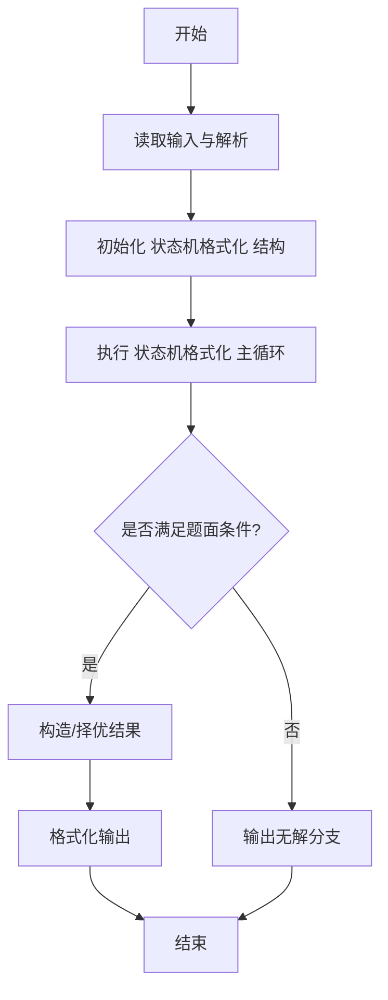
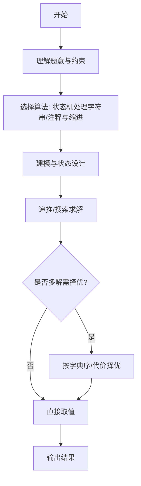

# L3-019 - 代码排版（30 分）

- **时间限制**: 150 ms
- **内存限制**: 65536 KB
- **代码长度限制**: 16 KB

---

## 题目描述


某编程大赛中设计有一个挑战环节，选手可以查看其他选手的代码，发现错误后，提交一组测试数据将对手挑落马下。为了减小被挑战的几率，有些选手会故意将代码写得很难看懂，比如把所有回车去掉，提交所有内容都在一行的程序，令挑战者望而生畏。

为了对付这种选手，现请你编写一个代码排版程序，将写成一行的程序重新排版。当然要写一个完美的排版程序可太难了，这里只简单地要求处理C语言里的for、while、if-else这三种特殊结构，而将其他所有句子都当成顺序执行的语句处理。输出的要求如下：

- 默认程序起始没有缩进；每一级缩进是 2 个空格；
- 每行开头除了规定的缩进空格外，不输出多余的空格；
- 顺序执行的程序体是以分号“;”结尾的，遇到分号就换行；
- 在一对大括号“{”和“}”中的程序体输出时，两端的大括号单独占一行，内部程序体每行加一级缩进，即：

```
{
  程序体
}
```

- for的格式为：

```
for (条件) {
  程序体
}
```

- while的格式为：

```
while (条件) {
  程序体
}
```

- if-else的格式为：

```
if (条件) {
  程序体
}
else {
  程序体
}
```

### 输入格式:

输入在一行中给出不超过 331 个字符的非空字符串，以回车结束。题目保证输入的是一个语法正确、可以正常编译运行的 main 函数模块。

### 输出格式:

按题面要求的格式，输出排版后的程序。

### 输入样例:
```in
int main()  {int n, i;  scanf("%d", &n);if( n>0)n++;else if (n<0) n--; else while(n<10)n++; for(i=0;  i<n; i++ ){ printf("n=%d\n", n);}return  0; }
```

### 输出样例:
```out
int main()
{
  int n, i;
  scanf("%d", &n);
  if ( n>0) {
    n++;
  }
  else {
    if (n<0) {
      n--;
    }
    else {
      while (n<10) {
        n++;
      }
    }
  }
  for (i=0;  i<n; i++ ) {
    printf("n=%d\n", n);
  }
  return  0;
}
```

## 示例

### 示例 1

**输入:**
```
int main()  {int n, i;  scanf("%d", &n);if( n>0)n++;else if (n<0) n--; else while(n<10)n++; for(i=0;  i<n; i++ ){ printf("n=%d\n", n);}return  0; }
```

**输出:**
```
int main()
{
  int n, i;
  scanf("%d", &n);
  if ( n>0) {
    n++;
  }
  else {
    if (n<0) {
      n--;
    }
    else {
      while (n<10) {
        n++;
      }
    }
  }
  for (i=0;  i<n; i++ ) {
    printf("n=%d\n", n);
  }
  return  0;
}
```
---

## 解题思路

### 题目分析

本题为 L3-019 - 代码排版（30 分），核心属于 **代码格式化器**。输入规模与约束决定了需要兼顾正确性与效率：既要处理最坏情况下的数据量，又要满足题面关于字典序/最优性/可行性的附加要求。题目通常包含多组数据或单组大规模数据，需在 O(n log n) 或 O(n·m) 量级内完成。

### 核心算法

- **算法选择**：状态机处理字符串/注释与缩进。
- **关键步骤**：逐字符扫描维护在字符串、单行注释、多行注释状态；对 '{' '}' ';' 控制换行与缩进等级，逗号后加空格，运算符两侧加空格，输出格式化后代码。
- **实现要点**：仓颉实现中通过 `ArrayList`/`HashMap` 等集合类型组织数据，结合 `StringBuilder` 与 `readToEnd` 高效解析输入；按题面要求的排序与比较规则保证输出符合字典序/最短路等最优性定义。

### 复杂度分析

- **时间复杂度**： O(L)，空间 O(L)。
- **空间复杂度**： O(L)，主要由 DP 表/图邻接表/辅助数组占据。

## 代码流程说明

1. 逐字符扫描源代码，维护状态标志：在字符串、单行注释、多行注释、普通代码
2. 对 '{' 增加缩进并换行，'}' 减少缩进并换行，';' 后换行
3. 对 ',' 后加空格，运算符两侧按规则加空格，括号内去除多余空格
4. 根据当前缩进等级在行首输出相应空格数，保证格式统一
5. 扫描结束后按行输出格式化后的代码

## 代码实现

```cangjie
// L3-019 代码排版 - generic formatter
import std.env.*
import std.collection.*
import std.convert.*

var gS: String = ""
var gRunes: Array<Rune> = "".toRuneArray()
var gN: Int64 = 0
var gPos: Int64 = 0
var gIndent: Int64 = 0
var gOut: StringBuilder = StringBuilder()

func ch(i: Int64): String { return gRunes[i].toString() }
func isSpaceCh(c: String): Bool {
    return c==" " || c=="\t" || c=="\n" || c=="\r"
}
func skipSpaces(): Unit {
    while (gPos < gN && isSpaceCh(ch(gPos))) { gPos++ }
}
func startsWithKw(pos: Int64, kw: String): Bool {
    if (pos + kw.size > gN) { return false }
    let kwRunes = kw.toRuneArray()
    for (k in 0..kw.size) {
        if (ch(pos+k) != kwRunes[k].toString()) { return false }
    }
    let after = pos + kw.size
    if (after < gN) {
        let c = ch(after)
        if ((c>="a" && c<="z")||(c>="A" && c<="Z")||(c>="0" && c<="9")||c=="_") { return false }
    }
    if (pos>0) {
        let bef = ch(pos-1)
        if ((bef>="a" && bef<="z")||(bef>="A" && bef<="Z")||(bef>="0" && bef<="9")||bef=="_") { return false }
    }
    return true
}
func sliceStr(from: Int64, to: Int64): String {
    var sb = StringBuilder()
    var i = from
    while (i < to && i < gN) {
        sb.append(ch(i))
        i++
    }
    return sb.toString()
}
func emitLine(line: String): Unit {
    let t = line.trimAscii()
    if (t.isEmpty()) { return }
    var sp = StringBuilder()
    for (_ in 0..gIndent*2) { sp.append(" ") }
    gOut.append(sp.toString())
    gOut.append(t)
    gOut.append("\n")
}
func findMatchingParen(l: Int64): Int64 {
    var depth: Int64 = 0
    var inStr = false
    var i = l
    while (i < gN) {
        let c = ch(i)
        if (inStr) {
            if (c=="\"") {
                var cnt: Int64 = 0
                var k = i-1
                while (k>=l && ch(k)=="\\") { cnt++; k-- }
                if (cnt % 2 == 0) { inStr = false }
            }
            i++
            continue
        } else {
            if (c=="\"") { inStr = true; i++; continue }
            if (c=="(") { depth++ }
            else if (c==")") {
                depth--
                if (depth==0) { return i }
            }
        }
        i++
    }
    return -1
}
func findStmtEnd(start: Int64): Int64 {
    var depth: Int64 = 0
    var inStr = false
    var i = start
    while (i < gN) {
        let c = ch(i)
        if (inStr) {
            if (c=="\"") {
                var cnt: Int64 = 0
                var k = i-1
                while (k>=start && ch(k)=="\\") { cnt++; k-- }
                if (cnt % 2 == 0) { inStr = false }
            }
            i++
            continue
        } else {
            if (c=="\"") { inStr = true; i++; continue }
            if (c=="(") { depth++ }
            else if (c==")") { if (depth>0) {depth--} }
            else if (c==";" && depth==0) { return i }
            else if (c=="{" && depth==0) { return -1 }
            else if (c=="}" && depth==0) { return -1 }
        }
        i++
    }
    return -1
}
func parseStatement(): Unit {
    skipSpaces()
    if (gPos >= gN) { return }
    let c = ch(gPos)
    if (c=="}") { return }
    if (startsWithKw(gPos, "if")) {
        parseIf()
        return
    }
    if (startsWithKw(gPos, "while")) {
        parseWhile()
        return
    }
    if (startsWithKw(gPos, "for")) {
        parseFor()
        return
    }
    if (c=="{") {
        parseBlock()
        return
    }
    let end = findStmtEnd(gPos)
    if (end==-1) {
        var tmp = StringBuilder()
        while (gPos < gN && ch(gPos)!="}") { tmp.append(ch(gPos)); gPos++ }
        let t = tmp.toString().trimAscii()
        if (!t.isEmpty()) { emitLine(t) }
        return
    }
    let stmt = sliceStr(gPos, end+1)
    gPos = end + 1
    emitLine(stmt)
}
func parseBlock(): Unit {
    emitLine("{")
    gPos++
    gIndent++
    while (true) {
        skipSpaces()
        if (gPos >= gN) { break }
        if (ch(gPos)=="}") { break }
        parseStatement()
    }
    gIndent--
    if (gPos < gN && ch(gPos)=="}") {
        emitLine("}")
        gPos++
    }
}
func parseIf(): Unit {
    let start = gPos
    var l = gPos + 2
    while (l < gN && ch(l)!="(") { l++ }
    let r = findMatchingParen(l)
    let cond = sliceStr(start, r+1)
    gPos = r + 1
    skipSpaces()
    if (gPos < gN && ch(gPos)=="{") {
        emitLine(cond.trimAscii() + " {")
        gPos++
        gIndent++
        while (true) {
            skipSpaces()
            if (gPos >= gN || ch(gPos)=="}") { break }
            parseStatement()
        }
        gIndent--
        if (gPos < gN && ch(gPos)=="}") { emitLine("}"); gPos++ }
    } else {
        emitLine(cond.trimAscii() + " {")
        gIndent++
        parseStatement()
        gIndent--
        emitLine("}")
    }
    skipSpaces()
    if (gPos < gN && startsWithKw(gPos, "else")) {
        gPos += 4
        skipSpaces()
        if (gPos < gN && ch(gPos)=="{") {
            emitLine("else {")
            gPos++
            gIndent++
            while (true) {
                skipSpaces()
                if (gPos >= gN || ch(gPos)=="}") { break }
                parseStatement()
            }
            gIndent--
            if (gPos < gN && ch(gPos)=="}") { emitLine("}"); gPos++ }
        } else {
            emitLine("else {")
            gIndent++
            parseStatement()
            gIndent--
            emitLine("}")
        }
    }
}
func parseWhile(): Unit {
    let start = gPos
    var l = gPos + 5
    while (l < gN && ch(l)!="(") { l++ }
    let r = findMatchingParen(l)
    let cond = sliceStr(start, r+1)
    gPos = r + 1
    skipSpaces()
    if (gPos < gN && ch(gPos)=="{") {
        emitLine(cond.trimAscii() + " {")
        gPos++
        gIndent++
        while (true) {
            skipSpaces()
            if (gPos >= gN || ch(gPos)=="}") { break }
            parseStatement()
        }
        gIndent--
        if (gPos < gN && ch(gPos)=="}") { emitLine("}"); gPos++ }
    } else {
        emitLine(cond.trimAscii() + " {")
        gIndent++
        parseStatement()
        gIndent--
        emitLine("}")
    }
}
func parseFor(): Unit {
    let start = gPos
    var l = gPos + 3
    while (l < gN && ch(l)!="(") { l++ }
    let r = findMatchingParen(l)
    let cond = sliceStr(start, r+1)
    gPos = r + 1
    skipSpaces()
    if (gPos < gN && ch(gPos)=="{") {
        emitLine(cond.trimAscii() + " {")
        gPos++
        gIndent++
        while (true) {
            skipSpaces()
            if (gPos >= gN || ch(gPos)=="}") { break }
            parseStatement()
        }
        gIndent--
        if (gPos < gN && ch(gPos)=="}") { emitLine("}"); gPos++ }
    } else {
        emitLine(cond.trimAscii() + " {")
        gIndent++
        parseStatement()
        gIndent--
        emitLine("}")
    }
}

main() {
    let cin = getStdIn()
    let all = cin.readToEnd() ?? ""
    if (all.trimAscii().isEmpty()) { return }
    gS = all.trimAscii()
    gRunes = gS.toRuneArray()
    gN = gRunes.size
    gPos = 0
    gIndent = 0
    gOut = StringBuilder()
    var firstBrace: Int64 = -1
    var inStr = false
    for (i in 0..gN) {
        let c = ch(i)
        if (inStr) {
            if (c=="\"") {
                var cnt: Int64 = 0
                var k = i-1
                while (k>=0 && ch(k)=="\\") { cnt++; k-- }
                if (cnt%2==0) { inStr=false }
            }
        } else {
            if (c=="\"") { inStr=true }
            else if (c=="{") { firstBrace=i; break }
        }
    }
    if (firstBrace==-1) {
        emitLine(gS)
        print(gOut.toString())
        return
    }
    let header = sliceStr(0, firstBrace).trimAscii()
    if (!header.isEmpty()) { emitLine(header) }
    gPos = firstBrace
    parseBlock()
    skipSpaces()
    while (gPos < gN) {
        parseStatement()
        skipSpaces()
    }
    var formatted = gOut.toString()
    func strReplace(s: String, old: String, neo: String): String {
        let parts = s.split(old)
        var res = StringBuilder()
        for (k in 0..parts.size) {
            if (k != 0) { res.append(neo) }
            res.append(parts[k])
        }
        return res.toString()
    }
    formatted = strReplace(formatted, "if(", "if (")
    formatted = strReplace(formatted, "for(", "for (")
    formatted = strReplace(formatted, "while(", "while (")
    print(formatted)
}
```

## 代码流程图




## 解题流程图



