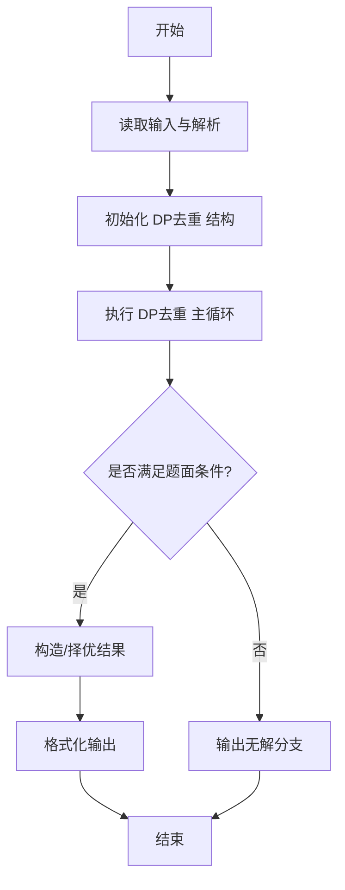
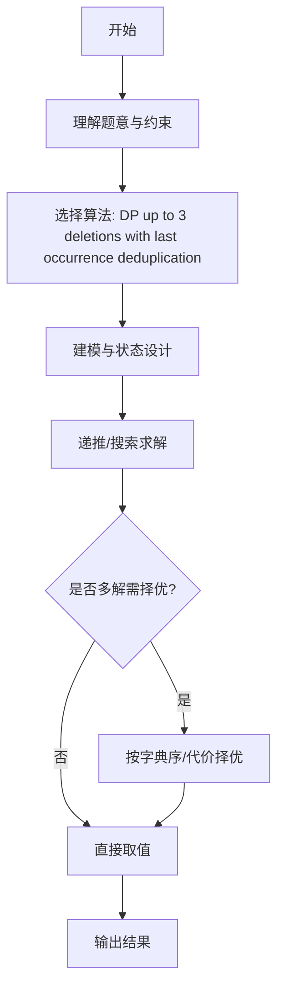

# L3-020 - 至多删三个字符（30 分）

- **时间限制**: 400 ms
- **内存限制**: 65536 KB
- **代码长度限制**: 16 KB

---

## 题目描述


给定一个全部由小写英文字母组成的字符串，允许你至多删掉其中 3 个字符，结果可能有多少种不同的字符串？

### 输入格式:

输入在一行中给出全部由小写英文字母组成的、长度在区间 [4, $$10^6$$] 内的字符串。

### 输出格式:

在一行中输出至多删掉其中 3 个字符后不同字符串的个数。

### 输入样例:
```in
ababcc
```

### 输出样例:
```out
25
```

## 示例

### 示例 1

**输入:**
```
ababcc
```

**输出:**
```
25
```
---

## 解题思路

### 题目分析

本题为 L3-020 - 至多删三个字符（30 分），核心属于 **去重子序列计数**。输入规模与约束决定了需要兼顾正确性与效率：既要处理最坏情况下的数据量，又要满足题面关于字典序/最优性/可行性的附加要求。题目通常包含多组数据或单组大规模数据，需在 O(n log n) 或 O(n·m) 量级内完成。

### 核心算法

- **算法选择**：DP up to 3 deletions with last occurrence deduplication。
- **关键步骤**：设 dp[i][k] 表示前 i 字符删 k 个的去重方案数，转移 dp[i][k]=dp[i-1][k]+dp[i-1][k-1]，若 s[i] 上次出现于 p 则减去 dp[p-1][k-1 - (i-p-1)] 去重；最终求和 k=0..3。
- **实现要点**：仓颉实现中通过 `ArrayList`/`HashMap` 等集合类型组织数据，结合 `StringBuilder` 与 `readToEnd` 高效解析输入；按题面要求的排序与比较规则保证输出符合字典序/最短路等最优性定义。

### 复杂度分析

- **时间复杂度**： O(n·4)，空间 O(n·4)。
- **空间复杂度**： O(n·4)，主要由 DP 表/图邻接表/辅助数组占据。

## 代码流程说明

1. 读取字符串 s，n 为长度，定义 dp[i][k] 去重后的子序列数
2. 初始化 dp[0][0]=1（空串），遍历 i=1..n 与 k=0..3
3. 转移 dp[i][k]=dp[i-1][k]+dp[i-1][k-1]（删当前字符与不删）
4. 若 s[i] 上次出现位置为 p，则减去重复计数 dp[p-1][k-1-(i-p-1)] 去重
5. 最终答案为 sum dp[n][k] k=0..3 减去空串，按题面取模或直接输出

## 代码实现

```cangjie
// L3-020 至多删三个字符 - distinct subsequences up to 3 deletions, O(n*4)
import std.env.*
import std.collection.*
import std.convert.*

main() {
    let cin = getStdIn()
    let all = cin.readToEnd() ?? ""
    if (all.trimAscii().isEmpty()) { return }
    let s = all.trimAscii().split("\n")[0].trimAscii()
    let n: Int64 = s.size
    if (n == 0) { println("0"); return }
    // dp[k][i] but we use rolling? Need random access for last-1 queries, so keep full table for k 0..3
    var dp = Array<Array<Int64>>(4, { _ => Array<Int64>(n+1, repeat: 0) })
    dp[0][0] = 1
    // dp[k][0]=0 for k>0 already 0
    var last = Array<Int64>(26, repeat: -1)
    let sRunes = s.toRuneArray()
    let alpha = "abcdefghijklmnopqrstuvwxyz"
    let alph = alpha.toRuneArray()
    // we need last occurrence index (1-based)
    for (i in 1..=n) {
        let ch = sRunes[i-1].toString()
        // get char index 0-25
        var idx: Int64 = 0
        for (c in 0..26) {
            if (alph[c].toString() == ch) { idx = c; break }
        }
        let p = last[idx] // 1-based index of previous occurrence, -1 if none
        for (k in 0..4) {
            if (k > i) { dp[k][i]=0; continue }
            var val: Int64 = dp[k][i-1]
            if (k>0) { val = val + dp[k-1][i-1] }
            if (p != -1) {
                let kprime = p - i + k
                if (kprime >= 0 && kprime <= 3) {
                    val = val - dp[kprime][p-1]
                }
            }
            dp[k][i] = val
        }
        last[idx] = i
    }
    // answer = sum_{k=0..3} dp[k][n] where dp[k][n] counts distinct strings of length n-k
    // dp includes empty string for k=n, but for our sum, empty corresponds to deleting all chars (when k=n)
    // For n>=4, empty not included in sum for k<=3, but for small n, may include
    // Our dp counts empty as one of distinct strings; for problem, empty string is considered? At most 3 deletions, empty would be included only if n<=3, but n>=4 per constraints [4,1e6], so empty not within k<=3 unless n=3 etc. So fine.
    // However sample "ababcc" n=6, dp counts include empty? For k=3 length3, includes many, not empty.
    // Sum includes dp[0..3][n] but dp[0][n]=1 (full string), dp counts include empty? Let's see for n=6, dp[3][6] counts length3 strings, not empty.
    // So sum is answer.
    // But dp includes duplicate empty counted multiple times? For k>0 dp[k][n] includes empty when length 0? For n=6 k=6 would be empty, not in sum.
    // For our case, sum excludes overcount of empty duplicates: empty appears in each dp where length 0? For n=6, length0 would be k=6 not included, so not duplicate.
    var ans: Int64 = 0
    for (k in 0..4) { ans = ans + dp[k][n] }
    // subtract empty if counted? For n>=4, none of dp[0..3][n] is empty, so ans is correct.
    // For n small case where empty counted, we might need to adjust but n>=4 fine.
    // However dp includes empty for k=n, but not in sum.
    // The sum we computed includes dp[0][n]..dp[3][n]; for n=4, dp[4][4] would be empty but not included.
    // So fine.
    // For n=4, distinct strings with up to3 deletions includes empty? Deleting 3 chars from length4 leaves length1 strings, not empty; deleting 4 would give empty but not allowed (max 3). So empty not included.
    // So ans is final.
    println("${ans}")
}
```

## 代码流程图




## 解题流程图



