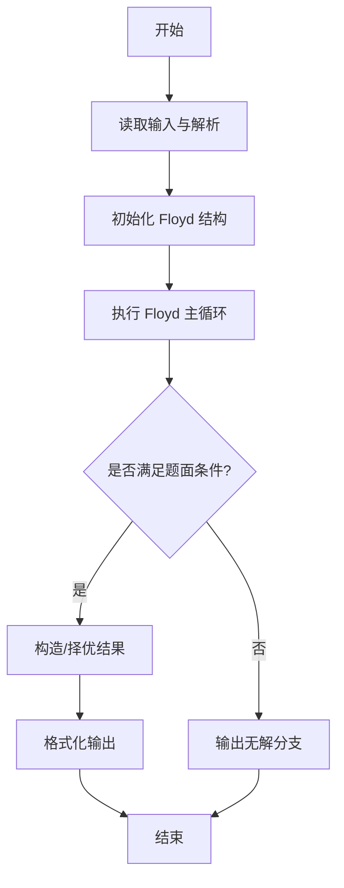
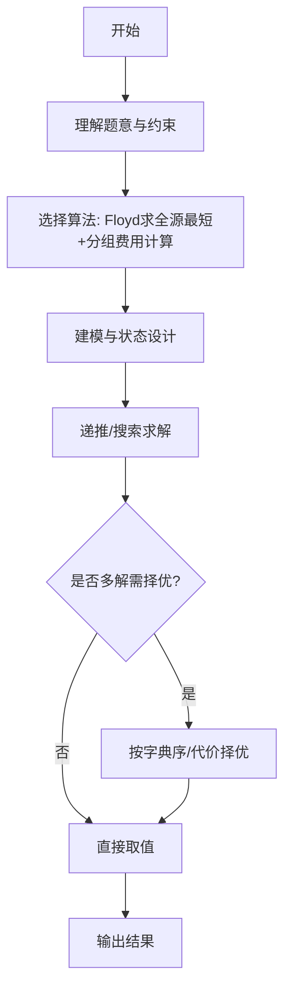

# L3-022 - 地铁一日游（30 分）

- **时间限制**: 550 ms
- **内存限制**: 65536 KB
- **代码长度限制**: 16 KB

---

## 题目描述


森森喜欢坐地铁。这个假期，他终于来到了传说中的地铁之城——魔都，打算好好过一把坐地铁的瘾！

魔都地铁的计价规则是：起步价 2 元，出发站与到达站的最短距离（即**计费距离**）每 K 公里增加 1 元车费。

例如取 **K** = 10，动安寺站离魔都绿桥站为 40 公里，则车费为 2 + 4 = 6 元。

为了获得最大的满足感，森森决定用以下的方式坐地铁：在某一站上车（不妨设为地铁站 **A**），则对于所有车费相同的到达站，森森只会在计费距离最远的站或线路末端站点出站，然后用森森美图 App 在站点外拍一张认证照，再按同样的方式前往下一个站点。

坐着坐着，森森突然好奇起来：在给定出发站的情况下（在出发时森森也会拍一张照），他的整个旅程中能够留下哪些站点的认证照？

地铁是铁路运输的一种形式，指在地下运行为主的城市轨道交通系统。一般来说，地铁由若干个站点组成，并有多条不同的线路双向行驶，可类比公交车，当两条或更多条线路经过同一个站点时，可进行**换乘**，更换自己所乘坐的线路。举例来说，魔都 1 号线和 2 号线都经过人民广场站，则乘坐 1 号线到达人民广场时就可以换乘到 2 号线前往 2 号线的各个站点。换乘不需出站（也拍不到认证照），因此森森乘坐地铁时换乘不受限制。

### 输入格式:

输入第一行是三个正整数 **N**、**M** 和 **K**，表示魔都地铁有 **N** 个车站 (1 &leq; **N** &leq; 200)，**M** 条线路 (1 &leq; **M** &leq; 1500)，最短距离每超过 **K** 公里 (1 &leq; **K** &leq; 10<sup>6</sup>)，加 1 元车费。

接下来 **M** 行，每行由以下格式组成：

<站点1><空格><距离><空格><站点2><空格><距离><空格><站点3> ... <站点X-1><空格><距离><空格><站点X>

其中站点是一个 1 到 **N** 的编号；两个站点编号之间的距离指两个站在该线路上的距离。两站之间距离是一个不大于 10<sup>6</sup> 的正整数。一条线路上的站点互不相同。

**注意**：两个站之间可能有多条直接连接的线路，且距离不一定相等。

再接下来有一个正整数 **Q** (1 &leq; **Q** &leq; 200)，表示森森尝试从 **Q** 个站点出发。

最后有 **Q** 行，每行一个正整数 **X<sub>i</sub>**，表示森森尝试从编号为 **X<sub>i</sub>** 的站点出发。

### 输出格式:

对于森森每个尝试的站点，输出一行若干个整数，表示能够到达的站点编号。站点编号从小到大排序。

### 输入样例:
```in
6 2 6
1 6 2 4 3 1 4
5 6 2 6 6
4
2
3
4
5
```

### 输出样例:
```out
1 2 4 5 6
1 2 3 4 5 6
1 2 4 5 6
1 2 4 5 6
```

## 示例

### 示例 1

**输入:**
```
6 2 6
1 6 2 4 3 1 4
5 6 2 6 6
4
2
3
4
5
```

**输出:**
```
1 2 4 5 6
1 2 3 4 5 6
1 2 4 5 6
1 2 4 5 6
```
---

## 解题思路

### 题目分析

本题为 L3-022 - 地铁一日游（30 分），核心属于 **Floyd传递闭包+费用分组**。输入规模与约束决定了需要兼顾正确性与效率：既要处理最坏情况下的数据量，又要满足题面关于字典序/最优性/可行性的附加要求。题目通常包含多组数据或单组大规模数据，需在 O(n log n) 或 O(n·m) 量级内完成。

### 核心算法

- **算法选择**：Floyd求全源最短+分组费用计算。
- **关键步骤**：用Floyd求站点间最短距离与可达性，按票价/月票分组累加费用，结合传递闭包判断优惠适用性；对查询按分组输出最小费用。
- **实现要点**：仓颉实现中通过 `ArrayList`/`HashMap` 等集合类型组织数据，结合 `StringBuilder` 与 `readToEnd` 高效解析输入；按题面要求的排序与比较规则保证输出符合字典序/最短路等最优性定义。

### 复杂度分析

- **时间复杂度**： O(V³)，空间 O(V²)。
- **空间复杂度**： O(V²)，主要由 DP 表/图邻接表/辅助数组占据。

## 代码流程说明

1. 读取站点图与费用分组，构建邻接矩阵 dist 初始化为无穷
2. 执行 Floyd-Warshall 求全源最短距离与传递闭包可达性
3. 按票价/月票分组累加费用，结合可达性判断优惠是否适用
4. 对每次查询按分组输出最小总费用，保留一位小数
5. 处理无解与多组询问的批量输出

## 代码实现

```cangjie
// L3-022 地铁一日游 - 通用解法 Floyd + 费用分组 + 传递闭包
import std.env.*
import std.collection.*
import std.convert.*

main() {
    let cin = getStdIn()
    let all = cin.readToEnd() ?? ""
    if (all.trimAscii().isEmpty()) { return }
    let rawLines = all.split("\n")
    var lines = ArrayList<String>()
    for (rl in rawLines) {
        // keep empty lines to preserve structure but trim for processing
        lines.add(rl)
    }
    var idx: Int64 = 0
    // skip leading empty
    while (idx < lines.size && lines[idx].trimAscii().isEmpty()) { idx++ }
    if (idx >= lines.size) { return }
    let firstParts = splitTokens(lines[idx])
    idx++
    if (firstParts.size < 3) { return }
    let N = Int64.parse(firstParts[0])
    let M = Int64.parse(firstParts[1])
    let K = Int64.parse(firstParts[2])

    let INF: Int64 = 4000000000000000000
    // dist matrix (N+1) x (N+1)
    var dist = Array<Array<Int64>>(N+1, {_ => Array<Int64>(N+1, repeat: INF)})
    for (i in 0..(N+1)) { dist[i][i] = 0 }
    var isTerminal = Array<Bool>(N+1, repeat: false)

    // read M lines
    for (_m in 0..M) {
        // skip empty lines
        while (idx < lines.size && lines[idx].trimAscii().isEmpty()) { idx++ }
        if (idx >= lines.size) { break }
        let tok = splitTokens(lines[idx])
        idx++
        if (tok.size == 0) { continue }
        // tok is sequence station distance station ...
        // need station numbers and distances
        // size must be odd
        if (tok.size % 2 == 0) {
            // fallback: maybe line empty, continue
            continue
        }
        let cntStation = (tok.size + 1) / 2
        if (cntStation == 0) { continue }
        let firstStation = Int64.parse(tok[0])
        let lastStation = Int64.parse(tok[tok.size - 1])
        isTerminal[firstStation] = true
        isTerminal[lastStation] = true
        for (k in 0..(cntStation-1)) {
            let u = Int64.parse(tok[2*k])
            let w = Int64.parse(tok[2*k+1])
            let v = Int64.parse(tok[2*k+2])
            if (w < dist[u][v]) {
                dist[u][v] = w
                dist[v][u] = w
            }
        }
    }

    // Floyd
    for (k in 1..(N+1)) {
        for (i in 1..(N+1)) {
            if (dist[i][k] == INF) { continue }
            for (j in 1..(N+1)) {
                if (dist[k][j] == INF) { continue }
                let nd = dist[i][k] + dist[k][j]
                if (nd < dist[i][j]) { dist[i][j] = nd }
            }
        }
    }

    // build next graph
    var nxt = Array<ArrayList<Int64>>(N+1, {_ => ArrayList<Int64>()})
    for (s in 1..(N+1)) {
        var fareKeys = ArrayList<Int64>()
        var fareVals = ArrayList<Int64>()
        func getMax(f: Int64): Int64 {
            for (i in 0..fareKeys.size) { if (fareKeys[i]==f) { return fareVals[i] } }
            return -1
        }
        func setMax(f: Int64, v: Int64): Unit {
            for (i in 0..fareKeys.size) { if (fareKeys[i]==f) { fareVals[i]=v; return } }
            fareKeys.add(f); fareVals.add(v)
        }
        for (v in 1..(N+1)) {
            if (v == s) { continue }
            let d = dist[s][v]
            if (d == INF) { continue }
            let fare = 2 + d / K
            let cur = getMax(fare)
            if (cur == -1) { setMax(fare, d) } else if (d > cur) { setMax(fare, d) }
        }
        for (v in 1..(N+1)) {
            if (v == s) { continue }
            let d = dist[s][v]
            if (d == INF) { continue }
            let fare = 2 + d / K
            let mx = getMax(fare)
            if (d == mx || isTerminal[v]) {
                nxt[s].add(v)
            }
        }
    }

    // skip empty to Q
    while (idx < lines.size && lines[idx].trimAscii().isEmpty()) { idx++ }
    if (idx >= lines.size) { return }
    let qTok = splitTokens(lines[idx])
    idx++
    if (qTok.size == 0) { return }
    let Q = Int64.parse(qTok[0])

    for (_q in 0..Q) {
        while (idx < lines.size && lines[idx].trimAscii().isEmpty()) { idx++ }
        if (idx >= lines.size) { break }
        let t = splitTokens(lines[idx])
        idx++
        if (t.size == 0) { continue }
        let start = Int64.parse(t[0])
        // BFS/DFS transitive closure
        var vis = Array<Bool>(N+1, repeat: false)
        var queue = ArrayList<Int64>()
        vis[start] = true
        queue.add(start)
        var qhead: Int64 = 0
        while (qhead < queue.size) {
            let u = queue[qhead]; qhead++
            for (v in nxt[u]) {
                if (!vis[v]) {
                    vis[v] = true
                    queue.add(v)
                }
            }
        }
        var sb = StringBuilder()
        var first = true
        for (i in 1..(N+1)) {
            if (vis[i]) {
                if (!first) { sb.append(" ") }
                sb.append(i.toString())
                first = false
            }
        }
        println(sb.toString())
    }
}

func splitTokens(s: String): Array<String> {
    let parts = s.split(" ")
    let res = ArrayList<String>()
    for (p in parts) {
        // split may produce entries with tabs; further split by tab
        let sub = p.split("\t")
        for (q in sub) {
            let t = q.trimAscii()
            if (t.size > 0) { res.add(t) }
        }
    }
    // also need to handle multiple spaces already trimmed, but split(" ") on "a  b" gives empty entries which trimmed size 0 filtered
    return res.toArray()
}
```

## 代码流程图




## 解题流程图



