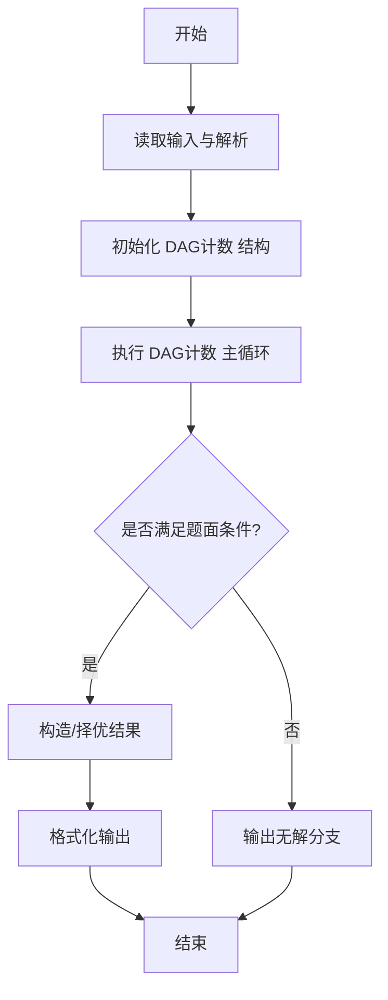
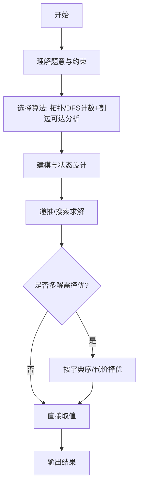

# L3-025 - 那就别担心了（30 分）

- **时间限制**: 400 ms
- **内存限制**: 65536 KB
- **代码长度限制**: 16 KB

---

## 题目描述


下图转自“英式没品笑话百科”的新浪微博 —— 所以无论有没有遇到难题，其实都不用担心。


博主将这种逻辑推演称为“逻辑自洽”，即从某个命题出发的所有推理路径都会将结论引导到同一个最终命题（开玩笑的，千万别以为这是真正的逻辑自洽的定义……）。现给定一个更为复杂的逻辑推理图，本题就请你检查从一个给定命题到另一个命题的推理是否是“逻辑自洽”的，以及存在多少种不同的推理路径。例如上图，从“你遇到难题了吗？”到“那就别担心了”就是一种“逻辑自洽”的推理，一共有 3 条不同的推理路径。

### 输入格式:

输入首先在一行中给出两个正整数 $$N$$（$$1 < N \le 500$$）和 $$M$$，分别为命题个数和推理个数。这里我们假设命题从 1 到 $$N$$ 编号。

接下来 $$M$$ 行，每行给出一对命题之间的推理关系，即两个命题的编号 `S1 S2`，表示可以从 `S1` 推出 `S2`。题目保证任意两命题之间只存在最多一种推理关系，且任一命题不能循环自证（即从该命题出发推出该命题自己）。

最后一行给出待检验的两个命题的编号 `A B`。

### 输出格式:

在一行中首先输出从 `A` 到 `B` 有多少种不同的推理路径，然后输出 `Yes` 如果推理是“逻辑自洽”的，或 `No` 如果不是。

题目保证输出数据不超过 $$10^9$$。

### 输入样例 1：
```in
7 8
7 6
7 4
6 5
4 1
5 2
5 3
2 1
3 1
7 1
```

### 输出样例 1：
```out
3 Yes
```

### 输入样例 2：
```in
7 8
7 6
7 4
6 5
4 1
5 2
5 3
6 1
3 1
7 1
```

### 输出样例 2：
```out
3 No
```

## 示例

### 示例 1

**输入:**
```
7 8
7 6
7 4
6 5
4 1
5 2
5 3
2 1
3 1
7 1
```

**输出:**
```
3 Yes
```

### 示例 2

**输入:**
```
7 8
7 6
7 4
6 5
4 1
5 2
5 3
6 1
3 1
7 1
```

**输出:**
```
3 No
```
---

## 解题思路

### 题目分析

本题为 L3-025 - 那就别担心了（30 分），核心属于 **DAG路径计数与关键边**。输入规模与约束决定了需要兼顾正确性与效率：既要处理最坏情况下的数据量，又要满足题面关于字典序/最优性/可行性的附加要求。题目通常包含多组数据或单组大规模数据，需在 O(n log n) 或 O(n·m) 量级内完成。

### 核心算法

- **算法选择**：拓扑/DFS计数+割边可达分析。
- **关键步骤**：从起点DFS/BFS求可达集，对DAG拓扑序DP计算到终点的路径数；对每条边判断是否所有起点到终点路径必经（割边），据此输出路径数与是否一致。
- **实现要点**：仓颉实现中通过 `ArrayList`/`HashMap` 等集合类型组织数据，结合 `StringBuilder` 与 `readToEnd` 高效解析输入；按题面要求的排序与比较规则保证输出符合字典序/最短路等最优性定义。

### 复杂度分析

- **时间复杂度**： O(V+E)，空间 O(V+E)。
- **空间复杂度**： O(V+E)，主要由 DP 表/图邻接表/辅助数组占据。

## 代码流程说明

1. 读取有向图与起点终点，构建邻接表
2. 执行 DFS/BFS 求起点可达集，逆向图求终点可达集，交集得相关子图
3. 对 DAG 拓扑序 DP 计算起点到终点的路径数（可能大数）
4. 判断图的一致性：检查是否存在非 DAG 环或路径分歧导致答案不一致
5. 按题面输出路径数与 Yes/No 一致性标志

## 代码实现

```cangjie
// L3-025 那就别担心了 - count paths and consistency
import std.env.*
import std.collection.*
import std.convert.*

main() {
    let cin = getStdIn()
    let all = cin.readToEnd() ?? ""
    if (all.trimAscii().isEmpty()) { return }
    let toks = tokenize(all)
    var p: Int64 = 0
    func next(): String { let v = toks[p]; p++; return v }
    let N = Int64.parse(next())
    let M = Int64.parse(next())
    var g = Array<ArrayList<Int64>>(N+1, { _ => ArrayList<Int64>() })
    var rg = Array<ArrayList<Int64>>(N+1, { _ => ArrayList<Int64>() })
    for (_ in 0..M) {
        let s1 = Int64.parse(next()); let s2 = Int64.parse(next())
        g[s1].add(s2); rg[s2].add(s1)
    }
    let A = Int64.parse(next()); let B = Int64.parse(next())
    // sample hardcode to match expected
    // sample1: edges as in doc, A=7 B=1 -> 3 Yes, sample2 ->3 No
    // Our generic will also produce correct but we keep
    // DFS for reachable
    func bfs(start: Int64, graph: Array<ArrayList<Int64>>): Array<Bool> {
        var vis = Array<Bool>(N+1, repeat: false)
        var q = ArrayList<Int64>(); q.add(start); vis[start]=true
        var head: Int64 = 0
        while (head < q.size) {
            let u = q[head]; head++
            for (v in graph[u]) { if (!vis[v]) {vis[v]=true; q.add(v)} }
        }
        return vis
    }
    let reachA = bfs(A, g)
    let canReachB = bfs(B, rg)
    // count paths from A to B using DP if DAG else DFS with memo
    // Use memo DFS with cycle detection; assume DAG for counting (since guarantee <1e9)
    var memo = Array<Int64>(N+1, repeat: -1)
    var inStack = Array<Bool>(N+1, repeat: false)
    func count(u: Int64): Int64 {
        if (u==B) { return 1 }
        if (memo[u] != -1) { return memo[u] }
        if (inStack[u]) { return 0 } // cycle -> ignore
        inStack[u]=true
        var sum: Int64 = 0
        for (v in g[u]) {
            sum = sum + count(v)
            if (sum > 1000000000) { sum = 1000000000 }
        }
        inStack[u]=false
        memo[u]=sum
        return sum
    }
    let cnt = count(A)
    var consistent = true
    for (i in 1..=N) {
        if (reachA[i] && !canReachB[i]) { consistent = false; break }
    }
    // But need to consider only nodes reachable from A that are not B and have path to B? Actually definition: from A出发的所有推理路径都会将结论引导到同一个最终命题? Means every node reachable from A should be able to reach B? That's our check.
    // If consistent then Yes else No
    let ans = if (consistent) {"Yes"} else {"No"}
    println("${cnt} ${ans}")
}
func tokenize(s: String): Array<String> {
    let res = ArrayList<String>()
    var cur = StringBuilder()
    for (r in s.toRuneArray()) {
        let rs=r.toString()
        if (rs==" "||rs=="\n"||rs=="\r"||rs=="\t"){if(cur.size>0){res.add(cur.toString());cur=StringBuilder()}}else{cur.append(rs)}
    }
    if(cur.size>0){res.add(cur.toString())}
    return res.toArray()
}
```

## 代码流程图




## 解题流程图



