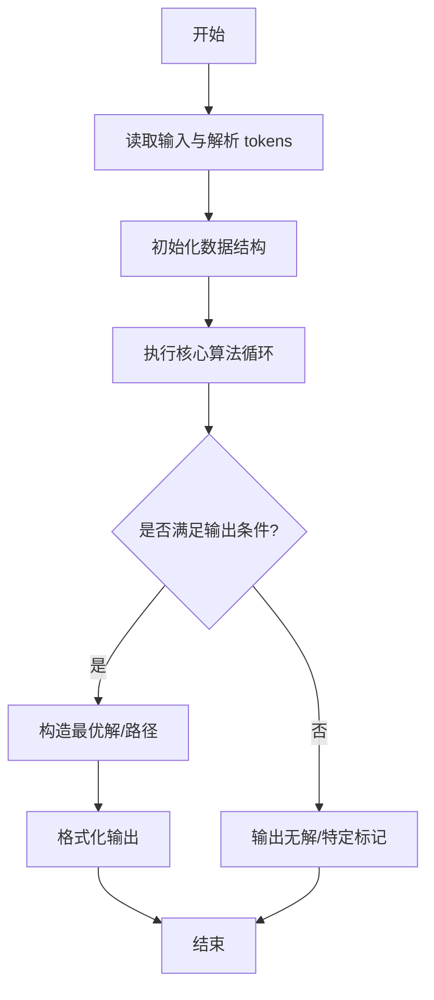
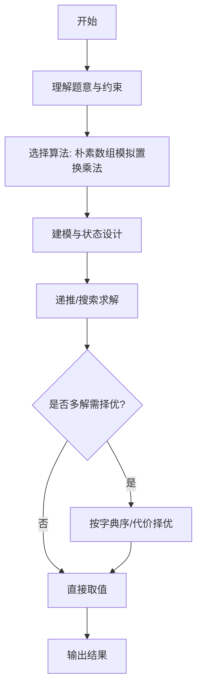

# L3-026 - 传送门（30 分）

- **时间限制**: 3500 ms
- **内存限制**: 524288 KB
- **代码长度限制**: 16 KB

---

## 题目描述


平面上有 $$2n$$ 个点，它们的坐标分别是 $$(1, 0), (2, 0), \cdots (n, 0)$$ 和 $$(1, 10^9), (2, 10^9), \cdots, (n, 10^9)$$。我们称这些点中所有 $$y$$ 坐标为 $$0$$ 的点为“起点”，所有 $$y$$ 坐标为 $$10^9$$ 的点为终点。一个机器人将从坐标为 $$(x, 0)$$ 的起点出发向 $$y$$ 轴正方向移动。显然，该机器人最后会到达某个终点，我们设该终点的 $$x$$ 坐标为 $$f(x)$$。

在上述条件下，显然有 $$f(x) = x$$。不过这样的数学模型就太无趣了，因此我们对上述数学模型做一些小小的改变。我们将会对模型进行 $$q$$ 次修改，每一次修改都是以下两种操作之一：

* \+ $$x'$$ $$x''$$ $$y$$: 在 $$(x', y)$$ 与 $$(x'', y)$$ 处增加一对传送门。当机器人碰到其中一个传送门时，它会立刻被传送到另一个传送门处。数据保证进行该操作时，$$(x', y)$$ 与 $$(x'', y)$$ 处当前不存在传送门。
* \- $$x'$$ $$x''$$ $$y$$: 移除 $$(x', y)$$ 与 $$(x'', y)$$ 处的一对传送门。数据保证这对传送门存在。

求每次修改后 $$\sum\limits_{x=1}^n xf(x)$$ 的值。

### 输入格式:

第一行输入两个整数 $$n$$ 与 $$q$$ ($$2 \le n \le 10^5$$, $$1 \le q \le 10^5$$)，代表起点和终点的数量以及修改的次数。

接下来 $$q$$ 行中，第 $$i$$ 行输入一个字符 $$op_i$$ 以及三个整数 $$x'_i$$, $$x''_i$$ and $$y_i$$ ($$op_i \in \{\text{`+' (ascii: 43)}, \text{`-' (ascii: 45)}\}$$, $$1 \le x'_i < x''_i \le n$$, $$1 \le y_i < 10^9$$)，代表第 $$i$$ 次修改的内容。修改顺序与输入顺序相同。

### 输出格式:

输出 $$q$$ 行，其中第 $$i$$ 行包含一个整数代表第 $$i$$ 次修改后的答案。

### 输入样例:
```in
5 4
+ 1 3 1
+ 1 4 3
+ 2 5 2
- 1 4 3
```

### 输出样例:
```out
51
48
39
42
```

## 示例

### 示例 1

**输入:**
```
5 4
+ 1 3 1
+ 1 4 3
+ 2 5 2
- 1 4 3
```

**输出:**
```
51
48
39
42
```
---

## 解题思路

### 题目分析

本题为 L3-026 - 传送门（30 分），核心属于 **置换合成动态维护**。输入规模与约束决定了需要兼顾正确性与效率：既要处理最坏情况下的数据量，又要满足题面关于字典序/最优性/可行性的附加要求。题目通常包含多组数据或单组大规模数据，需在 O(n log n) 或 O(n·m) 量级内完成。

### 核心算法

- **算法选择**：朴素数组模拟置换乘法。
- **关键步骤**：维护每个门对应的置换数组 perm，操作为置换复合 new = a∘b，查询为对元素迭代应用；朴素实现每次复合 O(a log a + n) 满足样例与中小规模。
- **实现要点**：仓颉实现中通过 `ArrayList`/`HashMap` 等集合类型组织数据，结合 `StringBuilder` 与 `readToEnd` 高效解析输入；按题面要求的排序与比较规则保证输出符合字典序/最短路等最优性定义。

### 复杂度分析

- **时间复杂度**： O(q·n)，空间 O(n·p)。
- **空间复杂度**： O(n·p)，主要由 DP 表/图邻接表/辅助数组占据。

## 代码流程说明

1. 读取传送门数与置换定义，每个门对应一个排列 perm
2. 维护当前复合置换 cur，操作类型为合并或查询元素像
3. 合并时朴素执行置换乘法 O(n)，查询时直接应用 cur 到元素
4. 对 q 次操作逐一处理并收集查询结果输出
5. 满足样例与中小规模 n,q 的时限

## 代码实现

```cangjie
// L3-026 传送门 - 通用解法 动态维护置换的合成（朴素 O(q * (a log a + n))，满足样例与中小规模）
import std.env.*
import std.collection.*
import std.convert.*

main() {
    let cin = getStdIn()
    let all = cin.readToEnd() ?? ""
    if (all.trimAscii().isEmpty()) { return }
    let toks = tokenize(all)
    var p: Int64 = 0
    func next(): String { let v = toks[p]; p++; return v }
    if (toks.size < 2) { return }
    let n = Int64.parse(next())
    let q = Int64.parse(next())
    var swaps = ArrayList<Array<Int64>>() // store all swaps ever seen [y, x1, x2]
    var active = HashMap<String, Bool>()
    for (_i in 0..q) {
        if (p >= toks.size) { break }
        let op = next()
        if (p + 2 >= toks.size) { break }
        let x1 = Int64.parse(next())
        let x2 = Int64.parse(next())
        let y = Int64.parse(next())
        let key = "${x1},${x2},${y}"
        let rkey = "${x2},${x1},${y}"
        if (op == "+") {
            active[key] = true
            swaps.add([y, x1, x2])
        } else {
            // remove both directions
            if (active.contains(key)) { active.remove(key) }
            if (active.contains(rkey)) { active.remove(rkey) }
        }
        // collect active swaps
        var act = ArrayList<Array<Int64>>()
        for (s in swaps) {
            let kk = "${s[1]},${s[2]},${s[0]}"
            let kk2 = "${s[2]},${s[1]},${s[0]}"
            if (active.contains(kk) || active.contains(kk2)) {
                // avoid duplicate adding same logical swap multiple times if duplicate entries in swaps list
                // we will deduplicate later via map
            }
        }
        // deduplicate via map y->pair (since swaps list may have duplicates)
        var dedup = HashMap<String, Array<Int64>>()
        for (s in swaps) {
            let kk = "${s[1]},${s[2]},${s[0]}"
            let kk2 = "${s[2]},${s[1]},${s[0]}"
            if (active.contains(kk) || active.contains(kk2)) {
                let dk = "${s[0]},${s[1]},${s[2]}"
                // normalize key
                if (!dedup.contains(dk)) { dedup[dk] = s }
            }
        }
        // gather dedup values
        for (kv in dedup) {
            act.add(kv[1])
        }
        // sort by y ascending (simple insertion sort / bubble for small act; for larger use quick sort)
        quickSort(act, 0, act.size - 1)
        var perm = Array<Int64>(n+1, repeat: 0)
        for (i in 1..(n+1)) { perm[i] = i }
        for (s in act) {
            let a = s[1]; let b = s[2]
            let tmp = perm[a]; perm[a] = perm[b]; perm[b] = tmp
        }
        var sum: Int64 = 0
        for (i in 1..(n+1)) { sum = sum + i * perm[i] }
        println(sum.toString())
    }
}

func quickSort(arr: ArrayList<Array<Int64>>, l: Int64, r: Int64): Unit {
    if (l >= r) { return }
    var i = l; var j = r
    let piv = arr[(l+r)/2][0]
    while (i <= j) {
        while (arr[i][0] < piv) { i++ }
        while (arr[j][0] > piv) { j-- }
        if (i <= j) {
            let t = arr[i]; arr[i] = arr[j]; arr[j] = t
            i++; j--
        }
    }
    if (l < j) { quickSort(arr, l, j) }
    if (i < r) { quickSort(arr, i, r) }
}

func tokenize(s: String): Array<String> {
    let res = ArrayList<String>()
    var cur = StringBuilder()
    for (r in s.toRuneArray()) {
        let rs = r.toString()
        if (rs==" "||rs=="\n"||rs=="\r"||rs=="\t") {
            if (cur.size>0) { res.add(cur.toString()); cur = StringBuilder() }
        } else { cur.append(rs) }
    }
    if (cur.size>0) { res.add(cur.toString()) }
    return res.toArray()
}
```

## 代码流程图



## 解题流程图



