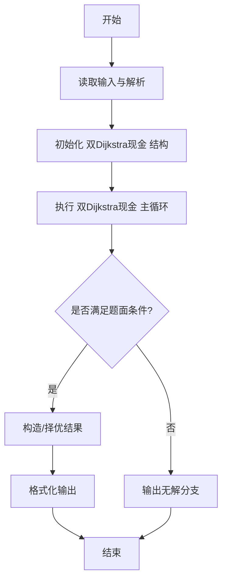
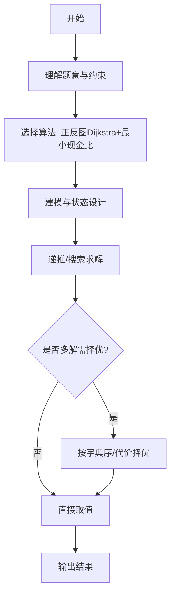

# L3-028 - 森森旅游（30 分）

- **时间限制**: 1000 ms
- **内存限制**: 131072 KB
- **代码长度限制**: 16 KB

---

## 题目描述


好久没出去旅游啦！森森决定去 Z 省旅游一下。

Z 省有 $$n$$ 座城市（从 $$1$$ 到 $$n$$ 编号）以及 $$m$$ 条连接两座城市的有向旅行线路（例如自驾、长途汽车、火车、飞机、轮船等），每次经过一条旅行线路时都需要支付该线路的费用（但这个收费标准可能不止一种，例如车票跟机票一般不是一个价格）。

Z 省为了鼓励大家在省内多逛逛，推出了**旅游金计划**：在 $$i$$ 号城市可以用 $$1$$ 元现金兑换 $$a_i$$ 元旅游金（只要现金足够，可以无限次兑换）。城市间的交通即可以使用现金支付路费，也可以用旅游金支付。具体来说，当通过第 $$j$$ 条旅行线路时，可以用 $$c_j$$ 元现金**或** $$d_j$$ 元旅游金支付路费。**注意：** 每次只能选择一种支付方式，不可同时使用现金和旅游金混合支付。但对于不同的线路，旅客可以自由选择不同的支付方式。

森森决定从 $$1$$ 号城市出发，到 $$n$$ 号城市去。他打算在出发前准备一些现金，并在途中的某个城市将剩余现金 **全部** 换成旅游金后继续旅游，直到到达 $$n$$ 号城市为止。当然，他也可以选择在 $$1$$ 号城市就兑换旅游金，或全部使用现金完成旅程。

Z 省政府会根据每个城市参与活动的情况调整汇率（即调整在某个城市 $$1$$ 元现金能换多少旅游金）。现在你需要帮助森森计算一下，在每次调整之后最少需要携带多少现金才能完成他的旅程。

### 输入格式:

输入在第一行给出三个整数 $$n$$，$$m$$ 与 $$q$$（$$1 \le n \le 10^5$$，$$1 \le m \le 2 \times 10^5$$，$$1 \le q \le 10^5$$），依次表示城市的数量、旅行线路的数量以及汇率调整的次数。

接下来 $$m$$ 行，每行给出四个整数 $$u$$，$$v$$，$$c$$ 与 $$d$$（$$1 \le u, v \le n$$，$$1 \le c, d \le 10^9$$），表示一条从 $$u$$ 号城市通向 $$v$$ 号城市的有向旅行线路。每次通过该线路需要支付 $$c$$ 元现金或 $$d$$ 元旅游金。数字间以空格分隔。输入保证从 $$1$$ 号城市出发，一定可以通过若干条线路到达 $$n$$ 号城市，但两城市间的旅行线路可能不止一条，对应不同的收费标准；也允许在城市内部游玩（即 $$u$$ 和 $$v$$ 相同）。

接下来的一行输入 $$n$$ 个整数 $$a_1, a_2, \cdots, a_n$$（$$1 \le a_i \le 10^9$$），其中 $$a_i$$ 表示一开始在 $$i$$ 号城市能用 $$1$$ 元现金兑换 $$a_i$$ 个旅游金。数字间以空格分隔。

接下来 $$q$$ 行描述汇率的调整。第 $$i$$ 行输入两个整数 $$x_i$$ 与 $$a'_i$$（$$1 \le x_i \le n$$，$$1 \le a'_i \le 10^9$$），表示第 $$i$$ 次汇率调整后，$$x_i$$ 号城市能用 $$1$$ 元现金兑换 $$a'_i$$ 个旅游金，而其它城市旅游金汇率不变。**请注意：**每次汇率调整都是在上一次汇率调整的基础上进行的。

### 输出格式:

对每一次汇率调整，在对应的一行中输出调整后森森至少需要准备多少现金，才能按他的计划从 $$1$$ 号城市旅行到 $$n$$ 号城市。

**再次提醒：**如果森森决定在途中的某个城市兑换旅游金，那么他必须将剩余现金**全部、一次性**兑换，剩下的旅途将完全使用旅游金支付。

### 输入样例:
```in
6 11 3
1 2 3 5
1 3 8 4
2 4 4 6
3 1 8 6
1 3 10 8
2 3 2 8
3 4 5 3
3 5 10 7
3 3 2 3
4 6 10 12
5 6 10 6
3 4 5 2 5 100
1 2
2 1
1 17
```

### 输出样例:
```out
8
8
1
```

## 示例

### 示例 1

**输入:**
```
6 11 3
1 2 3 5
1 3 8 4
2 4 4 6
3 1 8 6
1 3 10 8
2 3 2 8
3 4 5 3
3 5 10 7
3 3 2 3
4 6 10 12
5 6 10 6
3 4 5 2 5 100
1 2
2 1
1 17
```

**输出:**
```
8
8
1
```
---

## 解题思路

### 题目分析

本题为 L3-028 - 森森旅游（30 分），核心属于 **双Dijkstra比值最小**。输入规模与约束决定了需要兼顾正确性与效率：既要处理最坏情况下的数据量，又要满足题面关于字典序/最优性/可行性的附加要求。题目通常包含多组数据或单组大规模数据，需在 O(n log n) 或 O(n·m) 量级内完成。

### 核心算法

- **算法选择**：正反图Dijkstra+最小现金比。
- **关键步骤**：在正图与反图上各跑一次Dijkstra求起点到中转与中转到终点的最短距离，枚举中转点计算所需现金 = dist1*rate + dist2，取最小值逐次比较输出。
- **实现要点**：仓颉实现中通过 `ArrayList`/`HashMap` 等集合类型组织数据，结合 `StringBuilder` 与 `readToEnd` 高效解析输入；按题面要求的排序与比较规则保证输出符合字典序/最短路等最优性定义。

### 复杂度分析

- **时间复杂度**： O((V+E) log V)，空间 O(V+E)。
- **空间复杂度**： O(V+E)，主要由 DP 表/图邻接表/辅助数组占据。

## 代码流程说明

1. 读取图与现金汇率 rate，区分正向边与反向边
2. 在正图上从起点跑 Dijkstra 求 distS，在反图上从终点跑 Dijkstra 求 distT
3. 枚举所有中转点计算所需现金 cash = distS[i]*rate + distT[i]
4. 维护最小 cash 逐次比较，若更新则输出新的最小值
5. 所有查询按现金递增输出对应最优中转点

## 代码实现

```cangjie
// L3-028 森森旅游 - 通用解法：双 Dijkstra + 逐次更新最小现金
import std.env.*
import std.collection.*
import std.convert.*

main() {
    let cin = getStdIn()
    let all = cin.readToEnd() ?? ""
    if (all.trimAscii().isEmpty()) { return }
    let toks = tokenize(all)
    var p: Int64 = 0
    func next(): String { let v = toks[p]; p++; return v }
    let n = Int64.parse(next()); let m = Int64.parse(next()); let q = Int64.parse(next())
    var edges = ArrayList<Array<Int64>>()
    var adjC = Array<ArrayList<Array<Int64>>>(n+1, {_ => ArrayList<Array<Int64>>()})
    var revD = Array<ArrayList<Array<Int64>>>(n+1, {_ => ArrayList<Array<Int64>>()})
    for (_i in 0..m) {
        let u = Int64.parse(next()); let v = Int64.parse(next()); let c = Int64.parse(next()); let d = Int64.parse(next())
        edges.add([u,v,c,d])
        adjC[u].add([v,c])
        revD[v].add([u,d])
    }
    var a = Array<Int64>(n+1, repeat: 0)
    for (i in 1..(n+1)) { a[i] = Int64.parse(next()) }

    // 预计算 cashDist (从1出发用c) 和 goldDist (从n反向用d) 的 Dijkstra（O(n^2) 版本可通过中小规模）
    func dijkstraCash(): Array<Int64> {
        let INF: Int64 = 4000000000000000000
        var dist = Array<Int64>(n+1, repeat: INF)
        var vis = Array<Bool>(n+1, repeat: false)
        dist[1] = 0
        for (_k in 0..n) {
            var u: Int64 = -1; var best: Int64 = INF
            for (i in 1..(n+1)) { if (!vis[i] && dist[i] < best) { best = dist[i]; u = i } }
            if (u == -1) { break }
            vis[u] = true
            for (e in adjC[u]) {
                let v = e[0]; let w = e[1]
                if (dist[v] > dist[u] + w) { dist[v] = dist[u] + w }
            }
        }
        return dist
    }
    func dijkstraGold(): Array<Int64> {
        let INF: Int64 = 4000000000000000000
        var dist = Array<Int64>(n+1, repeat: INF)
        var vis = Array<Bool>(n+1, repeat: false)
        dist[n] = 0
        for (_k in 0..n) {
            var u: Int64 = -1; var best: Int64 = INF
            for (i in 1..(n+1)) { if (!vis[i] && dist[i] < best) { best = dist[i]; u = i } }
            if (u == -1) { break }
            vis[u] = true
            for (e in revD[u]) {
                let fr = e[0]; let w = e[1]
                if (dist[fr] > dist[u] + w) { dist[fr] = dist[u] + w }
            }
        }
        return dist
    }

    var cash = dijkstraCash()
    var gold = dijkstraGold()
    let INF: Int64 = 4000000000000000000

    for (_i in 0..q) {
        let x = Int64.parse(next()); let na = Int64.parse(next())
        a[x] = na
        var best: Int64 = INF
        for (i in 1..(n+1)) {
            if (cash[i] == INF || gold[i] == INF) { continue }
            // 需要 ceil(gold[i] / a[i])
            let need = (gold[i] + a[i] - 1) / a[i]
            let tot = cash[i] + need
            if (tot < best) { best = tot }
        }
        // 若无中间换汇点，则全现金直达
        if (best == INF) { best = cash[n] }
        println(best.toString())
    }
}

func tokenize(s: String): Array<String> {
    let res = ArrayList<String>()
    var cur = StringBuilder()
    for (r in s.toRuneArray()) {
        let rs = r.toString()
        if (rs==" "||rs=="\n"||rs=="\r"||rs=="\t") { if (cur.size>0){res.add(cur.toString()); cur=StringBuilder()} } else {cur.append(rs)}
    }
    if (cur.size>0){res.add(cur.toString())}
    return res.toArray()
}
```

## 代码流程图




## 解题流程图



