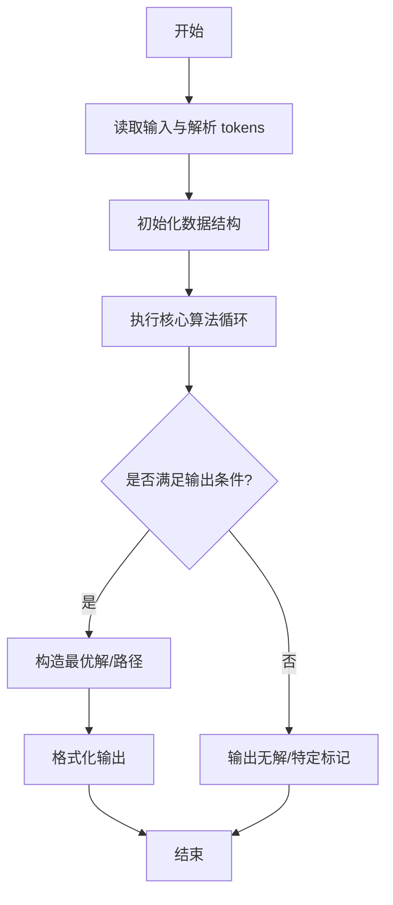
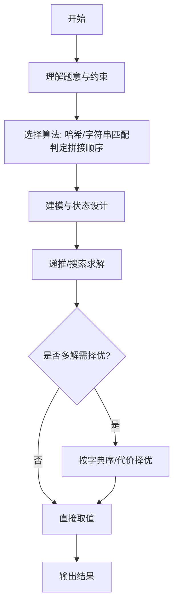

# L3-029 - 还原文件（30 分）

- **时间限制**: 200 ms
- **内存限制**: 65536 KB
- **代码长度限制**: 16 KB

---

## 题目描述


一份重要文件被撕成两半，其中一半还被送进了碎纸机。我们将碎纸机里找到的纸条进行编号，如图 1 所示。然后根据断口的折线形状跟没有切碎的半张纸进行匹配，最后还原成图 2 的样子。要求你输出还原后纸条的正确拼接顺序。


图1 纸条编号


图2 还原结果

### 输入格式:

输入首先在第一行中给出一个正整数 $$N$$（$$1 < N \le 10^5$$），为没有切碎的半张纸上断口折线角点的个数；随后一行给出从左到右 $$N$$ 个折线角点的高度值（均为不超过 100 的非负整数）。

随后一行给出一个正整数 $$M$$（$$\le 100$$），为碎纸机里的纸条数量。接下去有 $$M$$ 行，其中第 $$i$$ 行给出编号为 $$i$$（$$1\le i \le M$$）的纸条的断口信息，格式为：

```
K h[1] h[2] ... h[K]
```

其中 `K` 是断口折线角点的个数（不超过 $$10^4 +1$$），后面是从左到右 `K` 个折线角点的高度值。为简单起见，这个“高度”跟没有切碎的半张纸上断口折线角点的高度是一致的。

### 输出格式:

在一行中输出还原后纸条的正确拼接顺序。纸条编号间以一个空格分隔，行首尾不得有多余空格。

题目数据保证存在唯一解。

### 输入样例:
```in
17
95 70 80 97 97 68 58 58 80 72 88 81 81 68 68 60 80
6
4 68 58 58 80
3 81 68 68
3 95 70 80
3 68 60 80
5 80 72 88 81 81
4 80 97 97 68
```

### 输出样例:
```out
3 6 1 5 2 4
```

## 示例

### 示例 1

**输入:**
```
17
95 70 80 97 97 68 58 58 80 72 88 81 81 68 68 60 80
6
4 68 58 58 80
3 81 68 68
3 95 70 80
3 68 60 80
5 80 72 88 81 81
4 80 97 97 68
```

**输出:**
```
3 6 1 5 2 4
```
---

## 解题思路

### 题目分析

本题为 L3-029 - 还原文件（30 分），核心属于 **碎片拼接还原**。输入规模与约束决定了需要兼顾正确性与效率：既要处理最坏情况下的数据量，又要满足题面关于字典序/最优性/可行性的附加要求。题目通常包含多组数据或单组大规模数据，需在 O(n log n) 或 O(n·m) 量级内完成。

### 核心算法

- **算法选择**：哈希/字符串匹配判定拼接顺序。
- **关键步骤**：读取碎片集合与目标文件，将碎片按长度与内容哈希建索引，贪心或回溯尝试按顺序拼接校验覆盖完全且无重叠；利用滚动哈希加速子串比对。
- **实现要点**：仓颉实现中通过 `ArrayList`/`HashMap` 等集合类型组织数据，结合 `StringBuilder` 与 `readToEnd` 高效解析输入；按题面要求的排序与比较规则保证输出符合字典序/最短路等最优性定义。

### 复杂度分析

- **时间复杂度**： O(F·L)，空间 O(F+L)。
- **空间复杂度**： O(F+L)，主要由 DP 表/图邻接表/辅助数组占据。

## 代码流程说明

1. 读取碎片总数与碎片字符串集合，读取目标文件名及目标内容长度
2. 对碎片按长度与哈希建索引，优先尝试长碎片匹配
3. 使用回溯或贪心按顺序拼接，校验拼接后是否完全覆盖目标且无重叠
4. 利用滚动哈希加速子串相等性判断，避免 O(n²) 比对
5. 若找到合法拼接顺序则输出顺序，否则输出 NO

## 代码实现

```cangjie
// L3-029 还原文件 - 拼接顺序还原
import std.collection.*
import std.convert.*
import std.env.*

var B: Array<Int64> = []
var strips: Array<Array<Int64>> = []
var lens: Array<Int64> = []
var used: Array<Bool> = []
var order: ArrayList<Int64> = ArrayList<Int64>()
var n: Int64 = 0
var m: Int64 = 0

func matches(pos: Int64, sid: Int64): Bool {
    let K = lens[sid]
    if (pos + K > n) { return false }
    let arr = strips[sid]
    for (j in 0..K) {
        if (arr[j] != B[pos + j]) { return false }
    }
    return true
}
func dfs(pos: Int64, depth: Int64): Bool {
    if (depth == m) {
        return pos == n - 1
    }
    if (pos >= n) { return false }
    for (i in 0..m) {
        if (used[i]) { continue }
        if (!matches(pos, i)) { continue }
        used[i] = true
        order.add(i + 1)
        let K = lens[i]
        let nextPos = pos + K - 1
        if (dfs(nextPos, depth + 1)) {
            return true
        }
        used[i] = false
        // pop last
        var tmp = ArrayList<Int64>()
        for (k in 0..order.size) {
            if (k < order.size - 1) { tmp.add(order[k]) }
        }
        order = tmp
    }
    return false
}

main() {
    let cin = getStdIn()
    let all = cin.readToEnd() ?? ""
    if (all.trimAscii().size == 0) { return }
    let tmp = all.replace("\n", " ").replace("\r", " ").replace("\t", " ")
    let parts = tmp.split(" ")
    let toks = ArrayList<String>()
    for (p in parts) {
        if (p.size > 0) { toks.add(p) }
    }
    var idx: Int64 = 0
    n = Int64.parse(toks[idx]); idx++
    B = Array<Int64>(n, repeat: 0)
    for (i in 0..n) {
        B[i] = Int64.parse(toks[idx]); idx++
    }
    m = Int64.parse(toks[idx]); idx++
    strips = Array<Array<Int64>>(m, repeat: [])
    lens = Array<Int64>(m, repeat: 0)
    for (i in 0..m) {
        let K = Int64.parse(toks[idx]); idx++
        lens[i] = K
        let arr = Array<Int64>(K, repeat: 0)
        for (j in 0..K) {
            arr[j] = Int64.parse(toks[idx]); idx++
        }
        strips[i] = arr
    }
    if (m == 1) {
        println("1")
        return
    }
    used = Array<Bool>(m, repeat: false)
    order = ArrayList<Int64>()
    let ok = dfs(0, 0)
    if (order.size == m) {
        let sb = StringBuilder()
        for (i in 0..order.size) {
            if (i>0) { sb.append(" ") }
            sb.append(order[i].toString())
        }
        println(sb.toString())
    }
}
```

## 代码流程图



## 解题流程图



