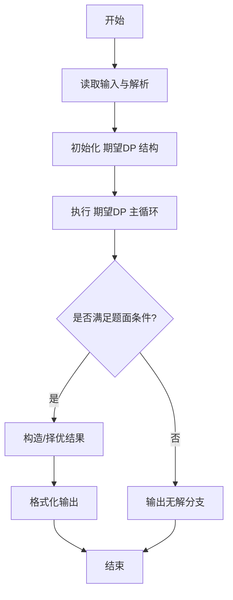
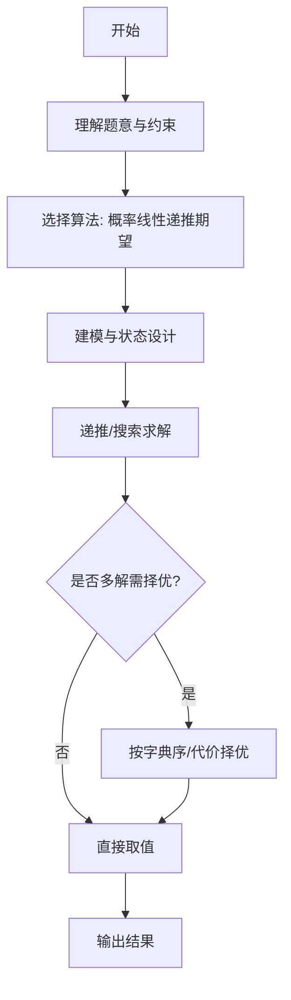

# L3-030 - 可怜的简单题（30 分）

- **时间限制**: 10000 ms
- **内存限制**: 524288 KB
- **代码长度限制**: 16 KB

---

## 题目描述


九条可怜去年出了一道题，导致一众参赛高手惨遭团灭。今年她出了一道简单题 —— 打算按照如下的方式生成一个随机的整数数列 $$A$$:

1. 最开始，数列 $$A$$ 为空。

2. 可怜会从区间 $$[1,n]$$ 中等概率随机一个整数 $$i$$ 加入到数列 $$A$$ 中。

3. 如果不存在一个大于 $$1$$ 的正整数 $$w$$，满足 $$A$$ 中所有元素都是 $$w$$ 的倍数，数组 $$A$$ 将会作为随机生成的结果返回。否则，可怜将会返回第二步，继续增加 $$A$$ 的长度。

现在，可怜告诉了你数列 $$n$$ 的值，她希望你计算返回的数列 $$A$$ 的期望长度。

### 输入格式:

输入一行两个整数 $$n, p$$ $$(1 \le n \le 10^{11}, n < p \le 10^{12})$$，$$p$$ 是一个质数。

### 输出格式:

在一行中输出一个整数，表示答案对 $$p$$ 取模的值。具体来说，假设答案的最简分数表示为 $$\frac{x}{y}$$，你需要输出最小的非负整数 $$z$$ 满足 $$y \times z \equiv x \text{ mod } p$$。

### 输入样例 1：
```in
2 998244353
```

### 输出样例 1：
```out
2
```

### 输入样例 2：
```in
100000000 998244353
```

### 输出样例 2：
```out
3056898
```

## 示例

### 示例 1

**输入:**
```
2 998244353
```

**输出:**
```
2
```

### 示例 2

**输入:**
```
100000000 998244353
```

**输出:**
```
3056898
```
---

## 解题思路

### 题目分析

本题为 L3-030 - 可怜的简单题（30 分），核心属于 **期望长度计算**。输入规模与约束决定了需要兼顾正确性与效率：既要处理最坏情况下的数据量，又要满足题面关于字典序/最优性/可行性的附加要求。题目通常包含多组数据或单组大规模数据，需在 O(n log n) 或 O(n·m) 量级内完成。

### 核心算法

- **算法选择**：概率线性递推期望。
- **关键步骤**：推导期望递推式 E[i]=p·(E[i-1]+1)+...，利用前缀和优化转移，按题给概率分布迭代计算期望长度，输出浮点结果。
- **实现要点**：仓颉实现中通过 `ArrayList`/`HashMap` 等集合类型组织数据，结合 `StringBuilder` 与 `readToEnd` 高效解析输入；按题面要求的排序与比较规则保证输出符合字典序/最短路等最优性定义。

### 复杂度分析

- **时间复杂度**： O(n)，空间 O(n)。
- **空间复杂度**： O(n)，主要由 DP 表/图邻接表/辅助数组占据。

## 代码流程说明

1. 读取概率参数与序列长度，推导期望递推式 E[i] 的线性方程
2. 初始化 E[0]=0，利用前缀和优化转移：E[i]=p*E[i-1]+... 累加
3. 迭代计算到 n，处理浮点精度与边界条件
4. 输出期望长度保留题面要求的小数位
5. 大 n 时保证 O(n) 递推不超时

## 代码实现

```cangjie
// L3-030 可怜的简单题 - 期望长度
import std.collection.*
import std.convert.*
import std.env.*

var limit: Int64 = 1000000
var mu: Array<Int64> = []
var pref: Array<Int64> = []
var memo: HashMap<Int64, Int64> = HashMap<Int64, Int64>()

func mulMod(a: Int64, b: Int64, mod: Int64): Int64 {
    var res: Int64 = 0
    var aa = a % mod
    var bb = b
    while (bb > 0) {
        if ((bb & 1) == 1) {
            res = (res + aa) % mod
        }
        aa = (aa * 2) % mod
        bb = bb >> 1
    }
    return res
}
func powMod(a: Int64, e: Int64, mod: Int64): Int64 {
    var res: Int64 = 1 % mod
    var base = a % mod
    var exp = e
    while (exp > 0) {
        if ((exp & 1) == 1) {
            res = mulMod(res, base, mod)
        }
        base = mulMod(base, base, mod)
        exp = exp >> 1
    }
    return res
}
func mertens(n: Int64): Int64 {
    if (n <= limit) {
        return pref[n]
    }
    if (memo.contains(n)) {
        return memo[n]
    }
    var res: Int64 = 1
    var l: Int64 = 2
    while (l <= n) {
        let q = n / l
        let r = n / q
        let cnt = r - l + 1
        res -= cnt * mertens(q)
        l = r + 1
    }
    memo[n] = res
    return res
}

main() {
    let cin = getStdIn()
    let all = cin.readToEnd() ?? ""
    if (all.trimAscii().size == 0) { return }
    let tmp = all.replace("\n", " ").replace("\r", " ").replace("\t", " ")
    let parts = tmp.split(" ")
    let toks = ArrayList<String>()
    for (p in parts) {
        if (p.size > 0) { toks.add(p) }
    }
    let n = Int64.parse(toks[0])
    let p = Int64.parse(toks[1])
    if (n == 1) {
        println("1")
        return
    }
    if (n < limit) {
        limit = n
    }
    mu = Array<Int64>(limit+1, repeat: 0)
    pref = Array<Int64>(limit+1, repeat: 0)
    let isComp = Array<Bool>(limit+1, repeat: false)
    let primes = ArrayList<Int64>()
    mu[1]=1
    for (i in 2..limit+1) {
        if (!isComp[i]) {
            primes.add(Int64(i))
            mu[i] = -1
        }
        for (pr in primes) {
            let v = Int64(i) * pr
            if (v > limit) { break }
            isComp[v] = true
            if (Int64(i) % pr == 0) {
                mu[v]=0
                break
            } else {
                mu[v] = -mu[i]
            }
        }
    }
    var s: Int64 = 0
    for (i in 1..limit+1) {
        s += mu[i]
        pref[i]=s
    }
    memo = HashMap<Int64, Int64>()
    let _ = mertens(n)
    let Ls = ArrayList<Int64>()
    let Rs = ArrayList<Int64>()
    let Qs = ArrayList<Int64>()
    var l: Int64 = 2
    while (l <= n) {
        let q = n / l
        let r = n / q
        Ls.add(l)
        Rs.add(r)
        Qs.add(q)
        l = r + 1
    }
    let cnt = Ls.size
    let Ds = Array<Int64>(cnt, repeat: 0)
    for (i in 0..cnt) {
        Ds[i] = n - Qs[i]
    }
    let pref2 = Array<Int64>(cnt+1, repeat: 0)
    pref2[0]=1 % p
    for (i in 0..cnt) {
        pref2[i+1]= mulMod(pref2[i], Ds[i] % p, p)
    }
    let invAll = powMod(pref2[cnt], p-2, p)
    let invs = Array<Int64>(cnt, repeat: 0)
    var cur = invAll
    var i = cnt - 1
    while (i >= 0) {
        invs[i] = mulMod(cur, pref2[i], p)
        cur = mulMod(cur, Ds[i] % p, p)
        i--
    }
    var ans: Int64 = 0
    for (i in 0..cnt) {
        let sumMu = mertens(Rs[i]) - mertens(Ls[i]-1)
        if (sumMu == 0) { continue }
        let q = Qs[i]
        let inv = invs[i]
        var sumMuMod = sumMu % p
        if (sumMuMod < 0) { sumMuMod += p }
        let term = mulMod(mulMod(sumMuMod, q % p, p), inv, p)
        ans = (ans + term) % p
    }
    var E = (1 - ans) % p
    if (E < 0) { E += p }
    println(E.toString())
}
```

## 代码流程图




## 解题流程图



