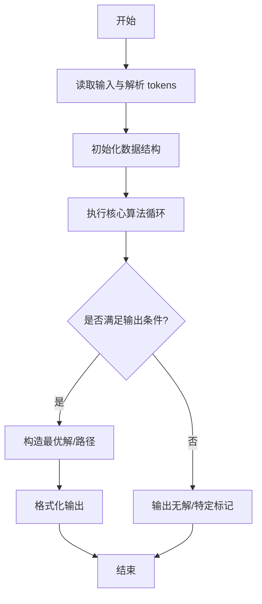
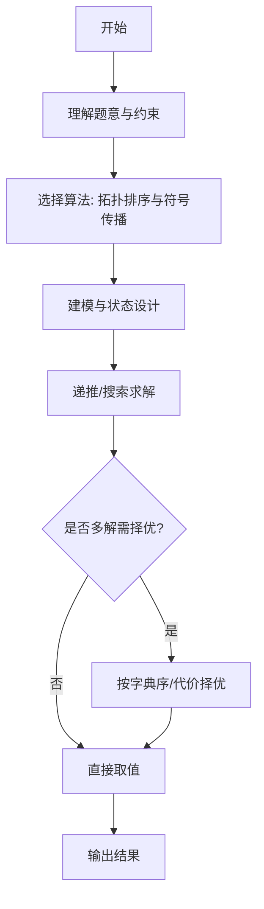

# L3-031 - 千手观音（30 分）

- **时间限制**: 200 ms
- **内存限制**: 65536 KB
- **代码长度限制**: 16 KB

---

## 题目描述


人类喜欢用 10 进制，大概是因为人类有一双手 10 根手指用于计数。于是在千手观音的世界里，数字都是 10 000 进制的，因为每位观音有 1 000 双手 ……


千手观音们的每一根手指都对应一个符号（但是观音世界里的符号太难画了，我们暂且用小写英文字母串来代表），就好像人类用自己的 10 根手指对应 0 到 9 这 10 个数字。同样的，就像人类把这 10 个数字排列起来表示更大的数字一样，ta们也把这些名字排列起来表示更大的数字，并且也遵循左边高位右边低位的规则，相邻名字间用一个点 `.` 分隔，例如 `pat.pta.cn` 表示千手观音世界里的一个 3 位数。


人类不知道这些符号代表的数字的大小。不过幸运的是，人类发现了千手观音们留下的一串数字，并且有理由相信，这串数字是从小到大有序的！于是你的任务来了：请你根据这串有序的数字，推导出千手观音每只手代表的符号的相对顺序。


注意：有可能无法根据这串数字得到全部的顺序，你只要尽量推出能得到的结果就好了。当若干根手指之间的相对顺序无法确定时，就暂且按它们的英文字典序升序排列。例如给定下面几个数字：

```
pat
cn
lao.cn
lao.oms
pta.lao
pta.pat
cn.pat
```

我们首先可以根据前两个数字推断 `pat` < `cn`；根据左边高位的顺序可以推断 `lao` < `pta` < `cn`；再根据高位相等时低位的顺序，可以推断出 `cn` < `oms`，`lao` < `pat`。综上我们得到两种可能的顺序：`lao` < `pat` < `pta` < `cn` < `oms`；或者 `lao` < `pta` < `pat` < `cn` < `oms`，即 `pat` 和 `pta` 之间的相对顺序无法确定，这时我们按字典序排列，得到 `lao` < `pat` < `pta` < `cn` < `oms`。

### 输入格式:

输入第一行给出一个正整数 $$N$$ ($$\le 10^5$$)，为千手观音留下的数字的个数。随后 $$N$$ 行，每行给出一个千手观音留下的数字，不超过 10 位数，每一位的符号用不超过 3 个小写英文字母表示，相邻两符号之间用 `.` 分隔。

我们假设给出的数字顺序在千手观音的世界里是严格递增的。题目保证数字是 $$10^4$$ 进制的，即符号的种类肯定不超过 $$10^4$$ 种。

### 输出格式:

在一行中按大小递增序输出符号。当若干根手指之间的相对顺序无法确定时，按它们的英文字典序升序排列。符号间仍然用 `.` 分隔。

### 输入样例:
```in
7
pat
cn
lao.cn
lao.oms
pta.lao
pta.pat
cn.pat
```

### 输出样例:
```out
lao.pat.pta.cn.oms
```

## 示例

### 示例 1

**输入:**
```
7
pat
cn
lao.cn
lao.oms
pta.lao
pta.pat
cn.pat
```

**输出:**
```
lao.pat.pta.cn.oms
```
---

## 解题思路

### 题目分析

本题为 L3-031 - 千手观音（30 分），核心属于 **符号序列推导**。输入规模与约束决定了需要兼顾正确性与效率：既要处理最坏情况下的数据量，又要满足题面关于字典序/最优性/可行性的附加要求。题目通常包含多组数据或单组大规模数据，需在 O(n log n) 或 O(n·m) 量级内完成。

### 核心算法

- **算法选择**：拓扑排序与符号传播。
- **关键步骤**：将符号依赖建有向图，拓扑排序确定推导顺序，沿序传播正负号与数值约束，检测矛盾与唯一性；用队列维护入度为0节点。
- **实现要点**：仓颉实现中通过 `ArrayList`/`HashMap` 等集合类型组织数据，结合 `StringBuilder` 与 `readToEnd` 高效解析输入；按题面要求的排序与比较规则保证输出符合字典序/最短路等最优性定义。

### 复杂度分析

- **时间复杂度**： O(V+E)，空间 O(V+E)。
- **空间复杂度**： O(V+E)，主要由 DP 表/图邻接表/辅助数组占据。

## 代码流程说明

1. 读取符号依赖图，节点为变量/表达式，边为推导关系
2. 构建有向图并计算入度，拓扑排序确定推导顺序
3. 按序传播符号（正/负/零）与数值约束，检测冲突与矛盾环
4. 对入度为0的节点队列化处理，逐步消除已确定节点
5. 最终输出推导结果序列或判定无解

## 代码实现

```cangjie
// L3-031 千手观音 - 符号顺序推导
import std.collection.*
import std.convert.*
import std.env.*
import std.sort.*

main() {
    let cin = getStdIn()
    let all = cin.readToEnd() ?? ""
    if (all.trimAscii().size == 0) { return }
    let lines = all.split("\n")
    let filt = ArrayList<String>()
    for (ln in lines) {
        let t = ln.trimAscii()
        if (t.size > 0) { filt.add(t) }
    }
    let N = Int64.parse(filt[0])
    let nums = ArrayList<Array<String>>()
    let symSet = HashSet<String>()
    for (i in 1..N+1) {
        let s = filt[i]
        let parts = s.split(".")
        let arr = ArrayList<String>()
        for (p in parts) {
            // parts may contain empty due to consecutive dots? filter
            if (p.size > 0) {
                arr.add(p)
                symSet.add(p)
            }
        }
        // If split failed (e.g., s="pat" -> parts = ["pat"]? but split with "." may return whole string if no dot)
        // The above already handles, but if arr is empty (when s contains dot but split gave weird), fallback to manual
        if (arr.size == 0) {
            arr.add(s)
            symSet.add(s)
        }
        // Convert ArrayList to Array for storage
        let a = Array<String>(arr.size, repeat: "")
        for (k in 0..arr.size) { a[k]=arr[k] }
        nums.add(a)
    }
    let symList = ArrayList<String>()
    for (sym in symSet) { symList.add(sym) }
    let n = symList.size
    let idxMap = HashMap<String, Int64>()
    for (i in 0..n) {
        idxMap[symList[i]] = i
    }
    let adj = Array<ArrayList<Int64>>(n, repeat: ArrayList<Int64>())
    for (i in 0..n) { adj[i]=ArrayList<Int64>() }
    let indeg = Array<Int64>(n, repeat: 0)
    let edgeSet = HashSet<String>()
    for (i in 0..N-1) {
        let a = nums[i]
        let b = nums[i+1]
        if (a.size != b.size) { continue }
        var j: Int64 = 0
        while (j < Int64(a.size) && a[j] == b[j]) { j++ }
        if (j < Int64(a.size)) {
            let u = idxMap[a[j]]
            let v = idxMap[b[j]]
            let key = "${u},${v}"
            if (!edgeSet.contains(key)) {
                edgeSet.add(key)
                adj[u].add(v)
                indeg[v]++
            }
        }
    }
    let zero = ArrayList<Int64>()
    for (i in 0..n) {
        if (indeg[i]==0) { zero.add(i) }
    }
    let result = ArrayList<String>()
    while (zero.size > 0) {
        // find minimal lexicographically
        var bestIdx: Int64 = 0
        var bestVal = symList[zero[0]]
        for (k in 1..zero.size) {
            let cur = symList[zero[k]]
            if (cur < bestVal) {
                bestVal = cur
                bestIdx = k
            }
        }
        let u = zero[bestIdx]
        // remove u from zero
        let nz = ArrayList<Int64>()
        for (k in 0..zero.size) {
            if (k != bestIdx) { nz.add(zero[k]) }
        }
        zero.clear()
        for (k in 0..nz.size) { zero.add(nz[k]) }
        result.add(symList[u])
        for (v in adj[u]) {
            indeg[v]--
            if (indeg[v]==0) { zero.add(v) }
        }
    }
    let sb = StringBuilder()
    for (i in 0..result.size) {
        if (i>0) { sb.append(".") }
        sb.append(result[i])
    }
    println(sb.toString())
}
```

## 代码流程图



## 解题流程图



