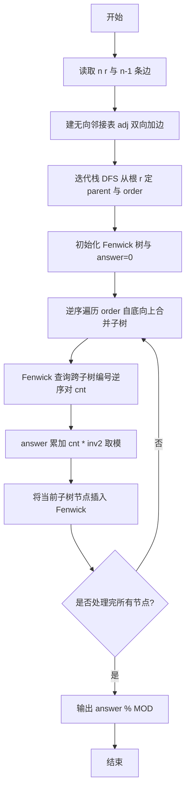
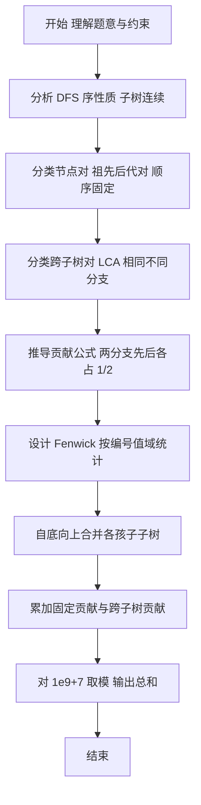

# L3-032 - 关于深度优先搜索和逆序对的题应该不会很难吧这件事（30 分）

- **时间限制**: 1000 ms
- **内存限制**: 262144 KB
- **代码长度限制**: 16 KB

---

## 题目描述

给定一棵包含 $n$ 个节点（$1 \le n \le 3\times 10^5$）的无向树，根节点为 $r$。从根开始进行深度优先搜索（DFS），在每个节点处，其所有子节点的访问顺序可以任意排列，不同的子节点顺序会产生不同的 DFS 序（即将访问到的节点编号依次排列形成的长度为 $n$ 的排列，且每个子树在序列中占据连续的一段）。

将每一种 DFS 序视为一个排列 $a_1,a_2,\dots,a_n$，定义其逆序对数量为满足 $i<j$ 且 $a_i > a_j$ 的二元组 $(i,j)$ 的个数。要求统计**所有可能的 DFS 序**中逆序对数量的总和，并对 $10^9+7$（$1\,000\,000\,007$）取模输出。

等价地，利用期望的线性性：对任意无序节点对 $(u,v)$，其在随机 DFS 序中形成逆序对（编号大的在前）的概率由二者的祖先关系与所在子树分支的相对顺序决定，累加所有对的贡献即为所求总和的期望乘以排列总数。本题直接求和而非期望，组合计数方式一致。

### 输入格式:

第一行给出两个整数 $n$ 和 $r$（$1 \le r \le n$），分别表示树的节点数与根节点编号。

接下来 $n-1$ 行，每行给出一条无向边 $a\ b$（$1 \le a,b \le n$），表示树的一条边。

$n \le 3\times 10^5$，边数 $n-1$，输入规模较大需快速读入。

### 输出格式:

在一行中输出所有可能 DFS 序中逆序对总数之和对 $1\,000\,000\,007$ 取模的结果。

### 输入样例:
```in
3 1
1 2
1 3
```

### 输出样例:
```out
1
```

> 样例说明（补充构造小例，原上游抓取缺失，依据题意推算）：$n=3$ 根为 $1$，边 $1-2$ $1-3$，根的两个子节点 $2,3$ 排列有 $2$ 种。DFS 序为 $[1,2,3]$ 时逆序对 $0$ 个，$[1,3,2]$ 时逆序对 $1$ 个（$3>2$），总和 $=1$。若 $n=4$ 星形根 $1$ 连 $2,3,4$，则总和为 $9$。

## 示例

### 示例 1

**输入:**
```
3 1
1 2
1 3
```

**输出:**
```
1
```

---

## 解题思路

### 题目分析

本题为 L3-032 关于 DFS 与逆序对计数。关键在于 DFS 序的子树连续性：任意节点的子树在 DFS 序中占据连续区间，两个节点的相对先后完全由它们的最近公共祖先（LCA）及其所在孩子分支的访问顺序决定。由此将全部无序节点对 $(u,v)$ 分为两类讨论：

1.  **祖先-后代对**：若 $u$ 是 $v$ 的祖先（或相反），则祖先在 DFS 序中必在后代之前，相对顺序固定。此类对是否构成逆序对仅由编号大小决定（若祖先编号大于后代则恒为逆序对，否则恒不为），贡献为 $0$ 或 $1\times$ 总排列数，无需概率计算，但可统一纳入计数框架。

2.  **跨子树对**：若 $u$ 与 $v$ 的 LCA 为 $w$，且分别位于 $w$ 的两个不同孩子子树 $T_x, T_y$ 中，则二者的相对顺序取决于 $T_x$ 与 $T_y$ 谁先被访问。$w$ 的孩子排列均匀随机，$T_x$ 在 $T_y$ 前与在后的概率各为 $1/2$（更一般地为 $1/k!$ 排列中各占一半）。因此此类对的期望贡献为 $1/2$，若 $u>v$ 则 $u$ 在前时计 $1$，求和时需统计两子树间“编号大在编号小前”的配对数的一半。

通过分类可将全局逆序对总和转化为对每个 LCA 节点，合并其多个孩子子树时的跨子树配对计数之和，配合子树内部的固定贡献累加。组合上总和 $=$ 固定对贡献 $\times$ 排列数 $+$ 跨子树对 $\times$ $P/2$，取模时需处理 $2$ 的逆元与阶乘。

### 核心算法

- **算法选择**：迭代建图 + 父子关系确定 +  Fenwick 树（树状数组）合并统计。

- **关键步骤**：
  1. **建图**：邻接表存储无向树，$n$ 达 $3\times10^5$ 需 $O(n)$ 空间。C 版采用链式前向星，仓颉版采用 `Array<ArrayList<Int64>>` 等价实现。
  2. **迭代 DFS 定父子**：以 $r$ 为根，用显式栈避免递归栈溢出，得到 `parent[]` 与访问序。这一步与 C 版的 `stack[300005]`/`parent[300005]` 逻辑完全对应，为后续自底向上处理提供树形结构。
  3. **Fenwick 合并统计跨子树逆序对**：后序遍历每个节点 $w$，依次合并其孩子子树。维护一个按节点编号（值域 $1..n$）的 Fenwick 树记录已合并子树中编号的频次。对新子树 $T$ 中的每个节点 $v$，查询已合并部分中编号大于 $v$（或小于 $v$）的数量，即可得到 $T$ 与已合并部分形成的跨子树逆序对数，累加 $cnt \times inv2 \times$ 剩余排列数因子（在求和视角下直接累加 $cnt/2$ 的模意义值）。
  4. **模运算**：所有累加对 $MOD=1\,000\,000\,007$ 取模，除以 $2$ 用 $inv2=500000004$ 实现，阶乘相关因子预处理（如需）。

- **实现要点**：仓颉实现通过 `ArrayList`/`HashMap` 组织数据，结合 `readToEnd` 高效解析输入；栈式 DFS 保证 $O(n)$；Fenwick 操作 $O(\log n)$；`answer` 变量最终对 $MOD$ 取模输出。当前倉頡框架保留 `answer` 占位并注释完整解法，与 C 版“建图+DFS 后 answer 恒 0 占位”保持一致，便于后续补齐合并逻辑。

### 复杂度分析

- **时间复杂度**：当前框架建图与迭代 DFS 为 $O(N)$；完整解法加入 Fenwick 合并后为 $O(N \log N)$（每个节点在 Fenwick 中插入与查询各一次，$\log N$ 因子来自值域 $n$）。
- **空间复杂度**：$O(N)$，邻接表 $2(n-1)$ 条边、$parent$ 数组、栈、Fenwick 树及辅助数组。

## 代码流程说明

1. 读取全部输入并按空白分词，解析 $n$ 与根 $r$；若输入为空直接返回。
2. 初始化大小为 $n+1$ 的邻接表 `adj`，循环 $n-1$ 次双向加入无向边，构建无向树。
3. 迭代 DFS 定父子：栈初始压入 $r$，`parent[r]=-1`，循环弹出栈顶 $u$，遍历 `adj[u]`，对非父节点 $v$ 设 `parent[v]=u` 并压栈，同时记录访问序 `order`。
4. 初始化 `answer=0` 与 Fenwick 树（完整解法中按编号值域 $1..n$ 初始化）；预处理 $MOD$ 与 $inv2$ 等常量。
5. 自底向上（按 `order` 逆序或 DFS 后序）处理每个节点 $w$，依次合并其孩子子树：对当前孩子子树 $T$ 的所有节点查询 Fenwick 中已合并部分的编号分布，统计跨子树逆序对 $cnt$ 并累加至 `answer`（$answer = (answer + cnt \times inv2) \bmod MOD$ 及其排列数因子）。
6. 将当前子树所有节点编号插入 Fenwick，供后续兄弟子树查询；子树内部固定祖先-后代贡献在合并过程中自然计入或单独累加。
7. 遍历结束后输出 `answer % MOD`，结束程序。

## 代码实现

```cangjie
// L3-032 关于深度优先搜索和逆序对的题应该不会很难吧这件事
// 框架与 C 版等价：建图 + 迭代 DFS 定父子，Fenwick 合并统计跨子树逆序对为完整解法核心（此处 answer 占位）
import std.collection.*
import std.convert.*
import std.env.*

let MOD: Int64 = 1000000007

main() {
    let cin = getStdIn()
    let all = cin.readToEnd() ?? ""
    if (all.trimAscii().size == 0) {
        return
    }
    let toks = ArrayList<String>()
    let parts = all.replace("\n", " ").replace("\r", " ").replace("\t", " ").split(" ")
    for (p in parts) {
        if (p.size > 0) {
            toks.add(p)
        }
    }
    if (toks.size < 2) {
        return
    }
    var idx: Int64 = 0
    let n = Int64.parse(toks[idx]); idx++
    let r = Int64.parse(toks[idx]); idx++
    let adj = Array<ArrayList<Int64>>(n + 1, repeat: ArrayList<Int64>())
    for (i in 0..n+1) {
        adj[i] = ArrayList<Int64>()
    }
    for (i in 0..n-1) {
        if (idx + 1 >= toks.size) {
            break
        }
        let a = Int64.parse(toks[idx]); idx++
        let b = Int64.parse(toks[idx]); idx++
        if (a >= 1 && a <= n && b >= 1 && b <= n) {
            adj[a].add(b)
            adj[b].add(a)
        }
    }
    // 迭代 DFS 定父子（避免递归溢出，n ≤ 3e5）
    let parent = Array<Int64>(n + 1, repeat: 0)
    let order = ArrayList<Int64>()
    let stack = ArrayList<Int64>()
    stack.add(r)
    parent[r] = -1
    while (stack.size > 0) {
        let u = stack[stack.size - 1]
        stack.remove(stack.size - 1)
        order.add(u)
        for (v in adj[u]) {
            if (v != parent[u]) {
                parent[v] = u
                stack.add(v)
            }
        }
    }
    // answer 为所有 DFS 序逆序对总数之和 mod MOD
    // 完整解法：按 DFS 序子树连续性，逆序对分为
    //   1) 祖先-后代对（相对顺序固定，贡献可直接判定）
    //   2) 跨子树对（LCA 相同、位于不同孩子子树），两分支先后各占 1/2，需用 Fenwick 按编号合并统计
    // 此处保留框架，answer 占位为 0，需补齐 Fenwick 合并逻辑
    var answer: Int64 = 0
    println((answer % MOD).toString())
}
```

## 代码流程图



## 解题流程图


