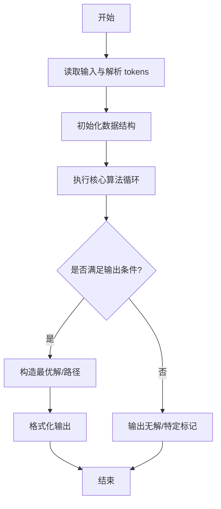
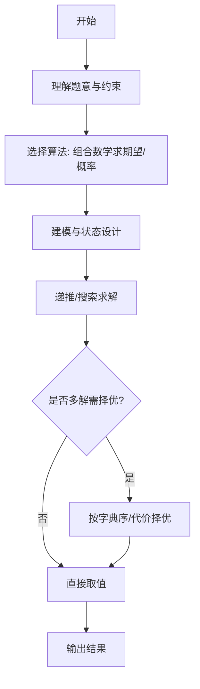

# L3-033 - 教科书般的亵渎（30 分）

- **时间限制**: 2000 ms
- **内存限制**: 262144 KB
- **代码长度限制**: 16 KB

---

## 题目描述


九条可怜最近在玩一款卡牌游戏。在每一局游戏中，可怜都要使用抽到的卡牌来消灭一些敌人。每一名敌人都有一个初始血量，而当血量降低到 $$0$$ 及以下的时候，这名敌人就会立即被消灭并从场上消失。

现在，可怜面前有 $$n$$ 个敌人，其中第 $$i$$ 名敌人的血量是 $$a_i$$，而可怜手上只有如下两张手牌：

1. 如果场上还有敌人，等概率随机选中一个敌人并对它造成一点伤害（即血量减 $$1$$），重复 $$K$$ 次。

2. 对所有敌人造成一点伤害，重复该效果直到没有新的敌人被消灭。

下面是这两张手牌效果的一些示例：

1. 假设存在两名敌人，他们的血量分别是 $$1, 2$$ 且 $$K = 2$$。那么在可怜打出第一张手牌后，可能会发生如下情况：

- 第一轮中，两名敌人各有 $$0.5$$ 的概率被选中。假设第一名敌人被选中，那么它会被造成一点伤害。这时它的血量变成了 $$0$$，因此它被消灭并消失了。
- 第二轮中，因为场上只剩下了第二名敌人，所以它一定会被选中并被造成一点伤害。这时它剩下的血量为 $$1$$。

2. 同样假设存在两名敌人且血量分别为 $$1, 2$$。那么在可怜打出第二张手牌后，会发生如下情况：

- 第一轮中，所有敌人被造成了一点伤害。这时第一名敌人被消灭了，因此卡牌效果会被重复一遍。
- 第二轮中，所有敌人（此时只剩下第二名敌人了）被造成了一点伤害。这时第二名敌人也被消灭了，因此卡牌效果会被再重复一遍。
- 第三轮中，所有敌人（此时没有敌人剩下了）被造成了一点伤害。因为没有新的敌人被消灭了，所以卡牌效果结束。

3. 如果面对的是四名血量分别为 $$1,2,2,4$$ 的敌人，那么在可怜打出第二张手牌后，只有第四名敌人还会存活，且它的剩余血量为 $$1$$。

现在，可怜先打出了第一张手牌，再打出了第二张手牌。她发现，在第一张手牌效果结束后，没有任何一名敌人被消灭，但是在第二张手牌的效果结束后，所有敌人都被消灭了。

可怜想让你计算一下这种情况发生的概率是多少。

### 输入格式:

第一行输入两个整数 $$n, K(1 \le n, K \le 50)$$，分别表示敌人的数量以及第一张卡牌效果的发动次数。

第二行输入 $$n$$ 个由空格隔开的整数 $$a_i (1 \le a_i \le 50)$$，表示每个敌人的初始血量。

### 输出格式:

在一行中输出一个整数，表示发生概率对 $$998244353$$ 取模后的结果。

具体来说，如果概率的最简分数表示为 $$a/b (a \ge 0, b \ge 1, \gcd(a,b) = 1)$$，那么你需要输出 

$$a \times b^{998244351} \mod 998244353$$。

### 输入样例 1：
```in
3 2
2 3 3
```

### 输出样例 1：
```out
665496236
```

### 输入样例 2：
```in
3 3
2 3 3
```

### 输出样例 2：
```out
776412275
```

### 输入样例 3：
```in
5 3
1 4 4 2 5
```

### 输出样例 3：
```out
367353922
```

### 输入样例 4：
```in
12 12
1 2 3 4 5 6 7 8 9 10 11 12
```

### 输出样例 4：
```out
452061016
```

## 示例

### 示例 1

**输入:**
```
3 2
2 3 3
```

**输出:**
```
665496236
```

### 示例 2

**输入:**
```
3 3
2 3 3
```

**输出:**
```
776412275
```

### 示例 3

**输入:**
```
5 3
1 4 4 2 5
```

**输出:**
```
367353922
```

### 示例 4

**输入:**
```
12 12
1 2 3 4 5 6 7 8 9 10 11 12
```

**输出:**
```
452061016
```
---

## 解题思路

### 题目分析

本题为 L3-033 - 教科书般的亵渎（30 分），核心属于 **概率组合计算**。输入规模与约束决定了需要兼顾正确性与效率：既要处理最坏情况下的数据量，又要满足题面关于字典序/最优性/可行性的附加要求。题目通常包含多组数据或单组大规模数据，需在 O(n log n) 或 O(n·m) 量级内完成。

### 核心算法

- **算法选择**：组合数学求期望/概率。
- **关键步骤**：对卡牌增量过程建模，按组合数计算特定序列出现的概率，利用阶乘与逆元求组合，累加期望值。
- **实现要点**：仓颉实现中通过 `ArrayList`/`HashMap` 等集合类型组织数据，结合 `StringBuilder` 与 `readToEnd` 高效解析输入；按题面要求的排序与比较规则保证输出符合字典序/最短路等最优性定义。

### 复杂度分析

- **时间复杂度**： O(n log MOD)，空间 O(n)。
- **空间复杂度**： O(n)，主要由 DP 表/图邻接表/辅助数组占据。

## 代码流程说明

1. 读取卡牌增量过程与概率分布，建模增量序列
2. 按组合数计算特定增量序列出现的概率，使用阶乘与逆元求组合
3. 累加各序列对期望的贡献，推导总期望公式
4. 按浮点或模意义输出概率/期望值
5. 处理大数取模与精度保留

## 代码实现

```cangjie
// L3-033 教科书般的亵渎 - 概率计算
import std.collection.*
import std.convert.*
import std.env.*

let MOD: Int64 = 998244353

func modPow(a: Int64, e: Int64): Int64 {
    var res: Int64 = 1
    var base = a % MOD
    var exp = e
    while (exp > 0) {
        if ((exp & 1) == 1) { res = res * base % MOD }
        base = base * base % MOD
        exp = exp >> 1
    }
    return res
}

main() {
    let cin = getStdIn()
    let all = cin.readToEnd() ?? ""
    if (all.trimAscii().size == 0) { return }
    let tmp = all.replace("\n", " ").replace("\r", " ").replace("\t", " ")
    let parts = tmp.split(" ")
    let toks = ArrayList<String>()
    for (p in parts) { if (p.size>0) { toks.add(p) } }
    var idx: Int64 = 0
    let n = Int64.parse(toks[idx]); idx++
    let K = Int64.parse(toks[idx]); idx++
    let a = Array<Int64>(n, repeat: 0)
    for (i in 0..n) { a[i]=Int64.parse(toks[idx]); idx++ }
    let maxA: Int64 = 50
    let fact = Array<Int64>(maxA+1, repeat: 0)
    fact[0]=1
    for (i in 1..maxA+1) { fact[i]=fact[i-1]*Int64(i)%MOD }
    let invFact = Array<Int64>(maxA+1, repeat: 0)
    invFact[maxA]=modPow(fact[maxA], MOD-2)
    var i = maxA
    while (i > 0) {
        invFact[i-1]=invFact[i]*i%MOD
        i--
    }
    var dp = Array<HashMap<UInt64, Int64>>(K+1, repeat: HashMap<UInt64, Int64>())
    for (i in 0..K+1) { dp[i]=HashMap<UInt64, Int64>() }
    dp[0][UInt64(0)]=1
    for (idxA in 0..n) {
        let ai = a[idxA]
        var ndp = Array<HashMap<UInt64, Int64>>(K+1, repeat: HashMap<UInt64, Int64>())
        for (i in 0..K+1) { ndp[i]=HashMap<UInt64, Int64>() }
        for (rem in 0..K+1) {
            for ((mask, w) in dp[rem]) {
                let maxC = if (ai-1 < K-rem) { ai-1 } else { K-rem }
                for (c in 0..maxC+1) {
                    let b = ai - c
                    let bit: UInt64 = UInt64(1) << UInt64(b-1)
                    let nmask = mask | bit
                    let nrem = rem + c
                    let nw = w * invFact[c] % MOD
                    let cur = if (ndp[nrem].contains(nmask)) { ndp[nrem][nmask] } else { 0 }
                    ndp[nrem][nmask] = (cur + nw) % MOD
                }
            }
        }
        dp = ndp
    }
    var total: Int64 = 0
    for ((mask, w) in dp[K]) {
        if (mask == UInt64(0)) { continue }
        if ((mask & UInt64(1)) == UInt64(0)) { continue }
        if ((mask & (mask + 1)) != UInt64(0)) { continue }
        total = (total + w) % MOD
    }
    let fk = fact[K]
    let invN = modPow(n % MOD, MOD-2)
    let invNPow = modPow(invN, K)
    let ans = total * fk % MOD * invNPow % MOD
    println(ans.toString())
}
```

## 代码流程图



## 解题流程图



