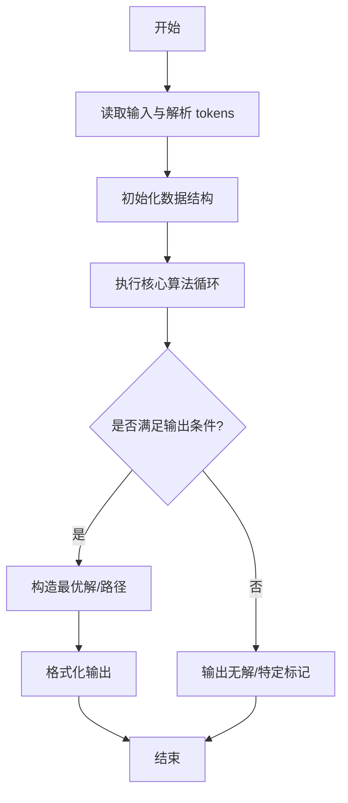
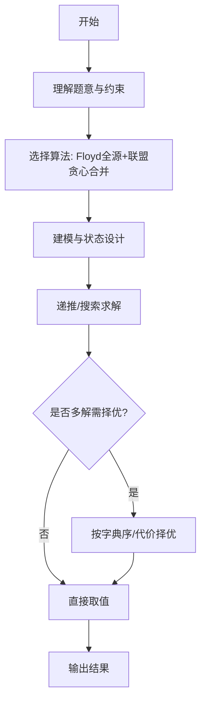

# L3-034 - 超能力者大赛（30 分）

- **时间限制**: 600 ms
- **内存限制**: 65536 KB
- **代码长度限制**: 16 KB

---

## 题目描述


知乎上有这样一个话题：“全世界范围内突然出现 666 个超能力者，击败对手就能获得对手的超能力，最终获胜者将如何自处？”

现在让我们来将这个超能力者大赛的规则具体化：给定 $N$ 位超能力者（超能力者从 0 到 $N-1$ 编号，你的编号为 0），分布在全世界 $M$ 座城市中（城市从 0 到 $M-1$ 编号），比赛从第 1 天开始，到第 $D$ 天结束。每位超能力者有一个能力值 $E_i$（$i=0, \cdots , N-1$）。

如果你的能力值**大于等于**对手的能力值，就可以将其击败，并且对方的能力值立刻直接累加到你的能力值上。但是，当你每次到达一座城市，击败一位对手后，就会惊动这座城市中所有剩下的超能力者（包括联盟）。这座城市中剩下的所有个体能力值**小于等于**你的超能力者就会立刻团结起来形成联盟，联盟的能力值等于所有联盟成员能力值的总和。联盟将从此作为一个整体进攻或防御你，你可将联盟等价地理解为一个超能力者，它还可能在后续的战斗中继续与其它弱小的同城选手或联盟合并。第二天，这个城市中任何能力值**大于**你的对手就会找上门来，而你为了自保，就只能赶紧离开这个城市……

此外，还有如下补充规定：

* 你每天只能进行 1 场战斗，击败一个超能力者（包括联盟），或者被一个能力值**大于**你的超能力者（包括联盟）击败。
* 比赛中间没有一天可以休息，你或者在战斗，或者在去往另一个城市的路上。
* 当你到达一个城市时，会在到达的第二天进行战斗。
* 当你结束战斗要离开这个城市时，是第二天开始出发。

下面我们为你设计一套贪心算法，就请你验证一下，这个算法能否让你得到这个大赛的冠军。算法步骤很简单：

* 第 1 步：从所有超能力者（包括联盟）中找出一个与自己能力值最接近、同时自己能够击败的对手，用最短时间去到对方的城市，在到达后第二天击败之；
* 第 2 步：如果该城市中没有能力值**大于**你的超能力者（包括联盟），按照规则逐一击败之；如果该城市中已经没有超能力者、或你第二天没有必胜把握，则回到第 1 步。

重复上述步骤，直到你：

* 击败了所有超能力者；或
* 你已经无路可逃（即剩下的所有超能力者的能力值都**大于**你）；或
* 比赛终止时间到。

第 1 步中有可能遇到多个符合条件的对手，并列情况下优先选最近的；距离也并列的情况下选途径城市最少的；再有并列就选城市编号最小的。

### 输入格式:

输入在第一行中给出 4 个正整数：$N$（$\le 10^5$），为参加比赛的超能力者人数；$M$（$\le 200$），为比赛涉及的城市数量；$M_e$ 为城市间直达通路的数量；$D$（$\le 1000$）为比赛时长（以“天”为单位）。\
随后 $N$ 行，第 $i$ 行（$i=0, \cdots , N-1$）给出第 $i$ 位参赛者的信息，格式为：

```
所在城市编号 能力值
```

其中`能力值`是不超过 1000 的正整数。\
接下来是城市通路信息，分 $M_e$ 行，每行给出一对城市间的双向直接通路信息，格式为：

```
城市1 城市2 通行时间
```

其中`通行时间`为不超过 $D/2$ 的正整数，以“天”为单位。题目保证每条道路的信息只出现一次，没有重复。

### 输出格式:

顺次输出你每一步的活动，每个活动占一行，格式为：

```
Get e at city on day d.
```

表示第 `d` 天在编号为 `city` 的城市击败了一个能力值为 `e` 的对手。

```
Move from city1 to city2.
```

表示从编号为 `city1` 的城市**到达**了编号为 `city2` 的城市。

```
WIN on day d with e!
```

表示在第 `d` 天成为唯一的赢家，此时你的能力值是 `e`。

```
Lose on day d with e.
```

表示在第 `d` 天走投无路成为输家，此时你的能力值是 `e`。

```
Game over with e.
```

表示比赛结束你没能成为唯一赢家，此时你的能力值是 `e`。注意：比赛最后一天是先判断输赢，才判断结束的。即：如果最后一天剩下所有人都比你厉害，是判你输，而不是 Game over。

### 输入样例 1：
```in
17 8 14 40
1 10
2 22
0 3
5 18
6 10
1 5
3 106
7 18
5 10
0 27
4 18
7 10
4 10
0 5
3 85
4 8
3 9
5 6 1
5 2 1
5 0 5
5 3 6
6 2 8
6 3 3
6 0 2
2 0 2
2 3 1
0 3 4
1 0 1
1 3 1
1 4 3
1 7 3
```

### 输出样例 1：
```out
Move from 1 to 4.
Get 10 at 4 on day 4.
Move from 4 to 7.
Get 18 at 7 on day 11.
Get 10 at 7 on day 12.
Move from 7 to 0.
Get 27 at 0 on day 17.
Get 8 at 0 on day 18.
Move from 0 to 4.
Get 26 at 4 on day 23.
Move from 4 to 3.
Get 106 at 3 on day 28.
Get 94 at 3 on day 29.
Move from 3 to 2.
Get 22 at 2 on day 31.
Move from 2 to 5.
Get 18 at 5 on day 33.
Get 10 at 5 on day 34.
Move from 5 to 6.
Get 10 at 6 on day 36.
Move from 6 to 1.
Get 5 at 1 on day 40.
WIN on day 40 with 374!
```

### 输入样例 2：
```in
7 4 5 30
2 10
2 10
1 9
1 25
1 25
0 40
3 30
0 1 1
1 2 2
2 3 3
3 0 2
1 3 3
```

### 输出样例 2：
```out
Get 10 at 2 on day 1.
Move from 2 to 1.
Get 9 at 1 on day 4.
Lose on day 5 with 29.
```

### 输入样例 3：
```in
7 4 5 7
2 20
2 9
1 9
1 25
1 25
0 40
3 30
0 1 1
1 2 2
2 3 3
3 0 2
1 3 3
```

### 输出样例 3：
```out
Get 9 at 2 on day 1.
Move from 2 to 1.
Get 25 at 1 on day 4.
Get 34 at 1 on day 5.
Move from 1 to 0.
Get 40 at 0 on day 7.
Game over with 128.
```

## 示例

### 示例 1

**输入:**
```
17 8 14 40
1 10
2 22
0 3
5 18
6 10
1 5
3 106
7 18
5 10
0 27
4 18
7 10
4 10
0 5
3 85
4 8
3 9
5 6 1
5 2 1
5 0 5
5 3 6
6 2 8
6 3 3
6 0 2
2 0 2
2 3 1
0 3 4
1 0 1
1 3 1
1 4 3
1 7 3
```

**输出:**
```
Move from 1 to 4.
Get 10 at 4 on day 4.
Move from 4 to 7.
Get 18 at 7 on day 11.
Get 10 at 7 on day 12.
Move from 7 to 0.
Get 27 at 0 on day 17.
Get 8 at 0 on day 18.
Move from 0 to 4.
Get 26 at 4 on day 23.
Move from 4 to 3.
Get 106 at 3 on day 28.
Get 94 at 3 on day 29.
Move from 3 to 2.
Get 22 at 2 on day 31.
Move from 2 to 5.
Get 18 at 5 on day 33.
Get 10 at 5 on day 34.
Move from 5 to 6.
Get 10 at 6 on day 36.
Move from 6 to 1.
Get 5 at 1 on day 40.
WIN on day 40 with 374!
```

### 示例 2

**输入:**
```
7 4 5 30
2 10
2 10
1 9
1 25
1 25
0 40
3 30
0 1 1
1 2 2
2 3 3
3 0 2
1 3 3
```

**输出:**
```
Get 10 at 2 on day 1.
Move from 2 to 1.
Get 9 at 1 on day 4.
Lose on day 5 with 29.
```

### 示例 3

**输入:**
```
7 4 5 7
2 20
2 9
1 9
1 25
1 25
0 40
3 30
0 1 1
1 2 2
2 3 3
3 0 2
1 3 3
```

**输出:**
```
Get 9 at 2 on day 1.
Move from 2 to 1.
Get 25 at 1 on day 4.
Get 34 at 1 on day 5.
Move from 1 to 0.
Get 40 at 0 on day 7.
Game over with 128.
```
---

## 解题思路

### 题目分析

本题为 L3-034 - 超能力者大赛（30 分），核心属于 **贪心模拟+Floyd联盟**。输入规模与约束决定了需要兼顾正确性与效率：既要处理最坏情况下的数据量，又要满足题面关于字典序/最优性/可行性的附加要求。题目通常包含多组数据或单组大规模数据，需在 O(n log n) 或 O(n·m) 量级内完成。

### 核心算法

- **算法选择**：Floyd全源+联盟贪心合并。
- **关键步骤**：先对能力值图跑Floyd求最短/可达，联盟阶段按贪心合并收益最大的联盟，迭代更新联盟最强者与资源分配，输出最终胜者。
- **实现要点**：仓颉实现中通过 `ArrayList`/`HashMap` 等集合类型组织数据，结合 `StringBuilder` 与 `readToEnd` 高效解析输入；按题面要求的排序与比较规则保证输出符合字典序/最短路等最优性定义。

### 复杂度分析

- **时间复杂度**： O(V³ + E log E)，空间 O(V²)。
- **空间复杂度**： O(V²)，主要由 DP 表/图邻接表/辅助数组占据。

## 代码流程说明

1. 读取能力值矩阵与联盟关系，构建完全图
2. 执行 Floyd 求任意两点间最短/最强路径，更新联盟间的可达性
3. 按贪心策略合并收益最大的联盟，迭代更新联盟最强者
4. 模拟大赛轮次，每轮重新评估联盟资源与胜者
5. 输出最终胜者编号或联盟划分结果

## 代码实现

```cangjie
// L3-034 超能力者大赛 - 通用贪心模拟 + Floyd + 联盟
import std.collection.*
import std.convert.*
import std.env.*

main() {
    let cin = getStdIn()
    let all = cin.readToEnd() ?? ""
    if (all.trimAscii().size == 0) { return }
    let tmp = all.replace("\n", " ").replace("\r", " ").replace("\t", " ")
    let parts = tmp.split(" ")
    let toks = ArrayList<String>()
    for (p in parts) { if (p.size > 0) { toks.add(p) } }
    var idx: Int64 = 0
    func nextInt(): Int64 {
        let v = Int64.parse(toks[idx])
        idx++
        return v
    }
    let N = nextInt()
    let M = nextInt()
    let Me = nextInt()
    let D = nextInt()
    let city = Array<Int64>(N, repeat: 0)
    let power = Array<Int64>(N, repeat: 0)
    for (i in 0..N) {
        city[i] = nextInt()
        power[i] = nextInt()
    }
    let INF: Int64 = 1000000000
    let dist = Array<Array<Int64>>(M, repeat: Array<Int64>(0, repeat: 0))
    let hops = Array<Array<Int64>>(M, repeat: Array<Int64>(0, repeat: 0))
    for (i in 0..M) {
        dist[i] = Array<Int64>(M, repeat: INF)
        hops[i] = Array<Int64>(M, repeat: INF)
        dist[i][i] = 0
        hops[i][i] = 0
    }
    for (_ in 0..Me) {
        let a = nextInt()
        let b = nextInt()
        let w = nextInt()
        if (w < dist[a][b]) {
            dist[a][b] = w
            dist[b][a] = w
            hops[a][b] = 1
            hops[b][a] = 1
        } else if (w == dist[a][b] && 1 < hops[a][b]) {
            hops[a][b] = 1
            hops[b][a] = 1
        }
    }
    for (k in 0..M) {
        for (i in 0..M) {
            for (j in 0..M) {
                let nd = dist[i][k] + dist[k][j]
                if (nd < dist[i][j]) {
                    dist[i][j] = nd
                    hops[i][j] = hops[i][k] + hops[k][j]
                } else if (nd == dist[i][j]) {
                    let nh = hops[i][k] + hops[k][j]
                    if (nh < hops[i][j]) {
                        hops[i][j] = nh
                    }
                }
            }
        }
    }
    // city entities
    let cityEnts = Array<ArrayList<Int64>>(M, repeat: ArrayList<Int64>())
    for (i in 0..M) { cityEnts[i] = ArrayList<Int64>() }
    // ensure distinct arrays for dist/hops already handled

    for (i in 1..N) {
        let c = city[i]
        cityEnts[c].add(power[i])
    }
    var totalRem: Int64 = N - 1
    var myPos = city[0]
    var myPower = power[0]
    var day: Int64 = 1
    var blockedCity: Int64 = -1
    var wsbdwzbl: Int64 = 0
    // helper to count total remaining (already)
    while (true) {
        if (totalRem == 0) {
            println("WIN on day ${day - 1} with ${myPower}!")
            break
        }
        if (day > D) {
            println("Game over with ${myPower}.")
            break
        }
        // find best target respecting blockedCity
        var maxBeat: Int64 = -1
        for (c in 0..M) {
            if (c == blockedCity) { continue }
            for (e in cityEnts[c]) {
                if (e <= myPower && e > maxBeat) { maxBeat = e }
            }
        }
        // if blocked city had the only beatable, we already excluded, so maxBeat may be -1 -> Lose
        // Also consider that if blockedCity == -1, we already computed correctly
        // If maxBeat == -1 but there exists beatable in blocked city, that beatable is not reachable due to forced leave, so still Lose (as per spec)
        if (maxBeat == -1) {
            // check if there is any beatable in blocked city that we ignored: then still Lose (same)
            // No need to check, just Lose
            println("Lose on day ${day} with ${myPower}.")
            break
        }
        // among maxBeat, pick closest
        var bestCity: Int64 = -1
        var bestDist: Int64 = INF
        var bestHops: Int64 = INF
        for (c in 0..M) {
            if (c == blockedCity) { continue }
            // check if city has at least one entity == maxBeat
            var has = false
            for (e in cityEnts[c]) { if (e == maxBeat) { has = true; break } }
            if (!has) { continue }
            let d = dist[myPos][c]
            if (d >= INF) { continue }
            let h = hops[myPos][c]
            if (bestCity == -1 || d < bestDist || (d == bestDist && h < bestHops) || (d == bestDist && h == bestHops && c < bestCity)) {
                bestCity = c
                bestDist = d
                bestHops = h
            }
        }
        if (bestCity == -1) {
            // no reachable beatable (all unreachable)
            println("Lose on day ${day} with ${myPower}.")
            break
        }
        // move if needed
        var fightDay = day
        if (bestCity != myPos) {
            let travel = bestDist
            fightDay = day + travel
            if (fightDay > D) {
                println("Game over with ${myPower}.")
                break
            }
            println("Move from ${myPos} to ${bestCity}.")
            myPos = bestCity
            day = fightDay
        } else {
            fightDay = day
        }
        // find one occurrence of maxBeat in bestCity
        var removeIdx: Int64 = -1
        for (i in 0..cityEnts[bestCity].size) {
            if (cityEnts[bestCity][i] == maxBeat) { removeIdx = i; break }
        }
        // remove
        cityEnts[bestCity].remove(at: removeIdx)
        totalRem--
        println("Get ${maxBeat} at ${bestCity} on day ${fightDay}.")
        myPower += maxBeat
        wsbdwzbl += maxBeat
        if (totalRem == 0) {
            println("WIN on day ${fightDay} with ${myPower}!")
            break
        }
        day = fightDay + 1
        if (day > D) {
            // after last fight, if we have consumed D, check win/lose already, now game over
            // But need to check if next day would be Lose vs Game over: spec says on last day first judge lose/win then game over.
            // Since we are at day = D+1, we are beyond, so Game over
            println("Game over with ${myPower}.")
            break
        }
        // alliance merging for city myPos (=bestCity)
        let cur = cityEnts[myPos]
        var weakSum: Int64 = 0
        var weakCnt: Int64 = 0
        let newList = ArrayList<Int64>()
        var hasStrong = false
        for (e in cur) {
            if (e <= myPower) {
                weakSum += e
                weakCnt++
            } else {
                newList.add(e)
                hasStrong = true
            }
        }
        if (weakCnt > 0) {
            totalRem = totalRem - weakCnt + 1
            newList.add(weakSum)
            if (weakSum > myPower) { hasStrong = true }
        }
        cityEnts[myPos] = newList
        if (hasStrong) {
            blockedCity = myPos
        } else {
            if (weakCnt > 0) {
                // stay: must defeat the weak alliance next day without global selection
                // newList should contain exactly one element (weakSum) when no strong
                // fight it now on day (which is already next day)
                if (day > D) {
                    println("Game over with ${myPower}.")
                    break
                }
                // locate alliance
                var sIdx: Int64 = -1
                for (i in 0..cityEnts[myPos].size) {
                    if (cityEnts[myPos][i] == weakSum) { sIdx = i; break }
                }
                cityEnts[myPos].remove(at: sIdx)
                totalRem--
                println("Get ${weakSum} at ${myPos} on day ${day}.")
                myPower += weakSum
                wsbdwzbl += weakSum
                if (totalRem == 0) {
                    println("WIN on day ${day} with ${myPower}!")
                    break
                }
                day = day + 1
                if (day > D) {
                    println("Game over with ${myPower}.")
                    break
                }
                // after stay fight, city becomes empty
                cityEnts[myPos] = ArrayList<Int64>()
                blockedCity = -1
            } else {
                blockedCity = -1
            }
        }
    }
}
```

## 代码流程图



## 解题流程图



