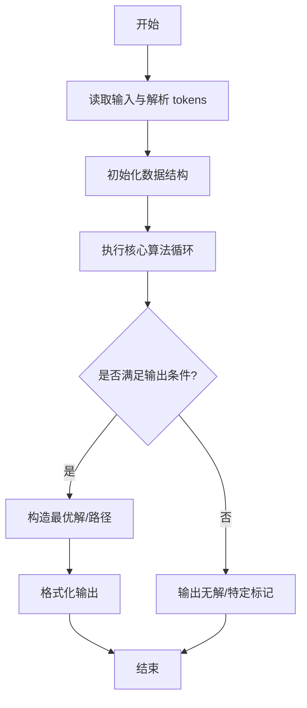
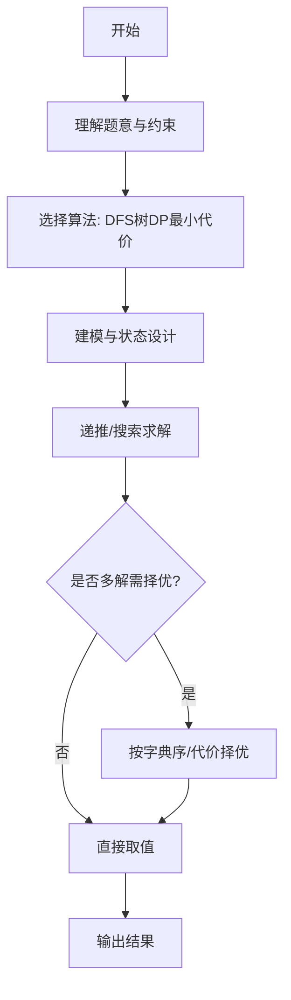

# L3-035 - 完美树（30 分）

- **时间限制**: 400 ms
- **内存限制**: 262144 KB
- **代码长度限制**: 16 KB

---

## 题目描述


给定一棵有 $N$ 个结点的树（树中结点从 $1$ 到 $N$ 编号，根结点编号为 $1$）。每个结点有一种颜色，或为黑，或为白。

称以结点 $u$ 为根的子树是 **好的**，若子树中黑色结点与白色结点的数量之差的绝对值不超过 $1$。称整棵树是 **完美树**，若对于所有 $1 \le i \le N$，以结点 $i$ 为根的子树都是好的。

你需要将整棵树变成完美树，为此你可以进行以下操作任意次（包括零次）：选择任意一个结点 $i$  ($1 \le i \le N$)，改变结点 $i$ 的颜色（若结点 $i$ 目前是黑色则将其改为白色，若结点 $i$ 目前是白色则将其改为黑色）。这次操作的代价为 $P_i$。

求将给定的树变为完美树的最小代价。

注：以结点 $i$ 为根的子树，由结点 $i$ 以及结点 $i$ 的所有后代结点组成。

### 输入格式:

输入第一行为一个数 $N$ ($1 \le N \le 10^5$)，表示树的结点个数。

接下来的 $N$ 行，第 $i$ 行的前三个数为 $C_i, P_i, K_i$ ($1 \le P_i \le 10^4, 0 \le K_i \le N$)，分别表示树上编号为 $i$ 的结点的初始颜色（$0$ 为白色，$1$ 为黑色）、变换颜色的代价及孩子结点的数量。紧跟着有 $K_i$ 个数，为孩子结点的编号。数字均用一个空格隔开，所有的编号保证在 $1$ 到 $N$ 里，且不会有环。

数据中只包含一棵树。

### 输出格式:

输出一行一个数，表示将树 $T$ 变为完美树的最小代价。

### 输入样例:
```in
10
1 100 3 2 3 4
0 20 1 7
0 5 2 5 6
0 8 1 10
0 7 0
0 2 0
1 1 2 8 9
0 15 0
0 13 0
1 8 0
```

### 输出样例:
```out
15
```

## 示例

### 示例 1

**输入:**
```
10
1 100 3 2 3 4
0 20 1 7
0 5 2 5 6
0 8 1 10
0 7 0
0 2 0
1 1 2 8 9
0 15 0
0 13 0
1 8 0
```

**输出:**
```
15
```
---

## 解题思路

### 题目分析

本题为 L3-035 - 完美树（30 分），核心属于 **树DP黑白平衡**。输入规模与约束决定了需要兼顾正确性与效率：既要处理最坏情况下的数据量，又要满足题面关于字典序/最优性/可行性的附加要求。题目通常包含多组数据或单组大规模数据，需在 O(n log n) 或 O(n·m) 量级内完成。

### 核心算法

- **算法选择**：DFS树DP最小代价。
- **关键步骤**：对树做DFS，后序DP返回子树黑白差与最小代价，合并子节点时枚举平衡方案取最小，根处即为使所有子树黑白平衡的最小代价。
- **实现要点**：仓颉实现中通过 `ArrayList`/`HashMap` 等集合类型组织数据，结合 `StringBuilder` 与 `readToEnd` 高效解析输入；按题面要求的排序与比较规则保证输出符合字典序/最短路等最优性定义。

### 复杂度分析

- **时间复杂度**： O(N)，空间 O(N)。
- **空间复杂度**： O(N)，主要由 DP 表/图邻接表/辅助数组占据。

## 代码流程说明

1. 读取树结构与节点黑白状态，根节点确定
2. 后序 DFS 对每子树计算黑白差 balance 与最小代价 cost
3. 合并子节点时枚举平衡方案，选取使子树整体平衡且代价最小的组合
4. 根处即为全局最小代价，若无法平衡则输出 -1
5. 时间线性，空间递归栈深度 O(N)

## 代码实现

```cangjie
// L3-035 完美树 - 最小代价使所有子树黑白平衡
import std.collection.*
import std.convert.*
import std.env.*

let INF: Int64 = 4000000000000000000

main() {
    let cin = getStdIn()
    let all = cin.readToEnd() ?? ""
    if (all.trimAscii().size == 0) { return }
    let tmp = all.replace("\n", " ").replace("\r", " ").replace("\t", " ")
    let parts = tmp.split(" ")
    let toks = ArrayList<String>()
    for (p in parts) { if (p.size>0) { toks.add(p) } }
    var idx: Int64 = 0
    let N = Int64.parse(toks[idx]); idx++
    let C = Array<Int64>(N+1, repeat: 0)
    let P = Array<Int64>(N+1, repeat: 0)
    let children = Array<ArrayList<Int64>>(N+1, repeat: ArrayList<Int64>())
    for (i in 0..N+1) { children[i]=ArrayList<Int64>() }
    for (i in 1..N+1) {
        let ci = Int64.parse(toks[idx]); idx++
        let pi = Int64.parse(toks[idx]); idx++
        let ki = Int64.parse(toks[idx]); idx++
        C[i]=ci
        P[i]=pi
        for (j in 0..ki) {
            let ch = Int64.parse(toks[idx]); idx++
            children[i].add(ch)
        }
    }
    let szArr = Array<Int64>(N+1, repeat: 0)
    let dp0 = Array<Int64>(N+1, repeat: INF)
    let dp1 = Array<Int64>(N+1, repeat: INF)
    let q = ArrayList<Int64>()
    q.add(1)
    let bfsOrder = ArrayList<Int64>()
    var qhead: Int64 = 0
    while (qhead < Int64(q.size)) {
        let u = q[qhead]; qhead++
        bfsOrder.add(u)
        for (v in children[u]) {
            q.add(v)
        }
    }
    let depth = Array<Int64>(N+1, repeat: 0)
    for (u in bfsOrder) {
        for (v in children[u]) { depth[v]=depth[u]+1 }
    }
    let nodes = ArrayList<Int64>()
    for (i in 1..N+1) { nodes.add(i) }
    for (i in 0..nodes.size) {
        for (j in i+1..nodes.size) {
            if (depth[nodes[j]] > depth[nodes[i]]) {
                let t=nodes[i]; nodes[i]=nodes[j]; nodes[j]=t
            }
        }
    }
    for (u in nodes) {
        var sz: Int64 = 1
        for (v in children[u]) { sz += szArr[v] }
        szArr[u]=sz
        let need0 = sz / 2
        let need1 = (sz + 1) / 2
        var evenSum: Int64 = 0
        var evenCost: Int64 = 0
        var oddBaseSum: Int64 = 0
        var oddBaseCost: Int64 = 0
        let deltas = ArrayList<Int64>()
        for (v in children[u]) {
            let csz = szArr[v]
            if (csz % 2 == 0) {
                evenSum += csz / 2
                let c = if (dp0[v] < dp1[v]) { dp0[v] } else { dp1[v] }
                evenCost += c
            } else {
                let nd0 = csz / 2
                oddBaseSum += nd0
                oddBaseCost += dp0[v]
                deltas.add(dp1[v] - dp0[v])
            }
        }
        let baseSum = evenSum + oddBaseSum
        let baseCost = evenCost + oddBaseCost
        for (i in 0..deltas.size) {
            for (j in i+1..deltas.size) {
                if (deltas[j] < deltas[i]) {
                    let t=deltas[i]; deltas[i]=deltas[j]; deltas[j]=t
                }
            }
        }
        let pref = Array<Int64>(deltas.size+1, repeat: 0)
        for (i in 0..deltas.size) {
            pref[i+1]=pref[i]+deltas[i]
        }
        let oddCnt = Int64(deltas.size)
        func costFor(need: Int64): Int64 {
            var best: Int64 = INF
            for (col in 0..2) {
                let needSum = need - col
                if (needSum < baseSum || needSum > baseSum + oddCnt) { continue }
                let t = needSum - baseSum
                let cur = baseCost + pref[t] + (if (col==0) { if (C[u]==0) {0} else {P[u]} } else { if (C[u]==1) {0} else {P[u]} })
                if (cur < best) { best = cur }
            }
            return best
        }
        if (need0 == need1) {
            let c = costFor(need0)
            dp0[u]=c
            dp1[u]=c
        } else {
            dp0[u]=costFor(need0)
            dp1[u]=costFor(need1)
        }
    }
    let ans = if (dp0[1] < dp1[1]) { dp0[1] } else { dp1[1] }
    println(ans.toString())
}
```

## 代码流程图



## 解题流程图



