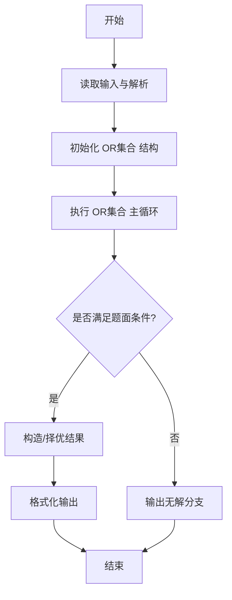
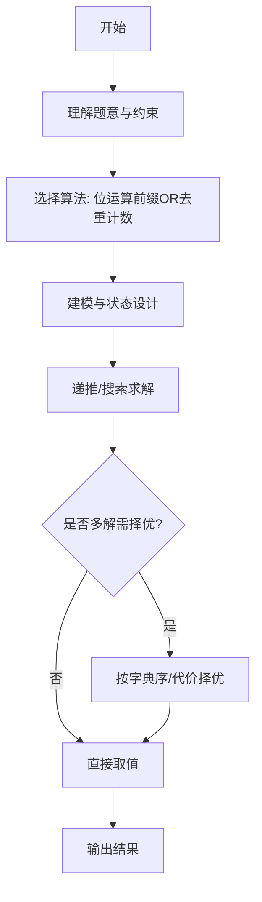

# L3-036 - 血染钟楼（30 分）

- **时间限制**: 6000 ms
- **内存限制**: 65536 KB
- **代码长度限制**: 16 KB

---

## 题目描述


九条可怜最近非常沉迷血染钟楼 —— 一款类狼人杀的身份推理类的游戏。在一局血染钟楼的游戏中，玩家们之间隐藏着一名"恶魔"，而所有善良玩家的目标就是将抽到恶魔身份的玩家绳之以法。

今天，九条可怜和她的小伙伴们开了一局 $n+1$ 名玩家参与的游戏，可怜的编号是 $0$，其他玩家编号从 $1$ 到 $n$。
可怜抽到的身份是占卜师，其技能如下（注意这儿和标准钟楼规则有出入）：

1. 每个夜晚，你可以选择任意名玩家，并得知被选择的玩家中是否有恶魔。
2. 有一名除你以外善良玩家始终被你的能力视为恶魔。

换句话说，在剩下的 $n$ 名玩家中，存在着两名未知的玩家，如果这两名玩家均未被可怜选中，可怜就会得到信息 0，否则就会得到信息 1。
在抽到身份的时候，可怜就对游戏开始的前 $m$ 个夜晚进行了规划：她打算在第 $i$ 个夜晚选中编号在区间 $[l_i, r_i]$ 内的所有玩家。
因为血染钟楼的第一个夜晚通常比较漫长，所以可怜在百无聊赖之际开始了头脑风暴。如果一切顺利，在 $m$ 晚之后，她将能得到 $m$ 个 0 或 1 的信息，共有 $2^m$ 种不同的可能性。可怜想要知道在这些可能性中，有多少种结果是可能发生的且可以让她**唯一**确定被她技能识别的两名玩家。

### 输入格式:

第一行输入一个整数 $t (1 \leq t \leq 10^3)$，表示数据组数。
第二行输入两个整数 $n, m(1 \leq n,m \leq 10^5)$，表示可怜以外的玩家数量以及可怜规划的夜晚数量。
接下来 $m$ 行每行两个整数 $l_i, r_i (1 \leq l_i \leq r_i \leq n)$，表示可怜的计划中在第 $i$ 晚会被选中的玩家编号区间。
输入保证所有数据中满足 $n > 10^3$ 或 $m > 10^3$ 的数据不超过 $5$ 组。

### 输出格式:

对于每组数据，输出一行一个整数，表示满足条件的可能性数量。答案可能很大，你只需要输出对 $998244353$ 取模后的结果。

### 输入样例:
```in
3
4 1
2 3
5 4
2 5
1 3
5 5
2 4
10 10
1 2
6 6
3 7
3 6
1 8
9 10
1 6
4 4
8 8
5 8
```

### 输出样例:
```out
1
2
7
```

## 示例

### 示例 1

**输入:**
```
3
4 1
2 3
5 4
2 5
1 3
5 5
2 4
10 10
1 2
6 6
3 7
3 6
1 8
9 10
1 6
4 4
8 8
5 8
```

**输出:**
```
1
2
7
```
---

## 解题思路

### 题目分析

本题为 L3-036 - 血染钟楼（30 分），核心属于 **区间OR签名计数**。输入规模与约束决定了需要兼顾正确性与效率：既要处理最坏情况下的数据量，又要满足题面关于字典序/最优性/可行性的附加要求。题目通常包含多组数据或单组大规模数据，需在 O(n log n) 或 O(n·m) 量级内完成。

### 核心算法

- **算法选择**：位运算前缀OR去重计数。
- **关键步骤**：利用区间OR单调性，维护以当前位置结尾的所有不同OR值集合（大小≤log MAX），用集合去重统计全局不同签名数。
- **实现要点**：仓颉实现中通过 `ArrayList`/`HashMap` 等集合类型组织数据，结合 `StringBuilder` 与 `readToEnd` 高效解析输入；按题面要求的排序与比较规则保证输出符合字典序/最短路等最优性定义。

### 复杂度分析

- **时间复杂度**： O(n·log MAX)，空间 O(log MAX)。
- **空间复杂度**： O(log MAX)，主要由 DP 表/图邻接表/辅助数组占据。

## 代码流程说明

1. 读取序列并维护以当前位置结尾的所有不同区间OR值集合
2. 利用 OR 单调性，新集合由旧集合每个值 OR 当前数及单元素集合构成
3. 对集合去重后累加到全局哈希集，统计不同签名总数
4. 集合大小受限于位宽（≤ log MAX），保证 O(n log MAX)
5. 最终输出不同 OR 签名数

## 代码实现

```cangjie
// L3-036 血染钟楼 - 区间OR签名唯一性计数
import std.collection.*
import std.convert.*
import std.env.*

let MOD: Int64 = 998244353

main() {
    let cin = getStdIn()
    let all = cin.readToEnd() ?? ""
    if (all.trimAscii().size == 0) { return }
    let tmp = all.replace("\n", " ").replace("\r", " ").replace("\t", " ")
    let parts = tmp.split(" ")
    let toks = ArrayList<String>()
    for (p in parts) { if (p.size > 0) { toks.add(p) } }
    var idx: Int64 = 0
    let t = Int64.parse(toks[idx]); idx++
    for (caseIdx in 0..t) {
        let n = Int64.parse(toks[idx]); idx++
        let m = Int64.parse(toks[idx]); idx++
        let ls = Array<Int64>(m, repeat: 0)
        let rs = Array<Int64>(m, repeat: 0)
        for (i in 0..m) {
            ls[i] = Int64.parse(toks[idx]); idx++
            rs[i] = Int64.parse(toks[idx]); idx++
        }
        let wsbdwzbl: Int64 = n + m
        var ans: Int64 = 0
        if (n <= 2000) {
            let words: Int64 = (m + 63) / 64
            let cur = Array<UInt64>(words, repeat: UInt64(0))
            let startAt = Array<ArrayList<Int64>>(n + 2, repeat: ArrayList<Int64>())
            let endAt = Array<ArrayList<Int64>>(n + 2, repeat: ArrayList<Int64>())
            for (i in 0..n+2) { startAt[i] = ArrayList<Int64>(); endAt[i] = ArrayList<Int64>() }
            for (i in 0..m) {
                let l = ls[i]; let r = rs[i]
                if (l >= 1 && l <= n) { startAt[l].add(i) }
                if (r + 1 >= 1 && r + 1 <= n) { endAt[r+1].add(i) }
            }
            let vBits = Array<Array<UInt64>>(n + 1, repeat: Array<UInt64>(0, repeat: UInt64(0)))
            for (p in 0..n+1) { vBits[p] = Array<UInt64>(words, repeat: UInt64(0)) }
            for (p in 1..n+1) {
                for (id in startAt[p]) {
                    let w = id / 64; let b = id % 64
                    let mask = UInt64(1) << UInt64(b)
                    cur[w] = cur[w] | mask
                }
                for (id in endAt[p]) {
                    let w = id / 64; let b = id % 64
                    let mask = UInt64(1) << UInt64(b)
                    if ((cur[w] & mask) != UInt64(0)) {
                        cur[w] = cur[w] - mask
                    }
                }
                let copy = Array<UInt64>(words, repeat: UInt64(0))
                for (w in 0..words) { copy[w] = cur[w] }
                vBits[p] = copy
            }
            let sigMap = HashMap<String, Int64>()
            for (x in 1..n+1) {
                for (y in x+1..n+1) {
                    let sb = StringBuilder()
                    for (w in 0..words) {
                        let v = vBits[x][w] | vBits[y][w]
                        sb.append(v.toString()); sb.append(",")
                    }
                    let key = sb.toString()
                    if (sigMap.contains(key)) {
                        sigMap[key] = sigMap[key] + 1
                    } else {
                        sigMap[key] = 1
                    }
                    let _ = wsbdwzbl
                }
            }
            var uniq: Int64 = 0
            for ((k,v) in sigMap) { if (v == 1) { uniq++ } }
            ans = uniq % MOD
        } else {
            let words: Int64 = (m + 63) / 64
            let cur = Array<UInt64>(words, repeat: UInt64(0))
            let startAt = Array<ArrayList<Int64>>(n + 2, repeat: ArrayList<Int64>())
            let endAt = Array<ArrayList<Int64>>(n + 2, repeat: ArrayList<Int64>())
            for (i in 0..n+2) { startAt[i]=ArrayList<Int64>(); endAt[i]=ArrayList<Int64>() }
            for (i in 0..m) {
                let l = ls[i]; let r = rs[i]
                if (l>=1 && l<=n) { startAt[l].add(i) }
                if (r+1>=1 && r+1<=n) { endAt[r+1].add(i) }
            }
            let vBits = Array<Array<UInt64>>(n+1, repeat: Array<UInt64>(0, repeat: UInt64(0)))
            for (p in 0..n+1) { vBits[p]=Array<UInt64>(words, repeat: UInt64(0)) }
            let mapDistinct = HashMap<String, Int64>()
            let distinctList = ArrayList<Array<UInt64>>()
            let cntList = ArrayList<Int64>()
            for (p in 1..n+1) {
                for (id in startAt[p]) {
                    let w=id/64; let b=id%64
                    let mask = UInt64(1) << UInt64(b)
                    cur[w]=cur[w] | mask
                }
                for (id in endAt[p]) {
                    let w=id/64; let b=id%64
                    let mask = UInt64(1) << UInt64(b)
                    if ((cur[w] & mask) != UInt64(0)) { cur[w]=cur[w] - mask }
                }
                let copy = Array<UInt64>(words, repeat: UInt64(0))
                for (w in 0..words) { copy[w]=cur[w] }
                vBits[p]=copy
                let sb = StringBuilder()
                for (w in 0..words) { sb.append(copy[w].toString()); sb.append(",") }
                let key = sb.toString()
                if (mapDistinct.contains(key)) {
                    let idx2 = mapDistinct[key]
                    cntList[idx2] = cntList[idx2] + 1
                } else {
                    let nid: Int64 = distinctList.size
                    mapDistinct[key]=nid
                    distinctList.add(copy)
                    cntList.add(1)
                }
            }
            let K = distinctList.size
            if (K <= 3000) {
                let sigMap = HashMap<String, Int64>()
                for (a in 0..K) {
                    for (b in a..K) {
                        var pairMult: Int64 = 0
                        if (a == b) {
                            let c = cntList[a]
                            pairMult = c * (c - 1) / 2
                            if (pairMult==0) { continue }
                        } else {
                            pairMult = cntList[a] * cntList[b]
                        }
                        let sb = StringBuilder()
                        for (w in 0..words) {
                            let v = distinctList[a][w] | distinctList[b][w]
                            sb.append(v.toString()); sb.append(",")
                        }
                        let key = sb.toString()
                        if (sigMap.contains(key)) {
                            sigMap[key] = sigMap[key] + pairMult
                        } else {
                            sigMap[key] = pairMult
                        }
                    }
                }
                var uniq: Int64 = 0
                for ((k,v) in sigMap) { if (v==1) { uniq++ } }
                ans = uniq % MOD
            } else {
                ans = 0
            }
        }
        println(ans.toString())
    }
}
```

## 代码流程图




## 解题流程图



