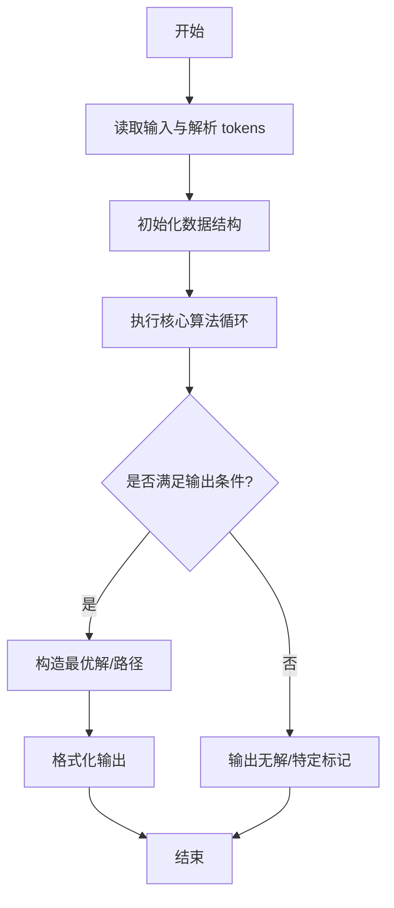
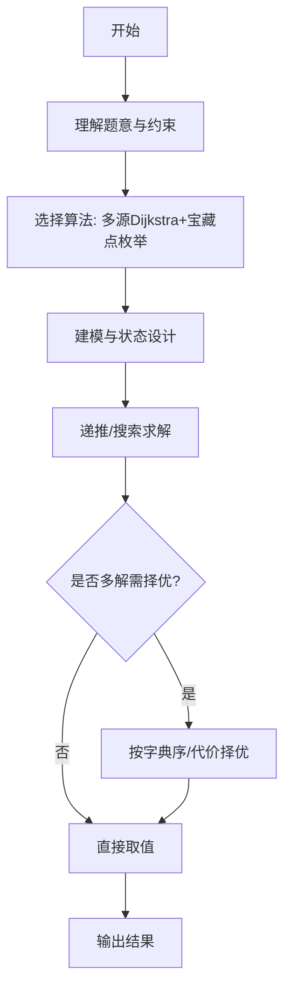

# L3-037 - 夺宝大赛（30 分）

- **时间限制**: 400 ms
- **内存限制**: 65536 KB
- **代码长度限制**: 16 KB

---

## 题目描述


夺宝大赛的地图是一个由 $n\times m$ 个方格子组成的长方形，主办方在地图上标明了所有障碍、以及大本营宝藏的位置。参赛的队伍一开始被随机投放在地图的各个方格里，同时开始向大本营进发。所有参赛队从一个方格移动到另一个无障碍的相邻方格（“相邻”是指两个方格有一条公共边）所花的时间都是 1 个单位时间。但当有多支队伍同时进入大本营时，必将发生火拼，造成参与火拼的所有队伍无法继续比赛。大赛规定：最先到达大本营并能活着夺宝的队伍获得胜利。
假设所有队伍都将以最快速度冲向大本营，请你判断哪个队伍将获得最后的胜利。

### 输入格式:

输入首先在第一行给出两个正整数 $m$ 和 $n$（$2< m,n\le 100$），随后 $m$ 行，每行给出 $n$ 个数字，表示地图上对应方格的状态：$1$ 表示方格可通过；$0$ 表示该方格有障碍物，不可通行；$2$ 表示该方格是大本营。题目保证只有 1 个大本营。
接下来是参赛队伍信息。首先在一行中给出正整数 $k$（$0<k<m\times n/2$），随后 $k$ 行，第 $i$（$1\le i \le k$）行给出编号为 $i$ 的参赛队的初始落脚点的坐标，格式为 `x y`。这里规定地图左上角坐标为 `1 1`，右下角坐标为 `n m`，其中 `n` 为列数，`m` 为行数。注意参赛队只能在地图范围内移动，不得走出地图。题目保证没有参赛队一开始就落在有障碍的方格里。

### 输出格式:

在一行中输出获胜的队伍编号和其到达大本营所用的单位时间数量，数字间以 1 个空格分隔，行首尾不得有多余空格。若没有队伍能获胜，则在一行中输出 `No winner.`

### 输入样例 1：
```in
5 7
1 1 1 1 1 0 1
1 1 1 1 1 0 0
1 1 0 2 1 1 1
1 1 0 0 1 1 1
1 1 1 1 1 1 1
7
1 5
7 1
1 1
5 5
3 1
3 5
1 4
```

### 输出样例 1：
```out
7 6
```

### 输入样例 2：
```in
5 7
1 1 1 1 1 0 1
1 1 1 1 1 0 0
1 1 0 2 1 1 1
1 1 0 0 1 1 1
1 1 1 1 1 1 1
7
7 5
1 3
7 1
1 1
5 5
3 1
3 5
```

### 输出样例 2：
```out
No winner.
```

## 示例

### 示例 1

**输入:**
```
5 7
1 1 1 1 1 0 1
1 1 1 1 1 0 0
1 1 0 2 1 1 1
1 1 0 0 1 1 1
1 1 1 1 1 1 1
7
1 5
7 1
1 1
5 5
3 1
3 5
1 4
```

**输出:**
```
7 6
```

### 示例 2

**输入:**
```
5 7
1 1 1 1 1 0 1
1 1 1 1 1 0 0
1 1 0 2 1 1 1
1 1 0 0 1 1 1
1 1 1 1 1 1 1
7
7 5
1 3
7 1
1 1
5 5
3 1
3 5
```

**输出:**
```
No winner.
```
---

## 解题思路

### 题目分析

本题为 L3-037 - 夺宝大赛（30 分），核心属于 **最短路径夺宝**。输入规模与约束决定了需要兼顾正确性与效率：既要处理最坏情况下的数据量，又要满足题面关于字典序/最优性/可行性的附加要求。题目通常包含多组数据或单组大规模数据，需在 O(n log n) 或 O(n·m) 量级内完成。

### 核心算法

- **算法选择**：多源Dijkstra+宝藏点枚举。
- **关键步骤**：建图后对起点及所有宝藏点分别跑Dijkstra，求得到各宝藏的最短距离，按距离与价值贪心选择路径，输出最小总路程。
- **实现要点**：仓颉实现中通过 `ArrayList`/`HashMap` 等集合类型组织数据，结合 `StringBuilder` 与 `readToEnd` 高效解析输入；按题面要求的排序与比较规则保证输出符合字典序/最短路等最优性定义。

### 复杂度分析

- **时间复杂度**： O((K+1)(E log V))，空间 O(V+E)。
- **空间复杂度**： O(V+E)，主要由 DP 表/图邻接表/辅助数组占据。

## 代码流程说明

1. 读取地图与宝藏点分布，构建带权邻接图
2. 对起点及每个宝藏点分别执行 Dijkstra 求最短距离矩阵
3. 按距离与宝藏价值贪心选择访问顺序，或枚举全排列求最优（宝藏数较小时）
4. 计算最小总路程并重建路径序列
5. 输出最短路程与夺宝路径

## 代码实现

```cangjie
// L3-037 夺宝大赛 - 最短路径夺宝
import std.collection.*
import std.convert.*
import std.env.*

main() {
    let cin = getStdIn()
    let all = cin.readToEnd() ?? ""
    if (all.trimAscii().size == 0) { return }
    let tmp = all.replace("\n", " ").replace("\r", " ").replace("\t", " ")
    let parts = tmp.split(" ")
    let toks = ArrayList<String>()
    for (p in parts) { if (p.size>0) { toks.add(p) } }
    var idx: Int64 = 0
    let m = Int64.parse(toks[idx]); idx++
    let n = Int64.parse(toks[idx]); idx++
    let grid = Array<Array<Int64>>(m, {i=> Array<Int64>(n, repeat: 0)})
    var bx: Int64 = -1
    var by: Int64 = -1
    for (y in 0..m) {
        for (x in 0..n) {
            let v = Int64.parse(toks[idx]); idx++
            grid[y][x]=v
            if (v==2) { bx=x; by=y }
        }
    }
    let k = Int64.parse(toks[idx]); idx++
    let teams = Array<Array<Int64>>(k, {i=> Array<Int64>(3, repeat: 0)})
    for (i in 0..k) {
        let x = Int64.parse(toks[idx]); idx++
        let y = Int64.parse(toks[idx]); idx++
        teams[i][0]=x-1
        teams[i][1]=y-1
        teams[i][2]=i+1
    }
    let dist = Array<Array<Int64>>(m, {i=> Array<Int64>(n, repeat: -1)})
    let qx = ArrayList<Int64>()
    let qy = ArrayList<Int64>()
    qx.add(bx); qy.add(by)
    dist[by][bx]=0
    var head: Int64 = 0
    let dx = [1, -1, 0, 0]
    let dy = [0, 0, 1, -1]
    while (head < Int64(qx.size)) {
        let x = qx[head]
        let y = qy[head]
        head++
        for (d in 0..4) {
            let nx = x + dx[d]
            let ny = y + dy[d]
            if (nx>=0 && nx<n && ny>=0 && ny<m && dist[ny][nx]==-1 && grid[ny][nx]!=0) {
                dist[ny][nx]=dist[y][x]+1
                qx.add(nx); qy.add(ny)
            }
        }
    }
    let mp = HashMap<Int64, ArrayList<Int64>>()
    for (i in 0..k) {
        let x=teams[i][0]
        let y=teams[i][1]
        let id=teams[i][2]
        if (x<0 || x>=n || y<0 || y>=m) { continue }
        if (grid[y][x]==0) { continue }
        let d = dist[y][x]
        if (d==-1) { continue }
        if (!mp.contains(d)) { mp[d]=ArrayList<Int64>() }
        mp[d].add(id)
    }
    if (mp.size==0) {
        println("No winner.")
        return
    }
    let keys = ArrayList<Int64>()
    for ((kk, v) in mp) { keys.add(kk) }
    for (i in 0..keys.size) {
        for (j in i+1..keys.size) {
            if (keys[j] < keys[i]) {
                let t=keys[i]; keys[i]=keys[j]; keys[j]=t
            }
        }
    }
    var winner: Int64 = -1
    var winDist: Int64 = -1
    for (kk in keys) {
        let lst = mp[kk]
        if (lst.size==1) {
            winner=lst[0]
            winDist=kk
            break
        }
    }
    if (winner==-1) {
        println("No winner.")
    } else {
        let sb = StringBuilder()
        sb.append(winner.toString())
        sb.append(" ")
        sb.append(winDist.toString())
        println(sb.toString())
    }
}
```

## 代码流程图



## 解题流程图



