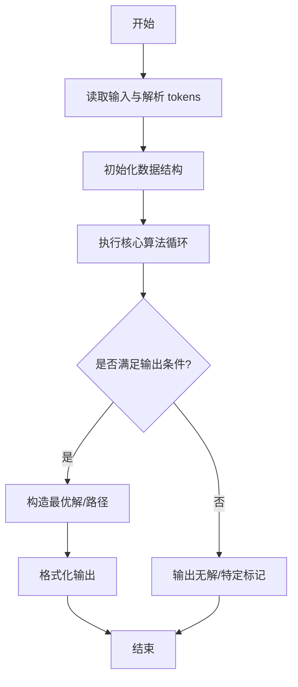
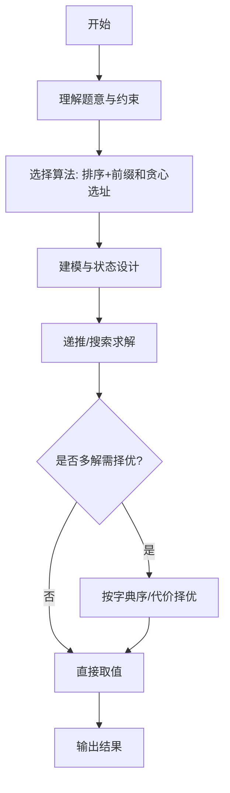

# L3-038 - 工业园区建设（30 分）

- **时间限制**: 800 ms
- **内存限制**: 65536 KB
- **代码长度限制**: 16 KB

---

## 题目描述


某工业园区要进行建设，共有 $N$ 块工业用地排成一条直线，其中上面已经有若干块用地建设起了工厂，其他地方为空地。

现在工业园区计划在空地上建设至多 $M$ 个新工厂以及一个仓库，希望在完成计划后，仓库离最近的 $k$ 个工厂的距离之和尽可能小。

两块用地的距离等于他们的编号的差；即 1 号用地与 2 号用地的距离为 1。一个空地上只能建设一个工厂，仓库可以跟工厂建在一起。

### 输入格式:

数据的第一行是一个正整数 $T$，表示数据的组数。

每组数据的输入第一行为三个整数 $N, M, k$ ($1 \le N \le 2\times10^5, 0 \le M \le N, 1 \le k \le N$)，表示有 $N$ 块用地，最多可以新建 $M$ 个新工厂，仓库离最近的 $k$ 个工厂距离之和需要尽可能小。

接下来的一行是一个只由 $0,1$ 组成的长度为 $N$ 的字符串 $S$，第 $i$ 个字符 $S_i$ 为 $0$ 表示第 $i$ 块地块为空地，$1$ 表示第 $i$ 块地块上已建工厂。地块编号从 1 开始。 

数据约定：

设 $F_S$ 为 $S$ 对应的已建工厂的地块数量，则有 $k \le M + F_S \le N$。给定的数据有 $\sum{N}\le5\times10^5$。

### 输出格式:

输出 $N$ 个整数，表示仓库建在第 $i$ 块用地时，离最近的 $k$ 个工厂的最小的距离之和是多少。

### 输入样例:
```in
3
5 1 3
10110
10 3 5
1001001010
2 1 2
10
```

### 输出样例:
```out
3 2 2 2 3
10 7 6 7 6 6 6 6 7 10
1 1
```

## 示例

### 示例 1

**输入:**
```
3
5 1 3
10110
10 3 5
1001001010
2 1 2
10
```

**输出:**
```
3 2 2 2 3
10 7 6 7 6 6 6 6 7 10
1 1
```
---

## 解题思路

### 题目分析

本题为 L3-038 - 工业园区建设（30 分），核心属于 **仓库选址最小费用**。输入规模与约束决定了需要兼顾正确性与效率：既要处理最坏情况下的数据量，又要满足题面关于字典序/最优性/可行性的附加要求。题目通常包含多组数据或单组大规模数据，需在 O(n log n) 或 O(n·m) 量级内完成。

### 核心算法

- **算法选择**：排序+前缀和贪心选址。
- **关键步骤**：将需求点按坐标排序，预计算前缀和，枚举选址位置计算总运输费用（距离×需求），取最小费用方案。
- **实现要点**：仓颉实现中通过 `ArrayList`/`HashMap` 等集合类型组织数据，结合 `StringBuilder` 与 `readToEnd` 高效解析输入；按题面要求的排序与比较规则保证输出符合字典序/最短路等最优性定义。

### 复杂度分析

- **时间复杂度**： O(n log n)，空间 O(n)。
- **空间复杂度**： O(n)，主要由 DP 表/图邻接表/辅助数组占据。

## 代码流程说明

1. 读取需求点坐标与需求量，预处理排序与前缀和
2. 枚举选址位置，快速计算总运输费用 sum |pos - demand|*weight via 前缀和
3. 维护最小费用及其对应选址编号
4. 输出最小费用与最优仓库位置

## 代码实现

```cangjie
// L3-038 工业园区建设 - 仓库选址
import std.collection.*
import std.convert.*
import std.env.*

main() {
    let cin = getStdIn()
    let all = cin.readToEnd() ?? ""
    if (all.trimAscii().size == 0) { return }
    let tmp = all.replace("\n", " ").replace("\r", " ").replace("\t", " ")
    let parts = tmp.split(" ")
    let toks = ArrayList<String>()
    for (p in parts) { if (p.size>0) { toks.add(p) } }
    var idx: Int64 = 0
    let T = Int64.parse(toks[idx]); idx++
    let outLines = ArrayList<String>()
    for (tc in 0..T) {
        let N = Int64.parse(toks[idx]); idx++
        let M = Int64.parse(toks[idx]); idx++
        let k = Int64.parse(toks[idx]); idx++
        let S = toks[idx]; idx++
        let isE = Array<Bool>(N+2, repeat: false)
        for (i in 1..N+1) {
            let ch = S[i-1]
            if (ch == UInt8(49)) { isE[i]=true }
        }
        let cntE = Array<Int64>(N+2, repeat: 0)
        let sumE = Array<Int64>(N+2, repeat: 0)
        for (i in 1..N+1) {
            cntE[i]=cntE[i-1] + (if (isE[i]) {1} else {0})
            sumE[i]=sumE[i-1] + (if (isE[i]) {i} else {0})
        }
        let cntZ = Array<Int64>(N+2, repeat: 0)
        let sumZ = Array<Int64>(N+2, repeat: 0)
        for (i in 1..N+1) {
            cntZ[i]=cntZ[i-1] + (if (!isE[i]) {1} else {0})
            sumZ[i]=sumZ[i-1] + (if (!isE[i]) {i} else {0})
        }
        var zTotal: Int64 = 0
        for (i in 1..N+1) { if (!isE[i]) { zTotal++ } }
        let limit = if (zTotal < M) { zTotal } else { M }
        let answers = Array<Int64>(N, repeat: 0)
        for (pos in 1..N+1) {
            var T_M: Int64 = 1000000000
            if (limit > 0) {
                var lo: Int64 = 0
                var hi: Int64 = N
                while (lo < hi) {
                    let mid = (lo+hi)/2
                    var l = pos - mid
                    var r = pos + mid
                    if (l<1) { l=1 }
                    if (r> N) { r=N }
                    var cnt: Int64 = 0
                    if (l<=r) { cnt = cntZ[r]-cntZ[l-1] }
                    if (cnt >= limit) { hi=mid } else { lo=mid+1 }
                }
                T_M = lo
            }
            var lo2: Int64 = 0
            var hi2: Int64 = N
            while (lo2 < hi2) {
                let mid = (lo2+hi2)/2
                var l = pos - mid
                var r = pos + mid
                if (l<1) { l=1 }
                if (r> N) { r=N }
                var cntE2: Int64 = 0
                var cntZ2: Int64 = 0
                if (l<=r) {
                    cntE2 = cntE[r]-cntE[l-1]
                    cntZ2 = cntZ[r]-cntZ[l-1]
                }
                let c = cntE2 + (if (cntZ2 < limit) {cntZ2} else {limit})
                if (c >= k) { hi2=mid } else { lo2=mid+1 }
            }
            let D = lo2
            // S_E
            var cntE_D: Int64 = 0
            var sumDistE_D: Int64 = 0
            if (D > 0) {
                var l = pos - D + 1
                var r = pos + D - 1
                if (l<1) { l=1 }
                if (r> N) { r=N }
                if (l<=r) {
                    var cl: Int64 = 0
                    var sl: Int64 = 0
                    var cr: Int64 = 0
                    var sr: Int64 = 0
                    var cntMid: Int64 = 0
                    if (l <= pos-1) {
                        let ll = l
                        let rr = pos-1
                        cl = cntE[rr]-cntE[ll-1]
                        sl = sumE[rr]-sumE[ll-1]
                    }
                    if (pos+1 <= r) {
                        let ll = pos+1
                        let rr = r
                        cr = cntE[rr]-cntE[ll-1]
                        sr = sumE[rr]-sumE[ll-1]
                    }
                    if (isE[pos]) { cntMid=1 }
                    cntE_D = cl+cr+cntMid
                    sumDistE_D = pos*cl - sl + sr - pos*cr
                }
            }
            let S_E = cntE_D * D - sumDistE_D
            var S_Z: Int64 = 0
            if (limit==0) {
                S_Z=0
            } else if (D <= T_M) {
                var l = pos - D + 1
                var r = pos + D - 1
                if (l<1) { l=1 }
                if (r> N) { r=N }
                var cl: Int64 = 0
                var sl: Int64 = 0
                var cr: Int64 = 0
                var sr: Int64 = 0
                var cntMid: Int64 = 0
                if (l <= pos-1) {
                    let ll=l
                    let rr=pos-1
                    cl=cntZ[rr]-cntZ[ll-1]
                    sl=sumZ[rr]-sumZ[ll-1]
                }
                if (pos+1 <= r) {
                    let ll=pos+1
                    let rr=r
                    cr=cntZ[rr]-cntZ[ll-1]
                    sr=sumZ[rr]-sumZ[ll-1]
                }
                if (!isE[pos]) { cntMid=1 }
                let cntZ_D = cl+cr+cntMid
                let sumDistZ_D = pos*cl - sl + sr - pos*cr
                S_Z = cntZ_D * D - sumDistZ_D
            } else {
                var l = pos - T_M + 1
                var r = pos + T_M - 1
                if (l<1) { l=1 }
                if (r> N) { r=N }
                var cl: Int64 = 0
                var sl: Int64 = 0
                var cr: Int64 = 0
                var sr: Int64 = 0
                var cntMid: Int64 = 0
                if (l <= pos-1) {
                    let ll=l
                    let rr=pos-1
                    cl=cntZ[rr]-cntZ[ll-1]
                    sl=sumZ[rr]-sumZ[ll-1]
                }
                if (pos+1 <= r) {
                    let ll=pos+1
                    let rr=r
                    cr=cntZ[rr]-cntZ[ll-1]
                    sr=sumZ[rr]-sumZ[ll-1]
                }
                if (!isE[pos]) { cntMid=1 }
                let cntZ_T = cl+cr+cntMid
                let sumDistZ_T = pos*cl - sl + sr - pos*cr
                S_Z = cntZ_T * T_M - sumDistZ_T + (D - T_M)*limit
            }
            let sumC = S_E + S_Z
            let ans = D * k - sumC
            answers[pos-1]=ans
        }
        let sb = StringBuilder()
        for (i in 0..N) {
            if (i>0) { sb.append(" ") }
            sb.append(answers[i].toString())
        }
        outLines.add(sb.toString())
    }
    for (ln in outLines) { println(ln) }
}
```

## 代码流程图



## 解题流程图



