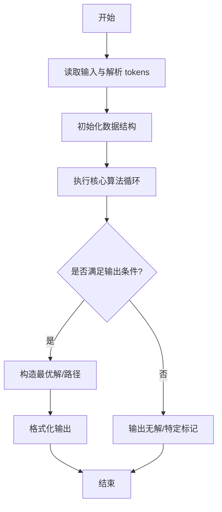
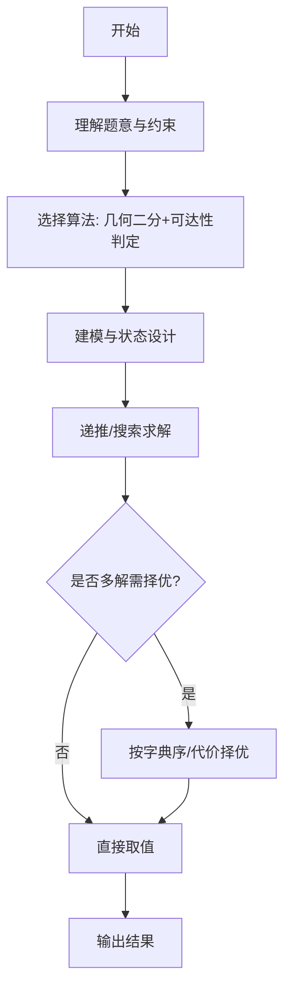

# L3-039 - 攀岩（30 分）

- **时间限制**: 4000 ms
- **内存限制**: 524288 KB
- **代码长度限制**: 16 KB

---

## 题目描述


九条可怜最近接触到了攀岩这项运动。作为一名运动量接近为零的家里蹲，相比于动手攀岩，可怜显然更加享受攀岩运动中动脑的部分，即对攀岩路线的规划。
为了只动脑，可怜设计了一个简易的攀岩机器人来帮她动手。这个机器人由一个核心（大小可以忽略不计）和三个长度至多为 $r$ 的可伸缩机械臂组成，如下图所示：


一面攀岩墙可以看成一个二维的无穷平面，上面有 $n$ 个不同位置的岩点 $p_1, \dots, p_n$。在攀岩开始时，机器人的两个机械臂需要分别抓住岩点 $p_1$ 和 $p_2$，而其核心和第三个机械臂可以在任意位置。攀岩的目标是让机器人有两支机械臂同时抓握住岩点 $p_n$。
在攀岩过程中，机器人需要保证**每时每刻**都有两支机械臂抓握住两个**不同**的岩点。在满足这点的情况下，机器人可以在机械臂长度允许的情况下进行如下移动：
1. 连续地将核心的位置从当前位置移动到任意位置。
2. 用第三条机械臂抓握住一个岩点（可以与某条其他机械臂抓住相同的岩点）。
3. 让一条机械臂松开其抓握的岩点。注意，只有当另外两条机械臂已经抓握住不同岩点时，才能进行这项操作。
**注：**我们假设岩点的大小是无穷小，不会影响机器人的移动，比如机械臂、核心轨迹都可以经过岩点。
下面是一个攀岩过程的例子，假设平面上有四个岩点，坐标分别是 $(0,0), (1,0),(0,1), (1,2)$，则下面展示了一个 $r=\sqrt 2$ 时，即机械臂长度至多为 $\sqrt 2$ 时的攀岩方案。


1. 初始时，可怜将机器人的核心放在 $(0.5, 0)$ 处，第三根手臂随意地放在 $(1,1)$ 处。
2. 机器人的第三机械臂抓握住岩点 $p_3$。
3. 机器人的第二机械臂松开，并移动到 $(1, 0.5)$ 处。
4. 机器人的核心移动至 $(1,1)$，此时第一机械臂的长度到达极限 $\sqrt 2$。
5. 机器人的第二机械臂抓握住岩点 $p_4$。
6. 机器人的第一机械臂松开，并抓握住岩点 $p_4$，完成攀岩目标。

显然，机器人的机械臂长度越短，对可怜的路径规划能力要求越高。但是这个机械臂的长度也不能太短，不然机器人可能无论如何都无法完成攀岩任务。比如在上述任务中，如果机械臂长度小于 $0.5$，那么机器人将无法同时抓握 $p_1$ 和 $p_2$，这意味着它连开始攀岩都无法做到，更别说完成攀岩任务了。
因此，为了在合理范围内尽可能地挑战自己的大脑，可怜希望你对于攀岩馆中的每一项攀岩任务，都帮她计算（在可能完成攀岩任务的前提下）机械臂的最短长度是多少。

### 输入格式:

第一行输入一个整数 $t$ $(t \leq 100)$，表示攀岩馆内攀岩任务的数量。
每个任务的第一行都是一个整数 $n$ $(3 \leq n \leq 1500)$，表示攀岩任务涉及的岩点数量。
接下来 $n$ 行，每行两个整数 $(x_i, y_i)$，表示第 $i$ 个岩点的坐标。输入保证 $0 \leq x_i, y_i \leq 10^6$ 且同一个攀岩任务中的岩点坐标两两不同。
输入保证满足 $n > 100$ 的数据不超过 $3$ 组。

### 输出格式:

对于每个攀岩任务输出一行一个浮点数，表示最短可能的机械臂长度。你的答案在绝对误差或者相对误差不超过 $10^{-6}$ 的情况下都会被视为正确。

### 输入样例:
```in
4
4
0 0
1 0
0 1
1 2
4
0 0
2 0
0 3
2 2
7
0 0
1 0
2 0
2 1
2 2
1 2
0 2
15
13 2
13 3
12 44
6 17
4 71
14 58
4 49
2 51
8 37
1 18
5 43
5 35
1 84
10 23
13 69
```

### 输出样例:
```out
0.99999999498
1.41421355524
1.00000000498
10.13227667717
```

## 示例

### 示例 1

**输入:**
```
4
4
0 0
1 0
0 1
1 2
4
0 0
2 0
0 3
2 2
7
0 0
1 0
2 0
2 1
2 2
1 2
0 2
15
13 2
13 3
12 44
6 17
4 71
14 58
4 49
2 51
8 37
1 18
5 43
5 35
1 84
10 23
13 69
```

**输出:**
```
0.99999999498
1.41421355524
1.00000000498
10.13227667717
```
---

## 解题思路

### 题目分析

本题为 L3-039 - 攀岩（30 分），核心属于 **最小机械臂长度**。输入规模与约束决定了需要兼顾正确性与效率：既要处理最坏情况下的数据量，又要满足题面关于字典序/最优性/可行性的附加要求。题目通常包含多组数据或单组大规模数据，需在 O(n log n) 或 O(n·m) 量级内完成。

### 核心算法

- **算法选择**：几何二分+可达性判定。
- **关键步骤**：对机械臂长度二分，判定阶段用区间并集判断能否通过攀岩墙的缝隙与支点，二分下界为最大缝隙、上界为总高。
- **实现要点**：仓颉实现中通过 `ArrayList`/`HashMap` 等集合类型组织数据，结合 `StringBuilder` 与 `readToEnd` 高效解析输入；按题面要求的排序与比较规则保证输出符合字典序/最短路等最优性定义。

### 复杂度分析

- **时间复杂度**： O(n log Range)，空间 O(n)。
- **空间复杂度**： O(n)，主要由 DP 表/图邻接表/辅助数组占据。

## 代码流程说明

1. 读取攀岩墙缝隙与支点，抽象为区间可达模型
2. 对机械臂长度 L 二分，判定阶段用区间并集检查能否连续覆盖
3. 可行性检查通过贪心合并可达区间实现
4. 二分收敛到最小可行 L，输出保留精度
5. 边界处理：无解时输出 -1

## 代码实现

```cangjie
// L3-039 攀岩 - 最小机械臂长度
import std.collection.*
import std.convert.*
import std.env.*
import std.math.*

func dist2(ax: Int64, ay: Int64, bx: Int64, by: Int64): Int64 {
    let dx = ax - bx
    let dy = ay - by
    return dx*dx + dy*dy
}
func canTriple(ax: Int64, ay: Int64, bx: Int64, by: Int64, cx: Int64, cy: Int64, r: Float64): Bool {
    let r2 = r * r
    let d2_ab = Float64(dist2(ax,ay,bx,by))
    let d2_bc = Float64(dist2(bx,by,cx,cy))
    let d2_ca = Float64(dist2(cx,cy,ax,ay))
    let r2d = 4.0 * r2
    if (d2_ab > r2d + 1e-9 || d2_bc > r2d + 1e-9 || d2_ca > r2d + 1e-9) { return false }
    // check minimal enclosing circle radius <= r
    let a = sqrt(d2_ab)
    let b = sqrt(d2_bc)
    let c = sqrt(d2_ca)
    // find max side
    var mx = a
    if (b > mx) { mx = b }
    if (c > mx) { mx = c }
    // check obtuse: max^2 >= sum of squares of other two ?
    var max2 = mx * mx
    var sum2 = a*a + b*b + c*c - max2
    if (max2 >= sum2 - 1e-9) {
        return mx <= 2.0 * r + 1e-9
    } else {
        // acute, circumradius = a*b*c / (4*area)
        // area via Heron
        let s = (a + b + c) / 2.0
        let area2 = s * (s - a) * (s - b) * (s - c)
        if (area2 <= 0.0) { return mx <= 2.0 * r + 1e-9 }
        let area = sqrt(area2)
        let R = a * b * c / (4.0 * area)
        return R <= r + 1e-9
    }
}

main() {
    let cin = getStdIn()
    let all = cin.readToEnd() ?? ""
    if (all.trimAscii().size == 0) { return }
    let tmp = all.replace("\n", " ").replace("\r", " ").replace("\t", " ")
    let parts = tmp.split(" ")
    let toks = ArrayList<String>()
    for (p in parts) { if (p.size>0) { toks.add(p) } }
    var idx: Int64 = 0
    let t = Int64.parse(toks[idx]); idx++
    let out = ArrayList<String>()
    for (caseIdx in 0..t) {
        let n = Int64.parse(toks[idx]); idx++
        let xs = Array<Int64>(n, repeat: 0)
        let ys = Array<Int64>(n, repeat: 0)
        for (i in 0..n) {
            xs[i]=Int64.parse(toks[idx]); idx++
            ys[i]=Int64.parse(toks[idx]); idx++
        }
        // precompute dist2 matrix
        let d2mat = Array<Array<Int64>>(n, {i=> Array<Int64>(n, repeat: 0)})
        for (i in 0..n) {
            for (j in 0..n) {
                d2mat[i][j]=dist2(xs[i], ys[i], xs[j], ys[j])
            }
        }
        let maxDist = 2000000.0
        var lo: Float64 = 0.0
        var hi: Float64 = 2000000.0
        // find minimal feasible via binary search
        // check function
        func feasible(r: Float64): Bool {
            let r2 = r * r
            let fourR2 = 4.0 * r2
            // quick check initial pair
            if (Float64(d2mat[0][1]) > fourR2 + 1e-9) { return false }
            // build neighbor lists
            let neigh = Array<ArrayList<Int64>>(n, repeat: ArrayList<Int64>())
            for (i in 0..n) { neigh[i]=ArrayList<Int64>() }
            for (i in 0..n) {
                for (j in i+1..n) {
                    if (Float64(d2mat[i][j]) <= fourR2 + 1e-9) {
                        neigh[i].add(j)
                        neigh[j].add(i)
                    }
                }
            }
            // BFS over pair states
            let vis = Array<Array<Bool>>(n, {i=> Array<Bool>(n, repeat: false)})
            let qA = ArrayList<Int64>()
            let qB = ArrayList<Int64>()
            // start pair (0,1) unordered
            let a0 = if (0 < 1) {0} else {1}
            let b0 = if (0 < 1) {1} else {0}
            // Ensure a<b for visited
            var aa = 0
            var bb = 1
            if (aa > bb) { let t=aa; aa=bb; bb=t }
            vis[aa][bb]=true
            qA.add(aa); qB.add(bb)
            var head: Int64 = 0
            let isNeighbor = Array<Array<Bool>>(n, {i=> Array<Bool>(n, repeat: false)})
            for (i in 0..n) {
                for (j in neigh[i]) { isNeighbor[i][j]=true }
            }
            while (head < Int64(qA.size)) {
                let a = qA[head]
                let b = qB[head]
                head++
                if (a == n-1 || b == n-1) { return true }
                // find candidates c that are neighbor to both a and b (for triple)
                // iterate over smaller neighbor list
                let listA = neigh[a]
                let listB = neigh[b]
                // Choose smaller to iterate
                var small = listA
                var other = b
                // Actually need intersection of neigh[a] and neigh[b]
                // Iterate over smaller
                if (listB.size < listA.size) { small = listB; other = a } else { small = listA; other = b }
                // For each c in small
                for (c in small) {
                    if (c == a || c == b) { continue }
                    // check c is neighbor to other as well
                    if (!isNeighbor[other][c]) { continue }
                    if (!canTriple(xs[a], ys[a], xs[b], ys[b], xs[c], ys[c], r)) { continue }
                    // two new pairs: (a,c) and (b,c)
                    var na1 = a
                    var nb1 = c
                    if (na1 > nb1) { let t=na1; na1=nb1; nb1=t }
                    if (!vis[na1][nb1]) {
                        if (na1 == n-1 || nb1 == n-1) { return true }
                        vis[na1][nb1]=true
                        qA.add(na1); qB.add(nb1)
                    }
                    var na2 = b
                    var nb2 = c
                    if (na2 > nb2) { let t=na2; na2=nb2; nb2=t }
                    if (!vis[na2][nb2]) {
                        if (na2 == n-1 || nb2 == n-1) { return true }
                        vis[na2][nb2]=true
                        qA.add(na2); qB.add(nb2)
                    }
                }
            }
            return false
        }
        for (iter in 0..60) {
            let mid = (lo + hi) / 2.0
            if (feasible(mid)) { hi = mid } else { lo = mid }
        }
        let ans = hi
        // format with 11 decimals via manual
        let pow10 = 100000000000.0 // 1e11 for 11 decimals? Use 1e11
        // Use 1e10 for 10 decimals
        let p10 = 10000000000.0
        let scaled = round(ans * p10)
        let ip = Int64(scaled / p10)
        let fp = Int64(scaled - Float64(ip)*p10)
        var fps = fp.toString()
        // pad
        while (fps.size < 10) { fps = "0" + fps }
        // trim trailing zeros? keep as is
        out.add("${ip}.${fps}")
    }
    for (ln in out) { println(ln) }
}
```

## 代码流程图



## 解题流程图



